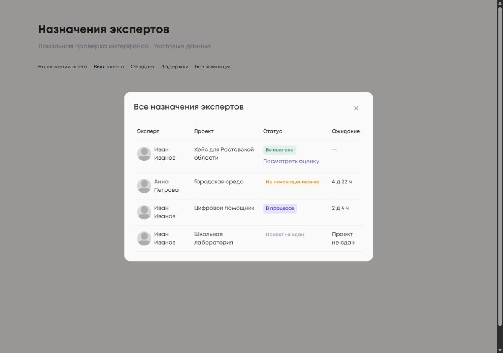
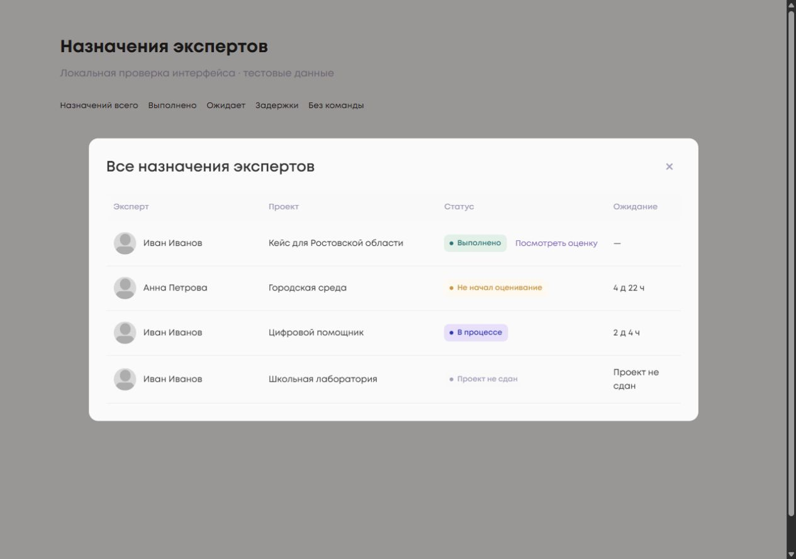
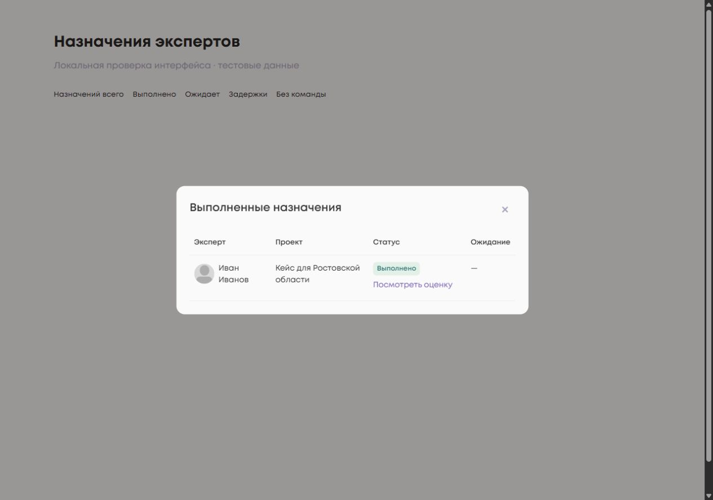
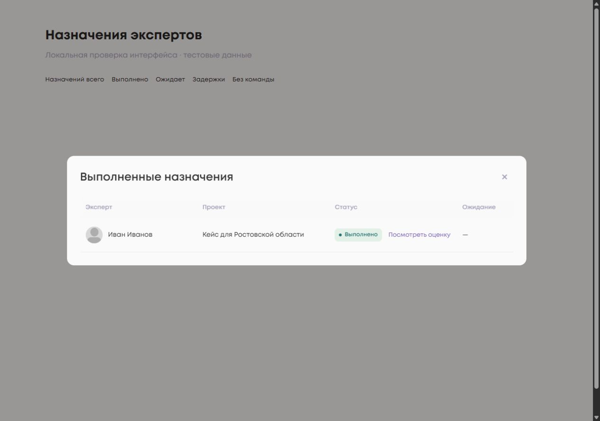
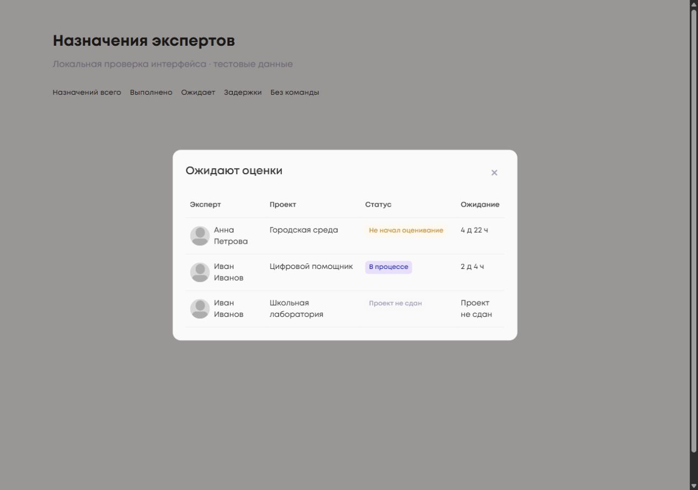
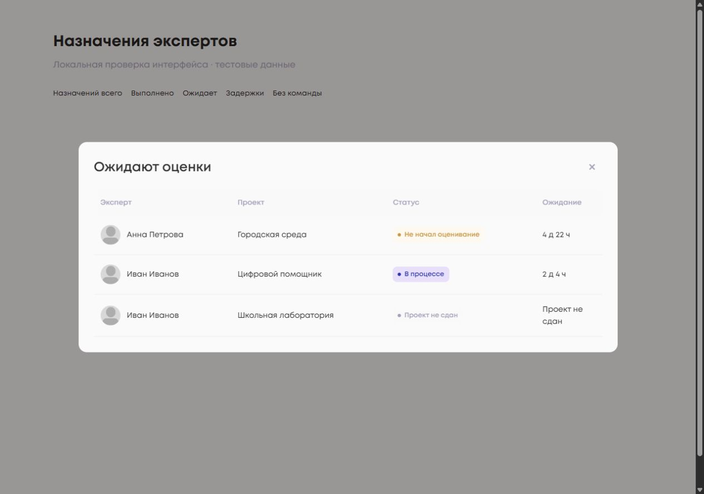
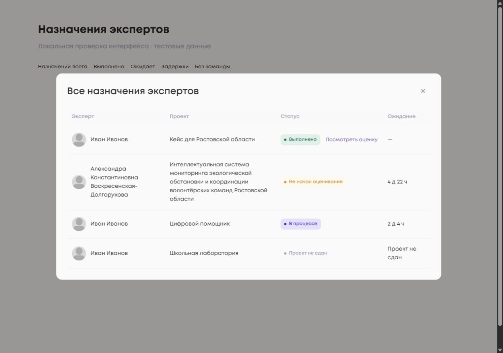
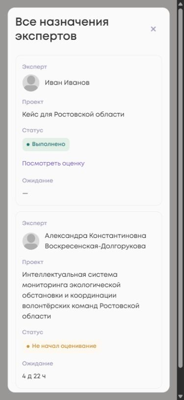

<!-- @format -->

# Модальные окна назначений экспертов

База DEV: `d8a4be8a90bac210a92181da8f3c80257baa3057`.

Три scope (`all`, `completed`, `pending`) используют существующий общий шаблон
`assignmentTable`. Оформление включается только для `view === "assignments"`:
через локальные модификаторы body и таблицы. Это сохраняет оформление backlog,
детализации оценки и таблиц внимания, которые используют тот же компонент.
Селектор body имеет достаточную специфичность, чтобы его ширина не зависела от
порядка подключения инкапсулированных стилей shared modal.

Изменения runtime ограничены HTML и SCSS компонента. Методы сервиса, статусы,
расчёт ожидания, загрузка, ошибки, пустые состояния, permissions, router,
backend, React и shared `app-modal` не изменялись.

## Визуальная проверка

Снимки сделаны в браузере с настоящими Angular-компонентами, CDK overlay,
системными стилями и шрифтом Mont. Использованы синтетические fixture-данные
и локальные mock use cases, без обращения к пользовательским данным.
Упрощённый фон относится только к локальному стенду.

Desktop до/после: одинаковый viewport **1280 × 900**, масштаб 100%.

| Scope          | До                                     | После                                    |
| -------------- | -------------------------------------- | ---------------------------------------- |
| Все назначения |              |              |
| Выполненные    |  |  |
| Ожидающие      |      |      |

Фактическая ширина окна на стенде: **632,5 → 980 px**. Прежняя ширина
перекрывалась shared-стилем. После изменения колонки имеют ширину
249,47 / 286,44 / 267,95 / 120,14 px, что соответствует 27 / 31 / 29 / 13%.
Обычные строки — 72 px; строка с двухстрочным ожиданием — 77 px.
Кнопка закрытия — 36 × 36 px.

Проверены ширины 320, 390, 768, 999, 1000 и 1280 px. До 1000 px используются
карточки, начиная с 1000 px — таблица. Горизонтального переполнения нет.
Системный scrollbar gutter учитывается в доступной ширине мобильного окна.

Проверены fallback avatar, перенос длинного имени и названия, все четыре статуса,
разделение badge и действия, отсутствие действия у незавершённых назначений.
Tab/Shift+Tab остаются внутри focus trap; Enter открывает оценку; возврат в список,
Escape и закрытие возвращают фокус на исходную кнопку.
В окончательном запуске локального стенда console errors/warnings не обнаружены.

Это локальный UI smoke. Авторизованная проверка на DEV-сервере не выполнялась;
merge и deploy не выполнялись.

## Автоматические проверки

Проверки выполнены на Node 20.20.2:

- `npm ci` — успешно, dependencies/lockfile не изменены.
- `npm run format:check` — exit 0. В локальном Windows checkout восстановлены
  исходные LF; постороннего форматирования в diff нет.
- `npm run lint:ts` — exit 0, шесть существующих warnings.
- `npx stylelint projects/social_platform/src/app/ui/pages/program/detail/analytics/drilldown/analytics-drilldown.component.scss` — exit 0.
- `npx vitest run --pool=forks program-analytics analytics-drilldown analytics-attention manager-analytics manager-assignments manager-assignment-scores camelcase.interceptor` — **140/140**, 9 файлов.
- `npm run test:ci` — exit 1: известный baseline `NG0401` в setup, до выполнения тестов.
- `npm run test:ci -- --pool=forks` — exit 0, **1653/1653**, 370 файлов; тесты действительно выполнены.
- `npm run build:prod` — exit 0, существующие предупреждения сборки.
- `git diff --check` — успешно.

Добавлены проверки заголовков трёх scope и изоляции assignment-модификаторов
от остальных таблиц. Сохранены проверки четырёх колонок, отсутствия «Прогресса»,
статусов, ожидания, действия completed, detail/back, loading/error/empty и focus trap.
Конфигурация тестов, исключения, зависимости и workflows не менялись.
