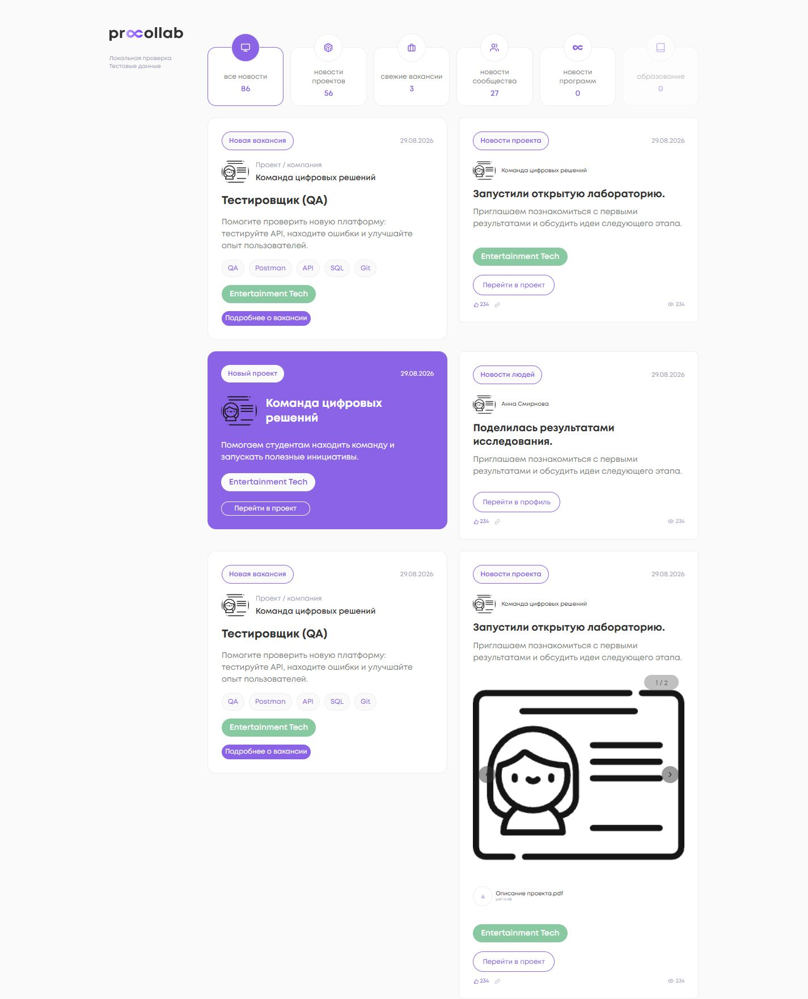
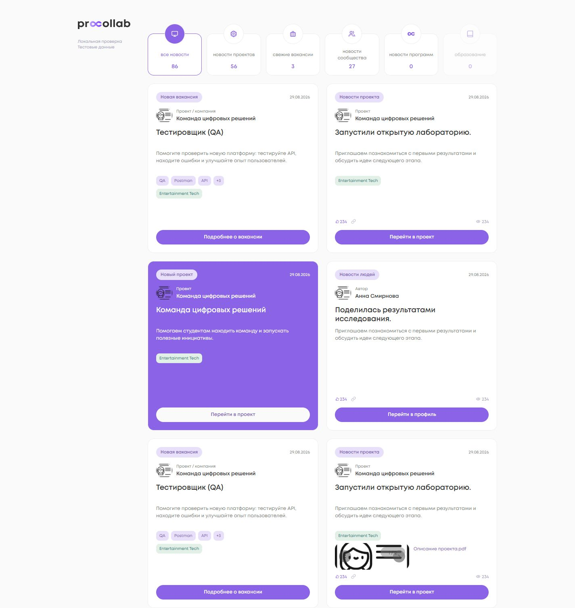
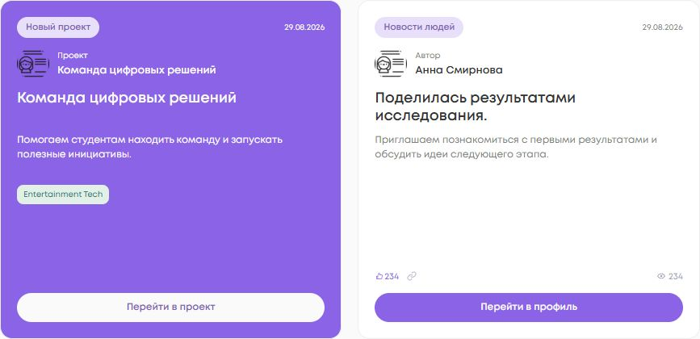
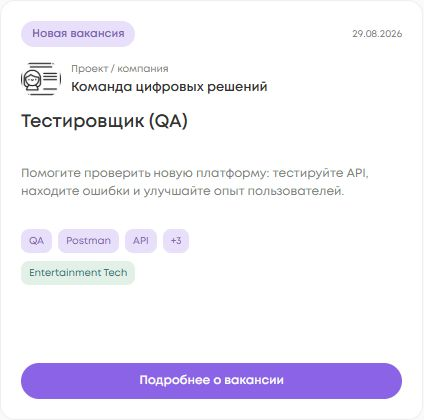
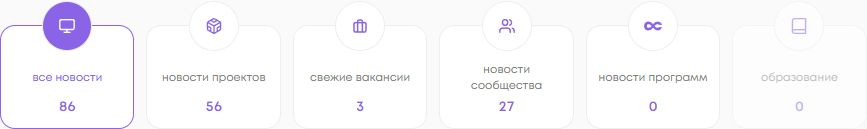
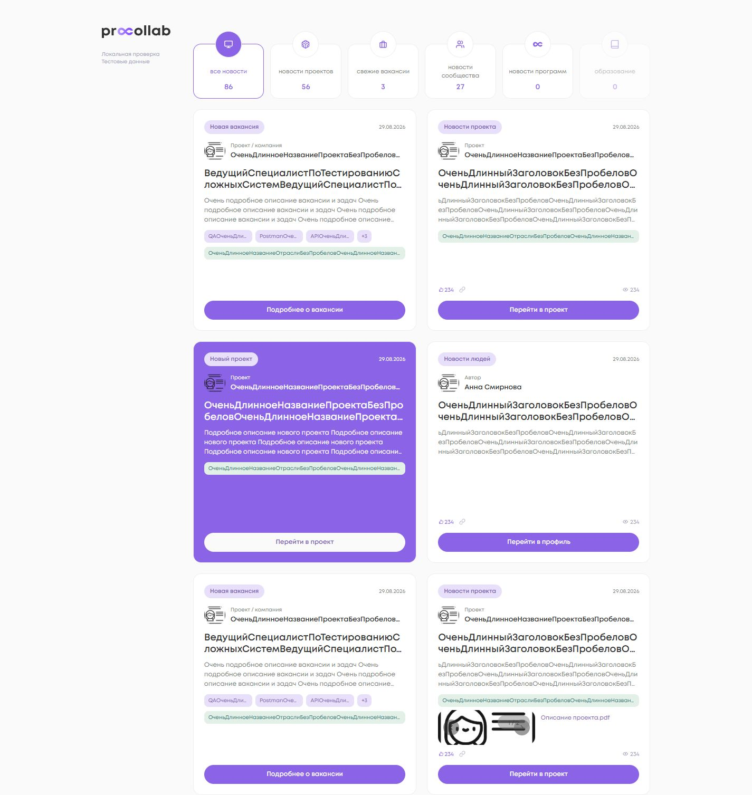
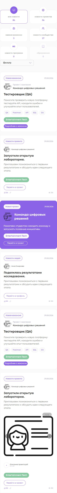
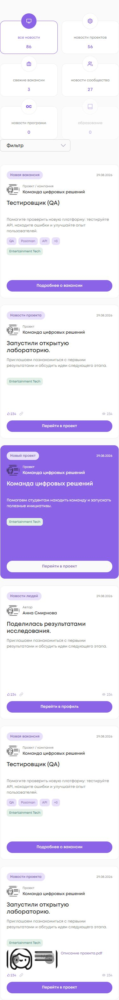

<!-- @format -->

# Единая визуальная система карточек ленты

## Восстановление прерванной задачи

База: `d4708cbc9ca7afbd245a4ff29940e2ab5dae0304` — актуальный `origin/dev` после #372; повторный fetch перед публикацией подтвердил тот же SHA.
Ветка: `fix/dev-feed-card-visual-system`.

Проверены status, staged/unstaged diff, последние 20 коммитов, локальные worktree, remote refs и PR.
На remote изменений этой визуальной задачи нет. Найденный #372 уже merged; отдельного Draft PR или незавершённой remote-реализации этого ТЗ не было.
Незакоммиченные изменения другого ПК недоступны; их содержимое не восстанавливалось предположениями.
Чужие изменения в основном checkout и старых worktree оставлены как есть. Merge/rebase в процессе не обнаружены.

На момент аудита:

- **Готово:** #372 — row order, `limit=6`, append, ключ `typeModel:id`, категории, counts, published_at, маршруты и разбиение текста новости.
- **Частично:** badges/date/source/CTA уже присутствовали, но высоты, типографика и линия счётчиков расходились.
- **Не сделано:** общая геометрия, иерархия вакансии, ограничение списка навыков, адаптивные замеры и визуальная приёмка.

Продолжена только визуальная часть от последней доступной DEV-базы. Уже готовая логика #372 не переписывалась.

## Реализация и соответствие ТЗ

| Пункты ТЗ  | Результат                                                                                                                                                                                                                    |
| ---------- | ---------------------------------------------------------------------------------------------------------------------------------------------------------------------------------------------------------------------------- |
| 2–6, 10–13 | Общий SCSS mixin: высота 420 px, padding 20 px, одинаковое скругление и строки type/date → источник → заголовок → описание → metadata → CTA. Четыре типа сохраняют свои данные и ссылки; фиолетовый «Новый проект» сохранён. |
| 7–9, 19    | Заголовок вакансии 18 px / 600, описание 12 px / 3 строки, первые 3 навыка + остаток `+N`; industry — вторичный chip 24 px. Длинные строки ограничены clamp/ellipsis, полный источник и названия доступны через title.       |
| 14–16      | Все шесть desktop-фильтров используют одну сетку: область заголовка 32 px, count 18 px; count 14 px / 600, tabular numbers. Индивидуальных поправок для категорий нет.                                                       |
| 17–18      | Grid по строкам, две desktop-колонки, нечётная карточка слева. Сервисы, API, append, page size и ключи #372 неизменны.                                                                                                       |
| 20         | До 1000 px — одна колонка карточек. На 390 и 768 px высота также 420 px, горизонтальной прокрутки нет. Существующий мобильный фильтр сохранён.                                                                               |
| 21         | Нативные ссылки CTA, кнопки desktop-фильтров и лайка, semantic time, aria-pressed и focus-visible. CTA не вложены в другой интерактивный элемент.                                                                            |
| 22         | Backend, React, API-контракт, counts, published_at, категории, tracking, likes, маршруты, права, dependencies, workflows не менялись. «Программы»/«Образование» остаются значениями текущего контракта.                      |
| 23–25      | Targeted и full tests, реальный браузер с Angular-компонентами, обычный/длинный контент, desktop/tablet/mobile, screenshots и числовые замеры.                                                                               |

CTA высотой 36 px занимает всю ширину content area: «Подробнее о вакансии», «Перейти в проект», «Перейти в профиль».
Фиксированные строки защищают положение CTA даже при отсутствии metadata или коротком тексте. Высота не зависит от текста.

Новости вне ленты продолжают использовать прежний шаблон. Форма редактирования не получает фиксированную сетку preview.
В ленте сохранены существующие обработчики лайка/копирования, счётчик просмотров, carousel и ссылки на все файлы.
Для изображений ограничен только preview ленты через CSS custom property; остальные поверхности сохраняют естественную высоту.
Много файлов остаются доступны в ограниченной области вложений; карточка не растёт.

## Проверки

Среда: Windows, Node 20.20.2, npm ci по неизменённому lockfile.

| Команда                                              | Реальный результат                                                                             |
| ---------------------------------------------------- | ---------------------------------------------------------------------------------------------- |
| `npm ci`                                             | exit 0, dependencies/lockfile не менялись                                                      |
| Targeted, команда ниже                               | **27/27**, 12 файлов, exit 0                                                                   |
| `npm run test:ci`                                    | exit 1: NG0401 в setup до выполнения тестов, 382 файла                                         |
| Та же команда на чистой базе `d4708cbc…`             | exit 1: тот же NG0401 в setup, 381 файл, тесты не запускались; status чистый                   |
| `npm run test:ci -- --pool=forks`                    | **1752/1752**, 382 файла, exit 0; unhandled errors нет                                         |
| `npm run lint:ts`                                    | exit 0, 0 errors, 6 существующих warnings об unused eslint-disable в logger/chat/message-input |
| Scoped Prettier                                      | exit 0                                                                                         |
| Scoped Stylelint всех изменённых SCSS + нового mixin | exit 0                                                                                         |
| `npm run build:prod`                                 | exit 0; существующие Angular/Sass/CommonJS warnings                                            |
| `git diff --check`                                   | exit 0                                                                                         |

После небольшого уточнения шаблона редактора и его regression assertion targeted повторены: 27/27. Test setup, pool по умолчанию, skips/excludes и exit codes не менялись. Штатный `test:ci` **не объявляется зелёным**.

```powershell
npm run test:ci -- --pool=forks projects/social_platform/src/app/ui/pages/feed projects/social_platform/src/app/ui/widgets/news-card projects/social_platform/src/app/ui/widgets/feed-filter projects/social_platform/src/app/api/feed projects/social_platform/src/app/infrastructure/adapters/feed projects/social_platform/src/app/infrastructure/repository/feed
```

Покрытие: четыре badge/date, source/title/description/skills/industry/CTA, профильный маршрут, counts/единая DOM-структура, первые 6 + следующие 6 без перестановки DOM, совпадающие числовые ID разных типов, лайк/файлы, обычная карточка вне ленты и редактор.
Проверка реальной геометрии выполнялась в браузере, а не через jsdom.

Особенность локального Windows build: существующий `build:sprite` с одинарными кавычками генерирует пустой SVG sprite. Эта побочная генерация отменена только в рабочей копии; sprite и scripts не входят в diff. Для визуальных проверок использован исходный sprite из DEV. Это ограничение штатной локальной сборки, не исправление этой задачи.

## Браузерные замеры

Масштаб 100%, реальные Angular FeedComponent / OpenVacancy / NewProject / NewsCard / FeedFilter и штатный SCSS office shell.
Только синтетические локальные данные; авторизация и живой backend не использовались. Это проверка UI, не live DEV end-to-end.
На всех размерах проверены четыре типа, длинные названия без пробелов, длинные описание/новость/industry и 6 навыков.

| Viewport   | Колонки | Все карточки W × H, px | Y шести counts                 | Y CTA по рядам                         |
| ---------- | ------- | ---------------------- | ------------------------------ | -------------------------------------- |
| 1440 × 900 | 2       | 423.328125 × 420       | 156, 156, 156, 156, 156, 156   | 570 / 1010 / 1450                      |
| 1280 × 800 | 2       | 423.328125 × 420       | 156, 156, 156, 156, 156, 156   | 570 / 1010 / 1450                      |
| 1024 × 768 | 2       | 368.75 × 420           | 156, 156, 156, 156, 156, 156   | 570 / 1010 / 1450                      |
| 768 × 1024 | 1       | 753 × 420              | 138, 138 / 272, 272 / 406, 406 | 878 / 1318 / 1758 / 2198 / 2638 / 3078 |
| 390 × 844  | 1       | 375 × 420              | 138, 138 / 272, 272 / 406, 406 | 878 / 1318 / 1758 / 2198 / 2638 / 3078 |

Координаты относительно документа локального fixture; scrollbar занимает 15 px. На desktop расхождение высот, widths и CTA внутри ряда — **0 px**. На mobile/tablet counts совпадают внутри каждого ряда фильтров. Длинный контент не изменяет эти значения. Горизонтального overflow нет.

До правки при 1440 × 900: высоты карточек 392.59375 / 362.296875 / 314.59375 / 332.59375 / 392.59375 / 790.625 px. Counts Y: 147.390625 / 155.1875 / 147.390625 / 155.1875 / 155.1875 / 147.390625.
Сырые замеры: [geometry.json](geometry.json). Во всех карточках padding 20 px, radius 15 px, badge 26 px, CTA 36 px; вложенных интерактивных элементов 0 — [style-receipt.json](style-receipt.json).

Также проверено в браузере:

- Пятая карточка нечётного набора остаётся слева (X=365.828125), высота 420 px.
- Лайк в fixture: `aria-pressed=true → false`, `234 → 233` без перезагрузки, через прежний output/state.
- CTA href: vacancy `/office/vacancies/1`; project `/office/projects/51`; new project `/office/projects/1`; people `/office/profile/42`.
- Tab переводит фокус на нативную ссылку; `:focus-visible=true`, outline solid.
- Новость с изображениями и файлом: 420 px, overflow отсутствует, изображение загружено, ссылка download сохранена.
- Enter на кнопке фильтра переключает его active/aria-pressed через прежний обработчик.
- Console errors при smoke не обнаружены.

Не проверялись: реальные backend-запросы, авторизованный live DEV, отправка лайка на сервер, реальное скачивание/clipboard и открытие detail-страниц. Их обработчики/маршруты не менялись. Общая логика переключения изображений carousel не изменялась; отдельная её функциональная приёмка не выполнялась.

## Скриншоты

Полная лента до / после:




Первый и второй ряды:




Крупные планы:




Длинный контент и mobile:





Дополнительно: [1024 px](screenshots/desktop-1024-after.png), [1280 px](screenshots/desktop-1280-after.png), [tablet](screenshots/tablet-long.png), [mobile long](screenshots/mobile-long.png), [focus](screenshots/keyboard-focus.png), [вложения](screenshots/news-attachments.png).

Крупные планы сняты с теми же реальными компонентами и шириной 423.328125 px: локальный fixture сдвигает canvas к началу viewport для нативного crop. Масштаб и размеры карточек не меняются. Полные страницы сняты без такого сдвига.

## Воспроизводимость

Временный fixture не включён в приложение и не добавляет route в продукт. Его исходники приложены как `.txt`:
`preview-main.ts.txt`, `preview-tsconfig.json.txt`, `preview-index.html.txt`, `serve-preview.py.txt`.
Скопировать их в игнорируемый `tmp/` как `surface-main.ts`, `surface-tsconfig.json`, `surface-index.html`, `serve-preview.py`.

```powershell
npx ng build social_platform --configuration=development --browser tmp/surface-main.ts --ts-config tmp/surface-tsconfig.json --index tmp/surface-index.html --output-path tmp/preview
Copy-Item tmp/preview/browser/surface-index.html tmp/preview/browser/index.html
# Запустить приложенный HTTP helper из tmp/preview/browser с абсолютным путём к скрипту.
# /office/feed — 6 карточек; ?long — длинный контент; ?odd — 5 карточек.
# ?crop=vacancy / ?crop=row2 / ?crop=filter — крупные планы при 1440×900.
```

Базовый preview построен до правок компонентов из exact DEV; текущий — из этой ветки. API-слой заменён только в локальном fixture; приложение использует прежние сервисы.

## Изменённые файлы

- `ui/pages/feed/feed.component.scss` и новый `feed.component.spec.ts`: breakpoint и защита порядка/ключей DOM.
- `ui/pages/feed/open-vacancy/open-vacancy.component.{html,scss,ts,spec.ts}`: иерархия вакансии и нативный CTA; TS — только удаление неиспользуемого импорта ButtonComponent.
- `ui/pages/feed/new-project/new-project.component.{html,scss,ts,spec.ts}`: общая геометрия и нативный CTA; TS — только удаление того же импорта.
- `ui/widgets/feed-filter/feed-filter.component.{html,scss,spec.ts}`: одинаковая область названия/count и native buttons.
- `ui/widgets/news-card/news-card.component.{html,scss,spec.ts}`: локальная ветка preview ленты и регрессионные проверки.
- `ui/widgets/news-card/carousel/carousel.component.scss`: опциональная высота через CSS variable только для preview ленты.
- `projects/social_platform/src/styles/_feed-card.scss`: общая геометрия и типографика.
- `docs/feed-card-visual-system/`: этот отчёт, замеры, fixture и скриншоты.

Пути `ui/...` относятся к `projects/social_platform/src/app/`. FeedComponent TS/HTML, NewsCard TS, весь API/domain/infrastructure и остальные страницы не изменены.
