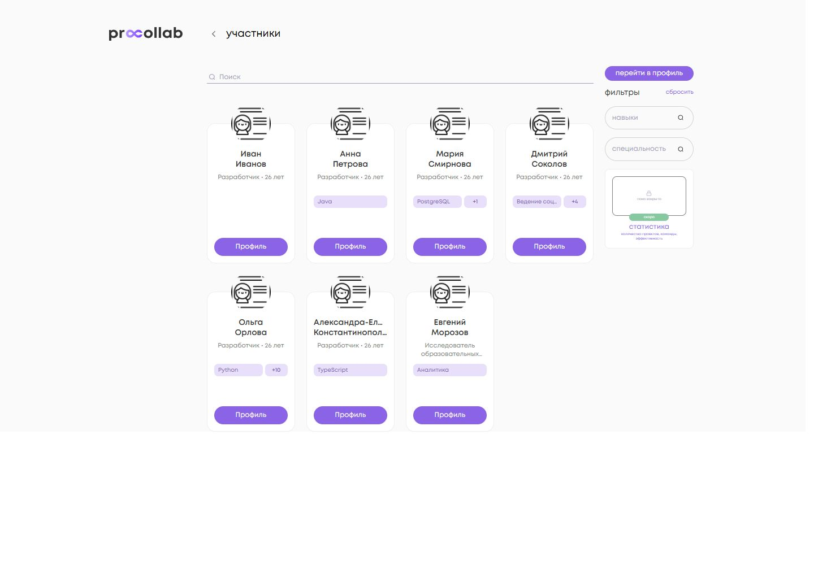
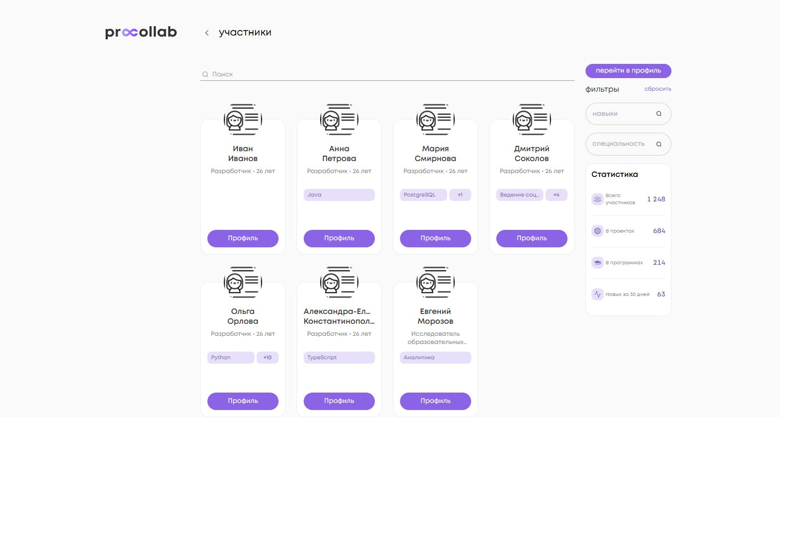
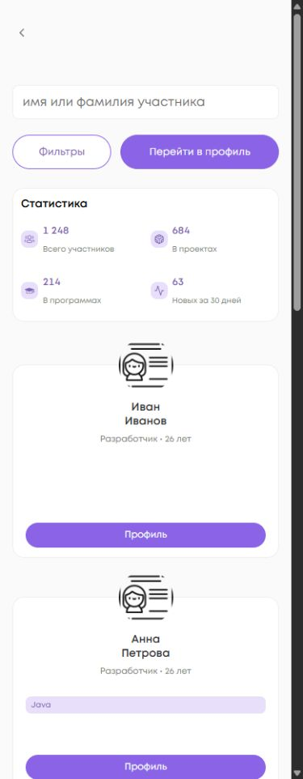

<!-- @format -->

# Статистика участников: DEV

База Angular: `96a7a676f7d47194fa105fb1748a5bfc28b5b544`.
База backend: `caea57a7c6f2869e7f2522e37c8fc395569b030c`.

## Данные и архитектура

Отдельный `GET /auth/public-users/stats/` возвращает `total`, `in_projects`,
`in_programs`, `new_last_30_days`. Общий CamelcaseInterceptor преобразует имена
в `total`, `inProjects`, `inPrograms`, `newLast30Days`; преобразование проверено
интеграционным тестом через настоящий interceptor, adapter, repository и use-case.

Все метрики относятся к активным legacy `CustomUser` с `user_type=MEMBER`:

| Подпись          | Определение backend                                                                            |
| ---------------- | ---------------------------------------------------------------------------------------------- |
| Всего участников | Число активных MEMBER                                                                          |
| В проектах       | Уникальные люди, являющиеся лидером или Collaborator проекта с `draft=False`, `is_public=True` |
| В программах     | Уникальные люди с PartnerProgramUserProfile программы с `draft=False`                          |
| Новых за 30 дней | `datetime_created >= timezone.now() - timedelta(days=30)`, включая границу                     |

Агрегация выполняется на сервере одним SQL-запросом; количество проверено для
10/100/1000 пользователей и множественных связей. Параметры поисковой выдачи не
передаются в endpoint. Миграций нет; React-модели не используются.

Цепочка: `MemberStatistics` → `MemberRepositoryPort` → `MemberHttpAdapter` →
`MemberRepository` → `GetMemberStatisticsUseCase` → `MemberStatisticsFacade` →
`MemberStatisticsCardComponent`.

Репозиторий проверяет четыре неотрицательных целых числа. Ошибочный контракт или
сетевая ошибка не превращаются в нули. Facade предоставляется на уровне страницы,
делает один запрос при открытии и отписывается при уничтожении страницы.
Поиск, фильтры, пагинация и смена layout не обновляют глобальные счётчики.

Loading/error показывают четыре прочерка и безопасный `role=status`; реальный ноль
остаётся `0`. HTTP body не попадает в UI. Числа форматируются через `ru-RU`, разряды
разделены неразрывными пробелами. Новых зависимостей и постоянного polling нет.

## Геометрия и responsive

Проверка выполнена в локальном браузере на реальных Angular-компонентах страницы и
office-оболочке, с одинаковыми синтетическими участниками до/после. Снимки не
представляют реальные данные DEV. Масштаб страницы одинаков; размеры ниже — CSS px.

| Viewport | Sidebar | Статистика | X сетки до → после      | Переполнение по X |
| -------- | ------- | ---------- | ----------------------- | ----------------- |
| 1440     | 157     | 157 × 280  | 365.828125 → 365.828125 | 0                 |
| 1280     | 157     | 157 × 280  | 285.828125 → 285.828125 | 0                 |
| 1024     | 157     | 157 × 280  | 201.5 → 201.5           | 0                 |
| 768      | нет     | 721 × 172  | compact layout          | 0                 |
| 414      | нет     | 367 × 172  | compact layout          | 0                 |
| 390      | нет     | 343 × 172  | compact layout          | 0                 |
| 375      | нет     | 328 × 172  | compact layout          | 0                 |

На desktop фильтры, кнопка профиля и аватар первой карточки сохраняют прежние
координаты. Карточка участника остаётся 156 × 248 px, аватар — 70 × 70 px.
Sidebar не расширяется; растёт только высота заменённой заглушки статистики.

Ниже 1000 px порядок: поиск → действия → статистика 2 × 2 → список.
Высота статистики одинакова при loading/error/zero/success: 280 px desktop,
172 px compact. Проверены 0, 9, 63, 999, 1248, 12345, 12500, 999999.
Все значения находятся внутри карточки. Длинные подписи при экстремальных значениях
переносятся, число не переносится. Исходные метрики: [geometry.json](geometry.json).

## Скриншоты

| Проверка                 | Снимок                                                                                                                                |
| ------------------------ | ------------------------------------------------------------------------------------------------------------------------------------- |
| Desktop до               | [1440](screenshots/before-desktop-1440.jpg), [1280](screenshots/before-desktop-1280.jpg), [1024](screenshots/before-desktop-1024.jpg) |
| Desktop после            | [1440](screenshots/after-desktop-1440.jpg), [1280](screenshots/after-desktop-1280.jpg), [1024](screenshots/after-desktop-1024.jpg)    |
| Крупный план             | [Фрагмент реального снимка 1440, увеличенный ×2](screenshots/statistics-closeup-157px.jpg)                                            |
| Большие числа            | [999 999](screenshots/large-values-999999.jpg)                                                                                        |
| Планшет                  | [768](screenshots/after-tablet-768.jpg)                                                                                               |
| Mobile и первая карточка | [414](screenshots/after-mobile-414.jpg), [390](screenshots/after-mobile-390.jpg), [375](screenshots/after-mobile-375.jpg)             |
| Состояния                | [Нули](screenshots/value-0-desktop.jpg), [Loading](screenshots/loading-desktop.jpg), [Ошибка](screenshots/error-desktop.jpg)          |

## Проверки 27.09.2026

Node 20.20.2, зависимости установлены через `npm ci`.

- Targeted: `npm run test:ci -- --pool=forks projects/social_platform/src/app/ui/pages/members projects/social_platform/src/app/api/member projects/social_platform/src/app/infrastructure/adapters/member projects/social_platform/src/app/infrastructure/repository/member` — **50/50**, 11 файлов.
- Full: `npm run test:ci -- --pool=forks` — **1819/1819**, 391 файл, exit 0;
  unhandled errors и ngx-autosize teardown error отсутствуют.
- `npm run lint:ts` — exit 0, шесть прежних предупреждений вне изменённых файлов.
- Scoped Stylelint двух затронутых SCSS — exit 0.
- Scoped Prettier изменённых файлов — exit 0.
- `npm run build:prod` — exit 0; остаются предупреждения Sass/CommonJS существующей сборки.
- `git diff --check` — exit 0.

Общий `npm run format:check` в Windows checkout с `core.autocrlf=true` сообщает
о CRLF в 1517 файлах; чистая DEV-база в том же режиме — 1524 файла.
Тот же check на чистом экспорте базы с LF проходит. Для итогового diff выполнен
отдельный check экспортированных с LF файлов; настройки форматирования, workflows
и чужие файлы ради этой особенности Windows не менялись.

В браузере нет console errors. Предупреждение NG0912 о двух существующих
IconComponent воспроизводится в исходной странице и в новой; shared-компоненты
ради него не менялись.

## Границы и будущий DEV-deploy

Заменён только SoonCard на странице Members. Общий SoonCard, карточки участников,
навыки, поиск, мобильное окно фильтров и остальные поверхности не изменены.
React, dependencies и workflows untouched. Merge/deploy не выполнялись.

Сначала потребуется backend с новым endpoint, затем Angular. При отсутствии
endpoint UI показывает безопасные прочерки. Live-проверка нового endpoint на
развёрнутом DEV не выполнялась: работа заканчивается двумя Draft PR.
