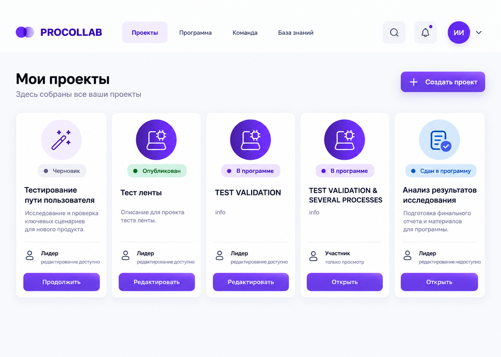
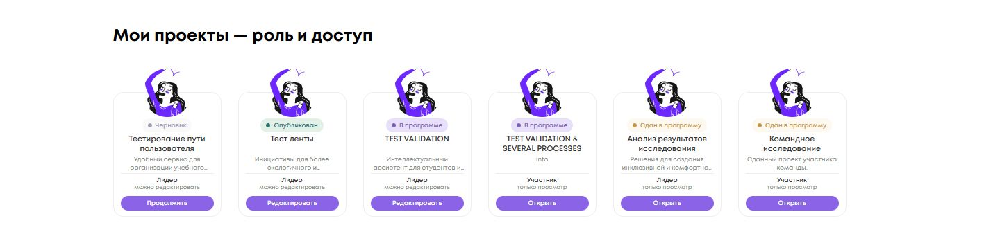
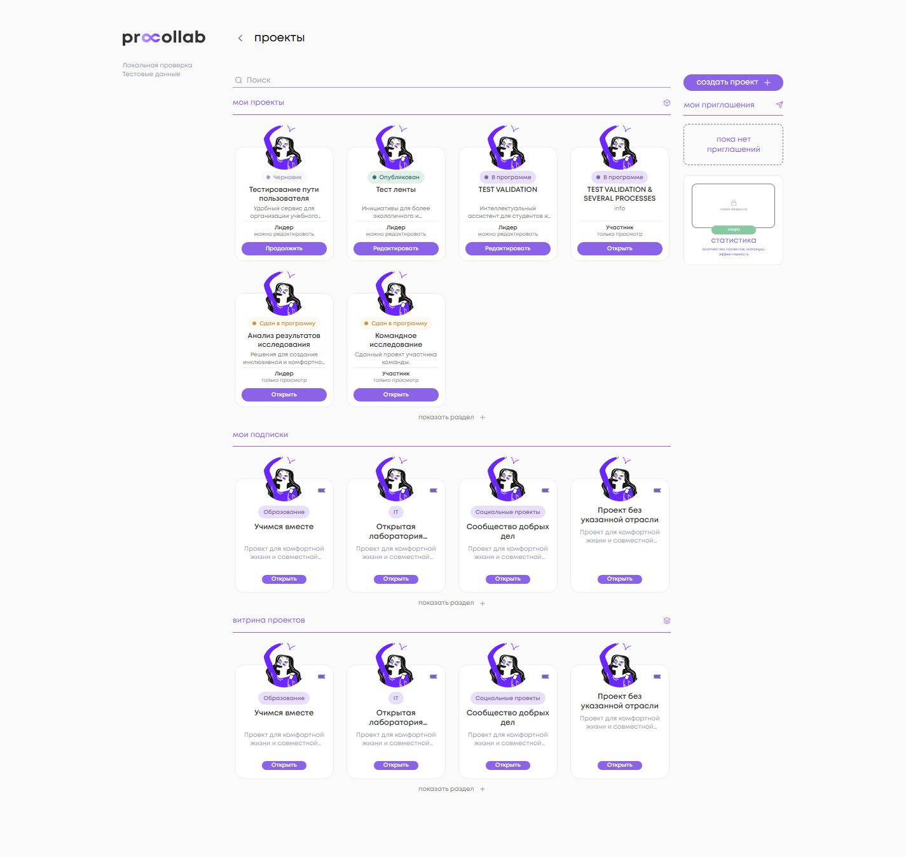
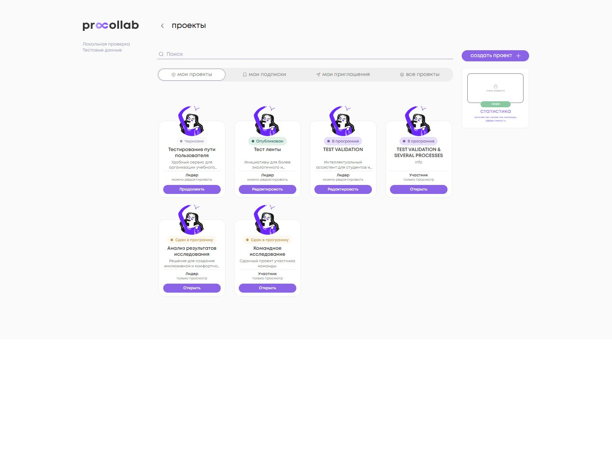
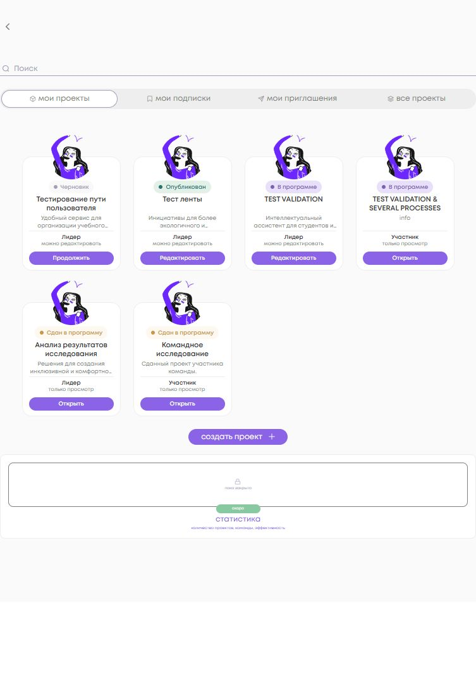
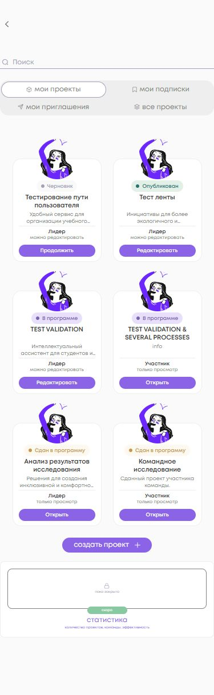
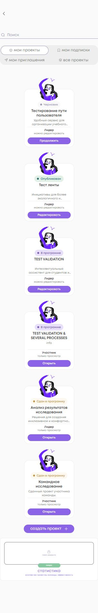
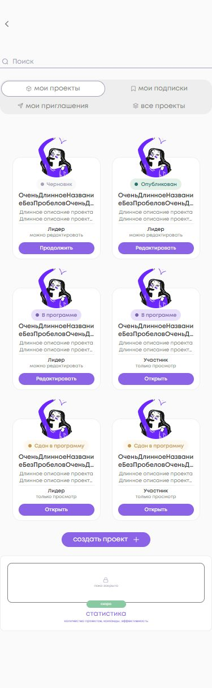

<!-- @format -->

# Роль и доступ в «Моих проектах»

База DEV после #358: `1b92bf0e8e05f1edd906195770ca8fa46ab8d95a`.
Точный head зафиксирован в описании PR.

## Данные и представление

`InfoCardComponent.myProjectPresentation` разделяет lifecycle и роль текущего
пользователя. Это представление существующего Angular list-контракта `Project`;
правила записи, API, guard и серверные права не меняются.

- Lifecycle: `partnerProgram.isSubmitted === true` → `draft === true` → наличие
  `partnerProgram` → опубликованный проект. `canSubmit` не обозначает факт сдачи.
- Текущий пользователь: `ProfileInfoService.profile()?.id`. Dashboard передаёт ID
  через `DashboardItemComponent`, полный список — непосредственно в `InfoCard`.
  Дополнительных запросов, чтения JWT и localStorage нет.
- Лидер: известный ID текущего пользователя строго совпадает с `project.leader`.
  Пока профиль не загружен, карточка показывает «Участник / только просмотр».
- Редактирование в представлении доступно только лидеру несданного проекта.
  Для сданного проекта лидер тоже видит «только просмотр».

| Проект               | Пользователь                   | Доступ              | CTA и маршрут                            |
| -------------------- | ------------------------------ | ------------------- | ---------------------------------------- |
| Черновик             | Лидер                          | можно редактировать | Продолжить → edit, `editingStep=main`    |
| Опубликован          | Лидер                          | можно редактировать | Редактировать → edit, `editingStep=main` |
| В программе, не сдан | Лидер                          | можно редактировать | Редактировать → edit, `editingStep=main` |
| Сдан в программу     | Лидер                          | только просмотр     | Открыть → detail, без query params       |
| Любой lifecycle      | Участник / профиль отсутствует | только просмотр     | Открыть → detail, без query params       |

Используются существующие `AppRoutes.projects.edit(id)` и
`AppRoutes.projects.detail(id)`. Внешняя ссылка вокруг my-карточки удалена в
dashboard и полном списке: CTA не вложен в `<a>` и выполняет один переход.
Guard редактора и проверки доступа не изменены.

Блок роли добавлен только для `type="projects"`, `appereance="my"`.
Подписки/витрина сохраняют отрасль и «Открыть», приглашения, участники, рейтинг
и пустые карточки не получают новый блок.

## Геометрия

Карточка остаётся **156×180 px**, аватар — **70×70 px**, CSS `top: -35px`.
Название центрировано: 11 px / 14 px, максимум две строки; полное значение
остаётся в DOM. Описание — 9 px / 12 px, две строки, `--grey-for-text`.

Внутри my-карточки уменьшены интервалы, а нижний блок имеет фиксированную
геометрию. Разделитель и role/access занимают 26 px; роль — 9 px, доступ — 8 px.
Иконка рядом с ролью не добавлена, чтобы сохранить читаемость в заданном размере.
CTA использует существующий `ButtonComponent`, `size="big"`, ширину 134 px
и фактическую высоту 21 px. Shared Button/Avatar не менялись.

Относительно верхнего края карточки role/access начинается на y=117 px,
CTA — на y=150 px. Это одинаково для коротких и длинных названий,
в dashboard и `/office/projects/my` при 1440, 768, 390 и 320 px.
Наложений карточек с учётом выступающих аватаров и горизонтального overflow нет.
Фактические проверки: [acceptance.json](acceptance.json).

В палитре есть только `--blue-dark`, без `--blue-light`. Поэтому для сдачи
использована разрешённая требованиями существующая пара `--gold-light/dark`.
Она отличается от фиолетового статуса «В программе». Lifecycle label теперь
«Сдан в программу»; правило определения сдачи сохранено.

## Визуальная приёмка

Скриншоты сделаны в браузере из реальных Angular-компонентов с тестовыми данными
через DI. На странице используются существующие dashboard/list, навигация,
карточки и стили. Внешняя боковая навигация preview упрощена. Стенд не обращается
к backend и не изменяет пользовательские данные. Это локальная UI-проверка,
а не авторизованная проверка развёрнутого DEV.

Шесть состояний сняты отдельно в одной строке для сравнения с референсом;
это те же `InfoCardComponent` без изменения их размеров или CSS.
В fixture используются существующие изображения проекта.

### Выбранный референс

### Шесть состояний реализации

### Dashboard и полный список

### Адаптивность и длинные тексты

Клавиатурный Enter по «Продолжить» приводит на существующий путь edit проекта
101 с `editingStep=main`; CTA участника — на detail проекта 105 без параметров.
Целевые страницы в стенде заменены диагностическим выводом маршрута: сохранение
проекта и авторизованный доступ на DEV в этой задаче не проверялись.
Ошибок консоли в проверенном UI нет. Неизвестный пользователь во всех карточках
получает только просмотр. Подписки и all не содержат role/access и сохраняют CTA.

## Проверки

Node **20.20.2**, npm **10.8.2**.

| Команда                                                                                                                     | Результат                                                       |
| --------------------------------------------------------------------------------------------------------------------------- | --------------------------------------------------------------- |
| `npm ci`                                                                                                                    | exit 0                                                          |
| `npm run format:check`                                                                                                      | exit 0                                                          |
| `npm run lint:ts`                                                                                                           | exit 0; шесть существующих предупреждений вне изменённых файлов |
| `npx stylelint projects/social_platform/src/app/ui/widgets/info-card/info-card.component.scss`                              | exit 0                                                          |
| `npx vitest run --pool=forks info-card projects/list/list.component.spec.ts projects/dashboard/dashboard.component.spec.ts` | 38/38, три файла, exit 0                                        |
| `npm run test:ci`                                                                                                           | exit 1, NG0401 в setupTestBed до выполнения тестов, 371 файл    |
| `npm run test:ci -- --pool=forks`                                                                                           | 371 файл, 1689/1689 тестов, exit 0; unhandled errors нет        |
| `npm run build:prod`                                                                                                        | exit 0; существующие Sass/CommonJS warnings                     |
| `git diff --check`                                                                                                          | exit 0                                                          |

NG0401 штатного пула относится к ранее зафиксированному baseline; harness
не менялся, тесты не исключались, ошибки не подавлялись. Дополнительный полный
forks-run выполнен по требованиям задачи.

**Backend untouched. React untouched. Permissions untouched.
Project lifecycle untouched. Card size unchanged.**
Зависимости, workflows, test setup, shared-компоненты и логика приглашений
не изменены. Merge/deploy не выполнялись.
