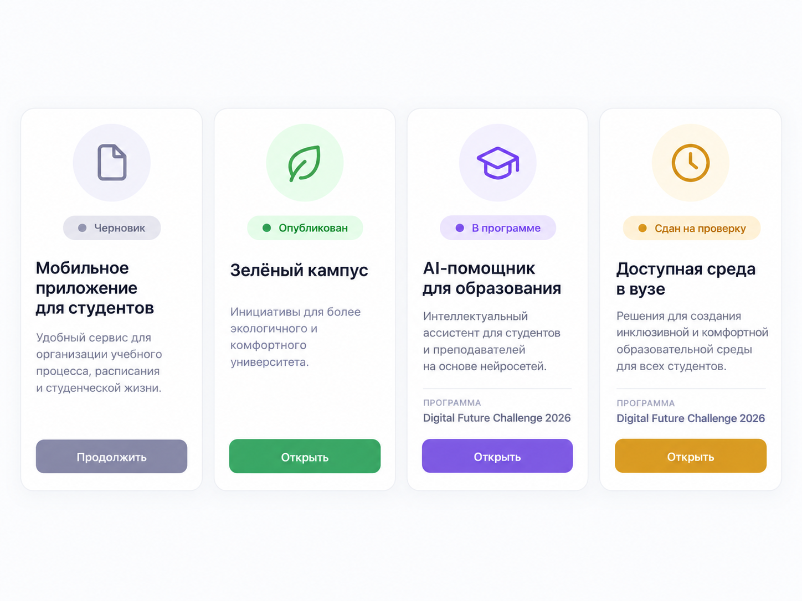
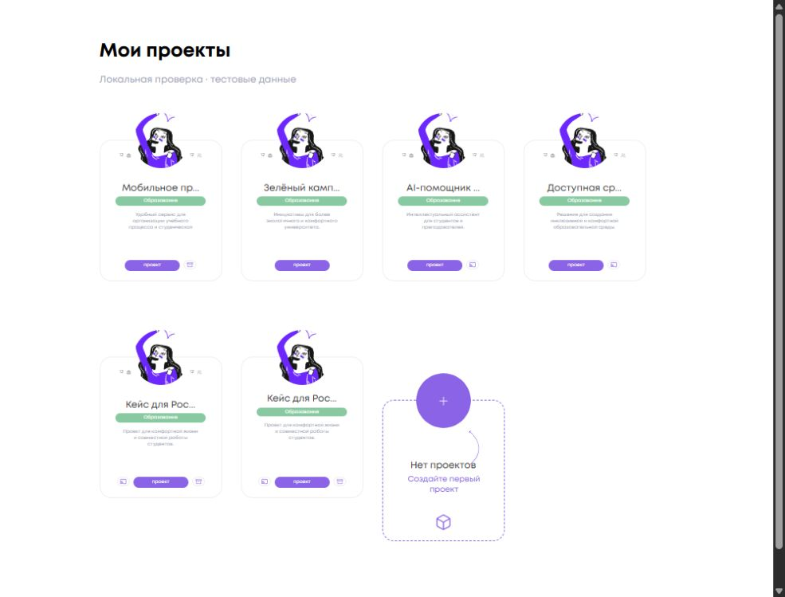
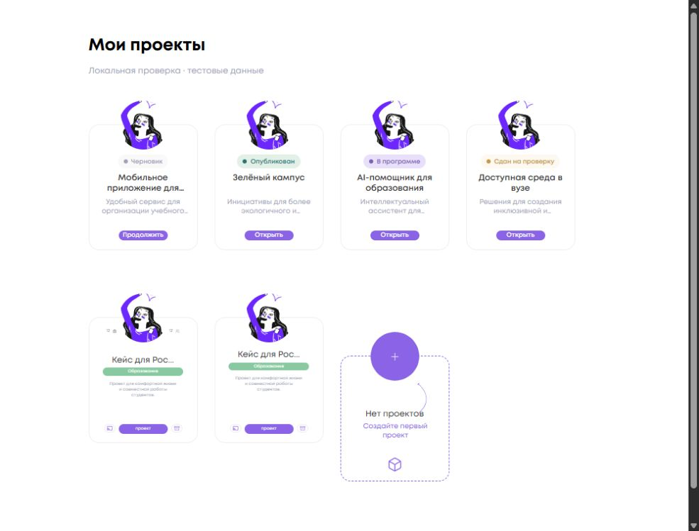

<!-- @format -->

# Статусы карточек «Мои проекты»

Изменение относится только к `InfoCardComponent` с `type="projects"` и
`appereance="my"`. База DEV: `42cbdd65117cc56beaa6069bcc061192df7733ce`.

## Источник статуса

Один `computed` использует существующий list-контракт `Project`, без новых запросов:

| Приоритет | Условие                                | Статус           | Действие   |
| --------- | -------------------------------------- | ---------------- | ---------- |
| 1         | `partnerProgram?.isSubmitted === true` | Сдан на проверку | Открыть    |
| 2         | `draft === true`                       | Черновик         | Продолжить |
| 3         | `partnerProgram` присутствует          | В программе      | Открыть    |
| 4         | Опубликованный проект без программы    | Опубликован      | Открыть    |

Это отображение уже полученного состояния. Приоритет сдачи действует и при
одновременном `draft=true`. Несданный черновик программы остаётся черновиком.
Имя программы не требуется: `PartnerProgramInfo` его не гарантирует.
Все CTA сохраняют `AppRoutes.projects.detail(project.id)`.

Вместо счётчиков, отрасли и мелких иконок отображается одна статусная плашка с
CSS-точкой и существующими цветовыми токенами. Название и описание сокращаются
после двух строк. Локальное исключение Stylelint сохраняет `display: -webkit-box`,
необходимый для двухстрочного ellipsis: удаление префикса ломает сокращение.

## Визуальная проверка

Локально собран настоящий Angular-компонент с фикстурами из
`info-card.fixture.ts` и заменёнными репозиториями. Это проверка UI на тестовых
данных; авторизованная страница DEV и реальные проекты не использовались.
Референс определяет иерархию, но не размеры. Аватары и кнопки сохранены штатными.

Сравнение DOM при одинаковом viewport **1000×760**, `devicePixelRatio=1`:

| Элемент                                  | До                         | После                            |
| ---------------------------------------- | -------------------------- | -------------------------------- |
| `.card__body` каждой из четырёх карточек | 156×180 px                 | 156×180 px                       |
| Аватар                                   | 70×70 px, CSS `top: -35px` | 70×70 px, CSS `top: -35px`       |
| Фон карточки                             | Белый                      | Белый                            |
| Кнопка                                   | 70×13,796875 px            | 70×13,796875 px                  |
| Верх кнопки относительно карточки        | 153 px                     | 152 px                           |
| Статус                                   | Иконки и подсказки         | Плашка высотой 20 px             |
| Название                                 | Обрезка до 12 символов     | 12 px / 15 px, максимум 2 строки |
| Описание                                 | 6 px / 7,8 px              | 10 px / 13 px, максимум 2 строки |

Кнопка остаётся в прежней нижней области. Относительные размеры и позиции
содержимого `base`, `subs`, `empty` совпали до и после. Полные измерения:
[geometry-comparison.json](geometry-comparison.json).

Дополнительно проверены длинное название без пробелов и многократно повторённое
описание: четыре карточки сохраняют 156×180 px, название занимает 30 px, описание
26 px, виден ellipsis. CTA доступен с клавиатуры (`:focus-visible`).
Статусных tooltip в новой разметке нет. Ошибок браузера нет; предупреждение
`NG0912` о двух существующих `IconComponent` присутствует и в базовой сборке.

## Автоматические проверки

Node.js 20.20.2, локальная Windows-среда.

| Команда                                                                                        | Результат                                                                   |
| ---------------------------------------------------------------------------------------------- | --------------------------------------------------------------------------- |
| `npm ci`                                                                                       | exit 0                                                                      |
| `npm run format:check`                                                                         | exit 0                                                                      |
| `npm run lint:ts`                                                                              | exit 0; 6 предупреждений вне изменённых файлов                              |
| `npx stylelint projects/social_platform/src/app/ui/widgets/info-card/info-card.component.scss` | exit 0                                                                      |
| `npx vitest run --pool=forks info-card`                                                        | 15/15, exit 0                                                               |
| `npm run test:ci`                                                                              | exit 1: `NG0401` в `setupTestBed`, 370 файлов не дошли до выполнения тестов |
| `npm run test:ci -- --pool=forks`                                                              | 370 файлов, 1667/1667 тестов, exit 0; без unhandled errors                  |
| `npm run build:prod`                                                                           | exit 0; предупреждения сборки о Sass, budget и CommonJS                     |
| `git diff --check`                                                                             | exit 0                                                                      |

Штатный запуск `test:ci` не объявляется успешным: полный набор выполнен отдельно
в режиме `forks`. Конфигурация тестов, scripts и workflows не менялись.

Компонентные проверки покрывают четыре состояния, приоритеты, замену данных,
маршрут CTA, отсутствие лишних элементов, сохранение остальных вариантов и
действия пустой карточки. Фикстуры не входят в runtime-граф импортов приложения.

## Границы изменения

Backend и React не изменены. Размеры карточки не изменены. Подписки и витрина
сохраняют прежний вид; состояния их hover-подсказок оставлены в компоненте.
Не менялись lifecycle, публикация, сдача, права, приглашения, удаление, редактор,
страница проекта, shared Avatar/Button, routing, зависимости и workflows.
Merge и deploy в рамках задачи не выполнялись.
