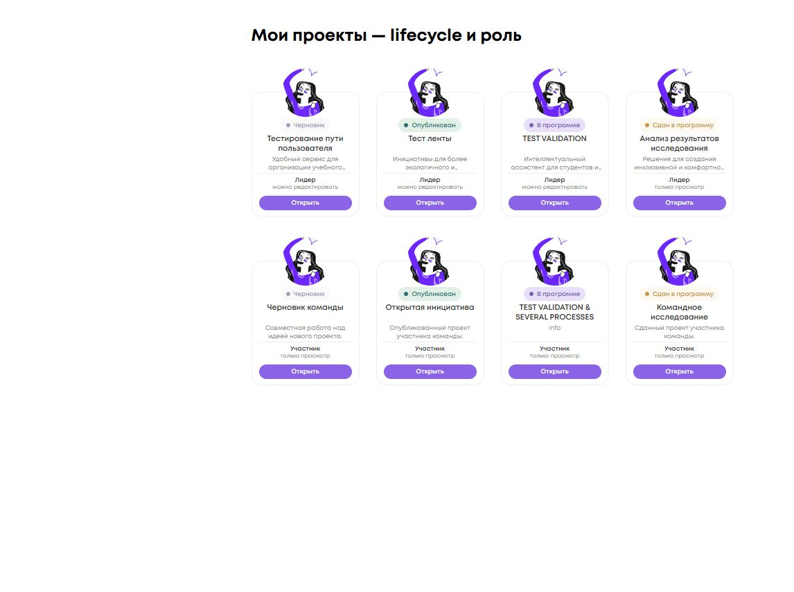
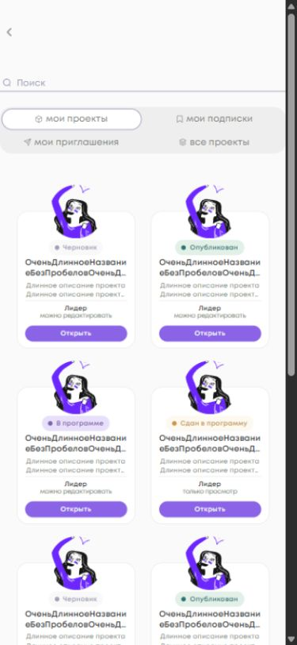

<!-- @format -->

# Выборочный перенос финальных карточек проектов на PROD

База master: `3890ee6ccb84bf92d215ea32b4316e3f52f1d404`.
Финальный DEV source: `683da4b9b30334bab4bd6c7a1afea3ddc91fe9ad`.

| DEV PR                                                         | Merge SHA                                  | Назначение                      |
| -------------------------------------------------------------- | ------------------------------------------ | ------------------------------- |
| [#357](https://github.com/PROCOLLAB-github/procollab/pull/357) | `918e30d54b3240078f8dda43c0fbc5761c011ae6` | Карточка и lifecycle            |
| [#358](https://github.com/PROCOLLAB-github/procollab/pull/358) | `1b92bf0e8e05f1edd906195770ca8fa46ab8d95a` | Общие поверхности списков       |
| [#359](https://github.com/PROCOLLAB-github/procollab/pull/359) | `ec822d13b4f55b0718335ac7f0f9e64d69ed05da` | Роль и доступ                   |
| [#360](https://github.com/PROCOLLAB-github/procollab/pull/360) | `358e818c7ebd8b7d5916e56167a402e2848177d6` | Единый CTA                      |
| [#361](https://github.com/PROCOLLAB-github/procollab/pull/361) | `69b37d12000b22fd09b77b5a35d95812bf6fbda5` | Независимость lifecycle от роли |
| [#362](https://github.com/PROCOLLAB-github/procollab/pull/362) | `683da4b9b30334bab4bd6c7a1afea3ddc91fe9ad` | Защита неполного контракта      |

## Состав переноса

Переносятся конечные изменения InfoCard, Dashboard/DashboardItem, ProjectsList,
адаптивной сетки и project-card контейнера ProgramList. Для этих 20 файлов
сравнены PROD master и DEV-база до #357 (`42cbdd65117cc56beaa6069bcc061192df7733ce`):
различие только в порядке двух SCSS-свойств. Поэтому итоговое содержимое выбранных
файлов совместимо с PROD без переноса остальных DEV-изменений.

Архивные макеты, промежуточные варианты и DEV merge commits не переносятся.
PROD editor, detail resolver, оценивание, прочие сервисы, React, workflows,
dependencies и test harness остаются на master-реализации.

## Инварианты

- Карточка 156 × 180 px, аватар 70 px; название и описание по центру, до двух строк.
- Lifecycle: submitted > draft > program > published, независимо от пользователя.
- Роль берётся из `Project.leader` и `ProfileInfoService.profile()?.id`.
- Редактирование обозначается только лидеру без связи или с явным `isSubmitted === false`.
  Неизвестный submission state даёт «только просмотр».
- CTA «Открыть» ведёт в detail; одна ссылка охватывает карточку и CTA.
  Подписка — отдельная кнопка вне ссылки; двойной навигации нет.
- Dashboard и полный список используют my/subs/base; all/subscriptions показывают
  отрасль и не получают lifecycle/роль собственного проекта.
- Приглашения сохраняют принятие/отклонение и идентичность по inviteId.
- Черновик серый, опубликованный зелёный, программа lilac/accent, сданный gold.

## Контракт и приёмка

Нужен backend port DEV #748: `partner_program` содержит `id`, `name`,
`program_link_id`, `program_id`, `is_submitted` той же min-PK связи, что в detail
для лидера/участника. Backend следует развернуть первым после отдельного разрешения.

Интеграционный тест передаёт сокращённый snake_case HTTP payload через настоящий
CamelcaseInterceptor, ApiService, adapter, repository и use case в InfoCard.
Проверяются сданный проект, неизвестное состояние, восемь сочетаний lifecycle/роли,
контексты Dashboard/List, маршруты, подписки и приглашения.

Проверки выполняются на PROD-ветке: targeted, полный `npm run test:ci`, format,
lint, scoped Stylelint, `build:prod`, diff-check. В master уже установлен `pool: forks`;
порт не меняет эту настройку и не подавляет ошибки.

Браузерный smoke использует локальную сборку настоящих компонентов с фикстурами,
без обращений к DEV/PROD и пользовательским данным. Он не заменяет авторизованную
live-проверку после отдельно разрешённого deploy. Здесь создаётся только Draft PR.

## Локальный visual smoke

Измерены reference, Dashboard и полные my/subscriptions/all при viewport 1440 × 900,
а также my с длинными строками при 390 × 844 и 320 × 844 (DPR 1).
Во всех случаях карточки 156 × 180 px, аватары 70 × 70 px; горизонтального overflow
и вложенных интерактивных элементов в project link нет. Восьми сочетаниям
lifecycle/роли соответствуют одинаковые подписи в Dashboard и полном списке.

Tab выделяет следующую ссылку рамкой 2 px; Enter показывает detail-placeholder
проекта 102. Это локальный TestBed-маршрут, не live detail. Console: ошибок нет,
есть предупреждение NG0912 о двух IconComponent в preview. Подписки и приглашения
дополнительно проверены компонентными тестами с настоящими DOM-действиями.

Замеры: [geometry.json](prod-project-cards/geometry.json).

