<!-- @format -->

# PROD: читаемость карточек и обновление подписки

База `origin/master`: `26ef957fc254895bc472af960c31a368cd0cfa36`.
Ветка: `release/prod-project-cards-readability-subscription`.

Селективно перенесены изменения Angular DEV:

- #364, merge `0ffe6c9e3c01016cdc01824e93656fff775f43a6`;
- #365, merge `4921ad4a2d1c5d9ee44ec62bdb4f1b5e1e13e728`.

DEV не объединялся с master. Перенесены только изменения `InfoCardComponent`
и его асинхронный regression spec. Файлы TS, HTML и нового spec совпадают
с соответствующими файлами #365; SCSS адаптирован под требования PROD.

## Поведение и ограничения

Название и описание расположены ближе; короткое название больше не резервирует
пустую вторую строку. Публичный CTA шире и крупнее. Текст, имя и кнопки приглашений
увеличены в списке и в правом dashboard-виджете. Карточка сохраняет 156×180 px.

После успешного API-ответа `markForCheck()` уведомляет OnPush-представление:
закладка закрашивается без reload, успешная отписка снимает закладку и закрывает
modal после одного подтверждения. При ошибке сохраняются прежняя подписка
и возможность повторить отписку. Это исправляет обновление обычных полей
в zoneless-приложении; публичный Input, use cases и события не меняются.

Отличие от DEV #365: **отрасль 11 px / font-weight 400**. Вес указан явно и для
`.card__context--industry`, и для `.card--invite .card__industry`.
Сохранены фон, улучшенный контраст, ellipsis и полный текст в `title`.
Вес lifecycle, роли, названия и CTA не менялся.

По требованию сохранить CTA «Моих проектов» оставлены исходные PROD 9 px / 11 px
для его текста; размеры и положение кнопки совпали с базой. Увеличение публичных
кнопок не затрагивает это исключение.

Lifecycle, роль, доступ, маршруты, права, данные, действия приглашений,
AddProjectSubscriptionUseCase, DeleteProjectSubscriptionUseCase, API и shared modal
сохранены. Статистика не редизайнилась, корзина не добавлялась.
Backend, React, DEV, dependencies, lockfile, test harness и workflows не менялись.
Merge и deploy не выполнялись.

## Проверки

Node 20.20.2, npm 10.8.2, Windows; зависимости установлены через `npm ci`.
PROD уже содержит `pool: "forks"`, конфигурация тестов не изменялась.

| Проверка                                 | Результат                                           |
| ---------------------------------------- | --------------------------------------------------- |
| Targeted InfoCard/List/Dashboard/Invites | 107/107, 16 файлов, exit 0                          |
| Полный `npm run test:ci`                 | 1814/1814, 380 файлов, exit 0; unhandled errors нет |
| `npm run format:check`                   | exit 0                                              |
| `npm run lint:ts`                        | exit 0; 6 существующих предупреждений вне diff      |
| Scoped Stylelint                         | exit 0                                              |
| `npm run build:prod`                     | exit 0; существующие Angular/Sass/CommonJS warnings |
| `npm run build:pr`                       | exit 0; проверка по инструкции репозитория          |
| `git diff --check`                       | exit 0                                              |

```text
npm run test:ci -- projects/social_platform/src/app/ui/widgets/info-card projects/social_platform/src/app/ui/pages/projects/list projects/social_platform/src/app/ui/pages/projects/dashboard projects/social_platform/src/app/api/invite projects/social_platform/src/app/ui/pages/projects/edit/components/project-team-step/invite-card
npm run test:ci
npm run format:check
npm run lint:ts
npx stylelint projects/social_platform/src/app/ui/widgets/info-card/info-card.component.scss
npm run build:prod
npm run build:pr
git diff --check
```

Новый spec из #365 проверяет отложенный ответ без ручного `detectChanges()` после
него: подписка, снятие подписки и закрытие modal, ошибки и retry для base/subs.
Существующие тесты проверяют lifecycle, роль, доступ, переходы и inviteId действий.

Первый format-check свежего worktree обнаружил CRLF из локального Git checkout.
Окончания строк нормализованы только в изолированном PROD-worktree, без изменения
содержимого файлов и без массового форматирования постороннего кода.

Windows-скрипт `build:sprite` создаёт пустой tracked SVG из-за обработки кавычек
в glob. Его побочный результат восстановлен из HEAD и не включён в PR; preview
использует исходный спрайт. Скрипты сборки и зависимости не изменялись.

## Visual acceptance

Проверены настоящие Angular-компоненты на локально собранном PROD-коде.
Оболочка и данные тестовые, ответ use case задержан на 700 мс.
Live PROD API, авторизация и реальные данные пользователей не проверялись
и не изменялись. Ошибки API покрыты асинхронными unit-тестами.

- Dashboard, подписки, витрина и приглашения: desktop 1440×900,
  tablet 768×1024, mobile 390×844. Горизонтального overflow нет.
- У всех проверенных отраслей computed style — **11 px / 400**.
  Длинные значения сокращаются многоточием с полным `title`.
- Все карточки — **156×180 px**. Dashboard: расположение карточек, статистика
  и CTA «Моих проектов» совпали до/после.
- Subscribe обновил закладку без reload. Одно подтверждение unsubscribe закрыло
  modal и сняло закладку на обеих вкладках; Enter также проверен.
- Кнопки приглашения передали прежние действия `accept:801`, `reject:802`
  в тестовый обработчик, без перехода со списка.
- Console errors отсутствуют. Локальная оболочка выводит одинаковый до/после
  NG0912 о дублировании IconComponent; это не исправлялось в данном переносе.

Подробные измерения и результаты: [browser-acceptance.json](browser-acceptance.json).

## Скриншоты

| Поверхность                    | Desktop                               | Tablet                              | Mobile                              |
| ------------------------------ | ------------------------------------- | ----------------------------------- | ----------------------------------- |
| Dashboard и правое приглашение | 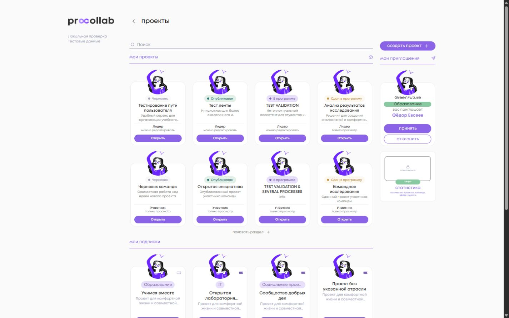       | 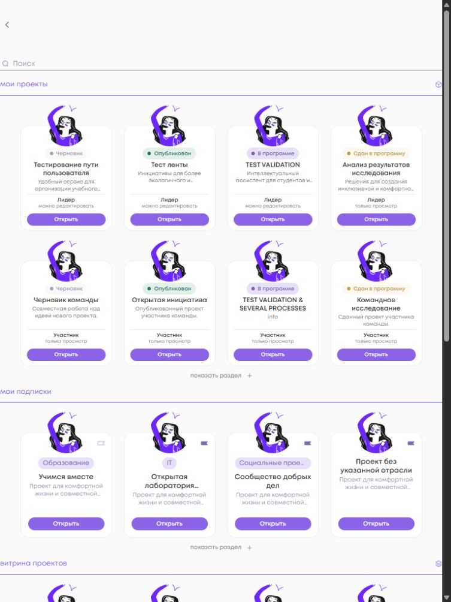     | 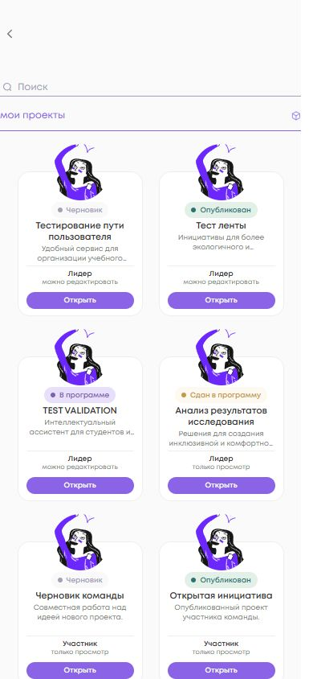     |
| Мои подписки                   | 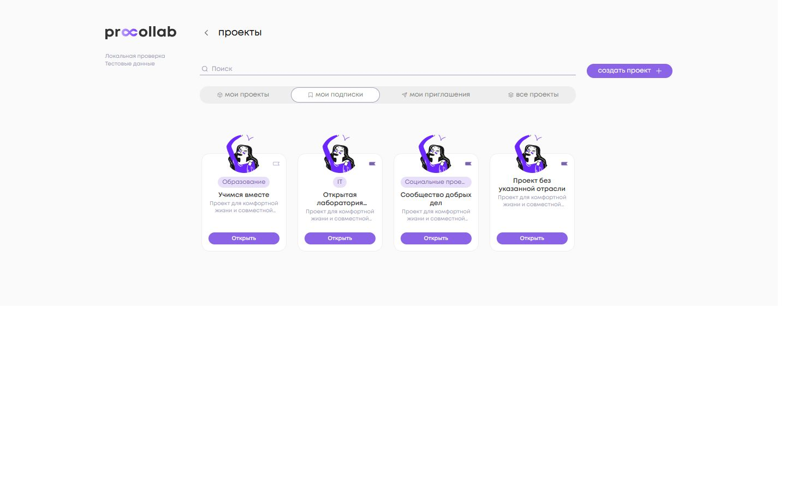 | 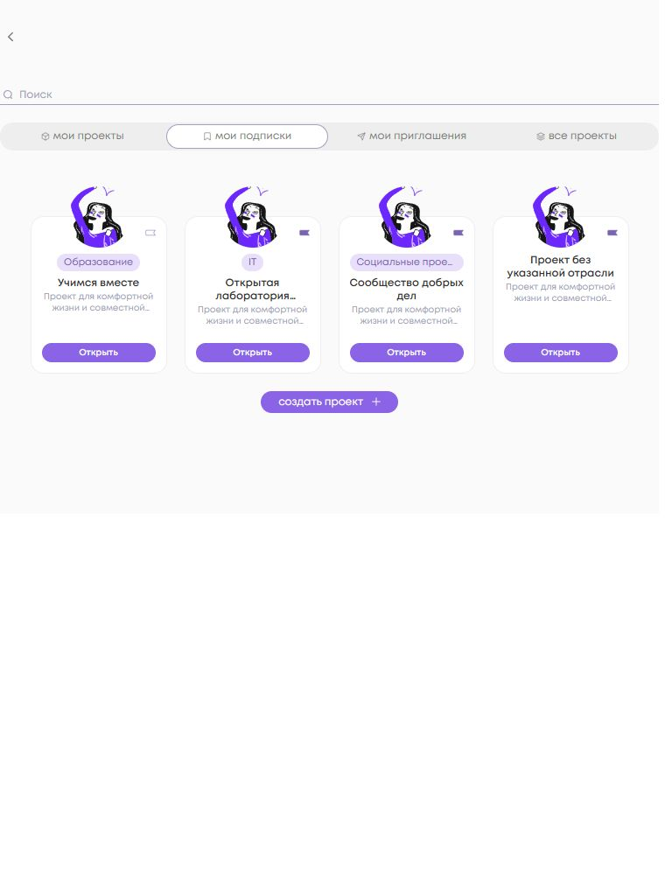 | 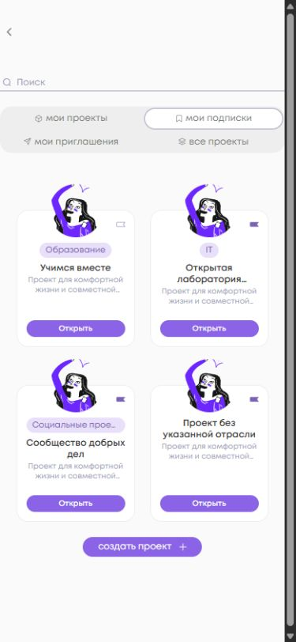 |
| Все проекты                    | 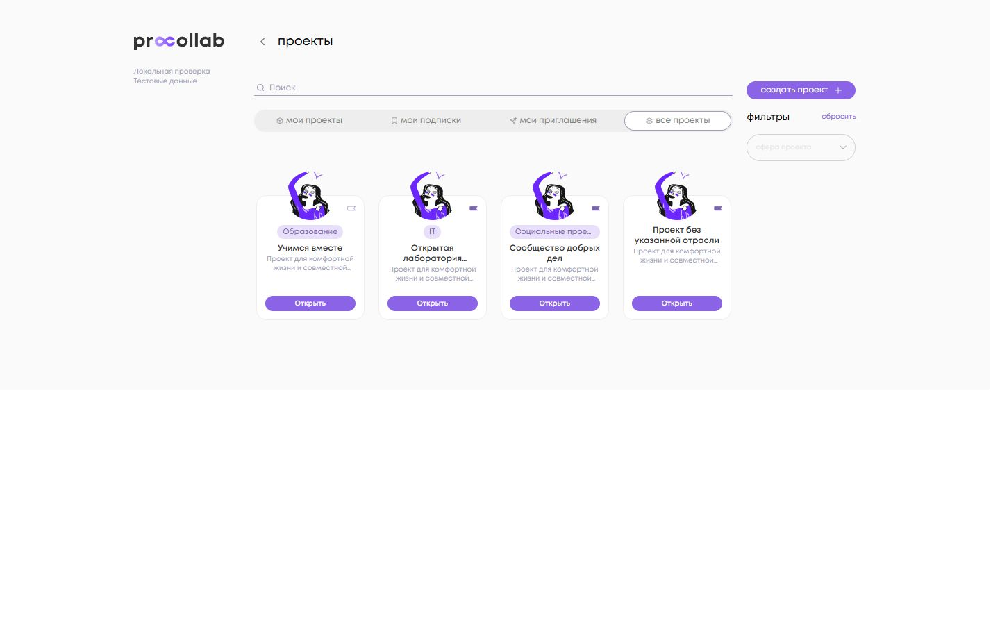           | 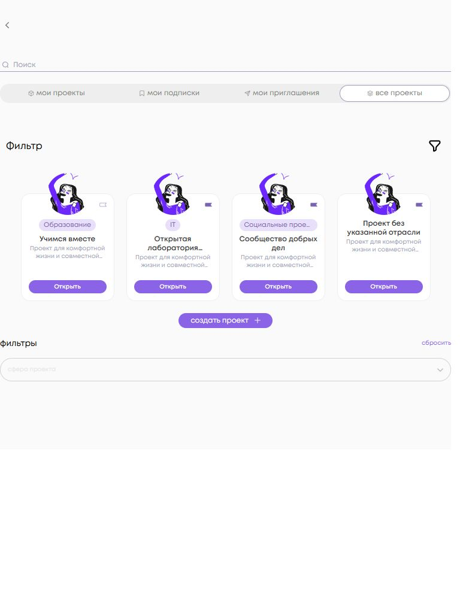           | 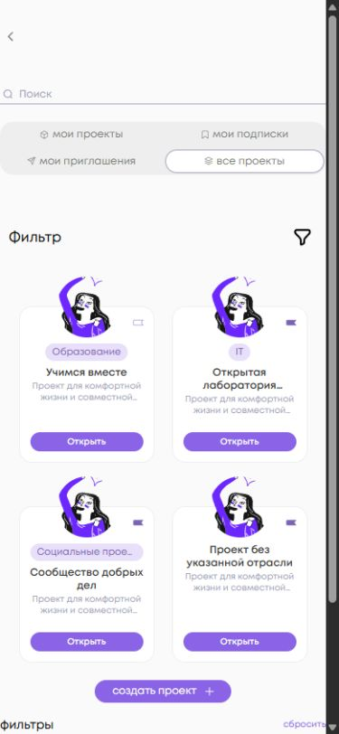           |
| Мои приглашения                | 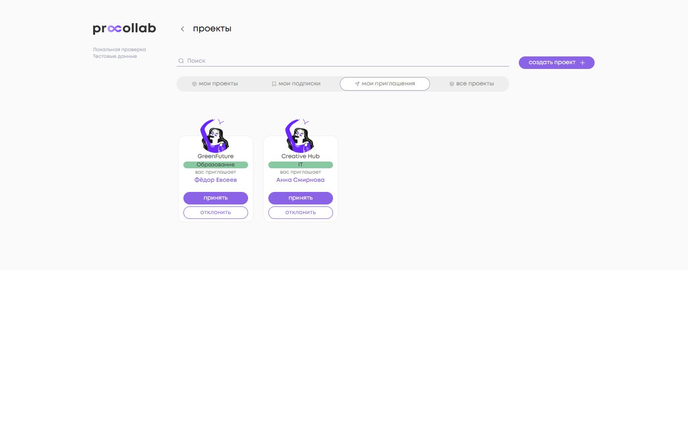       | 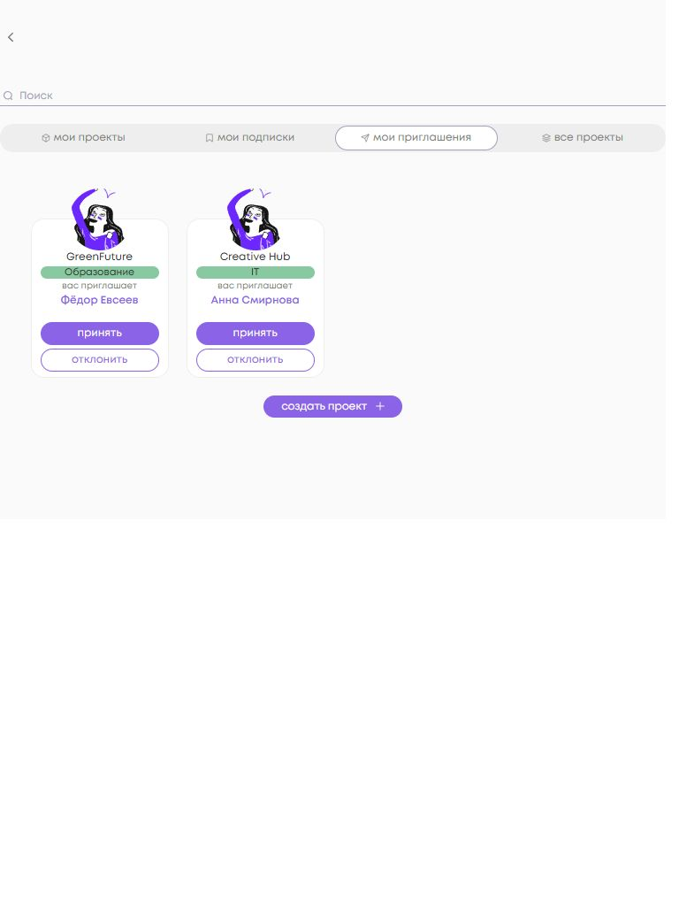       | 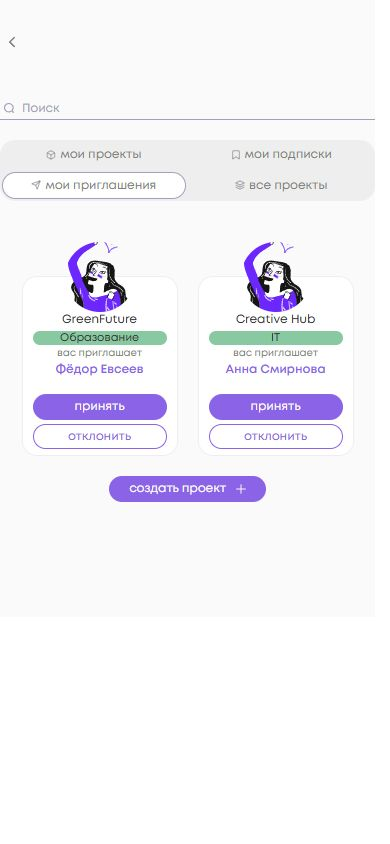       |

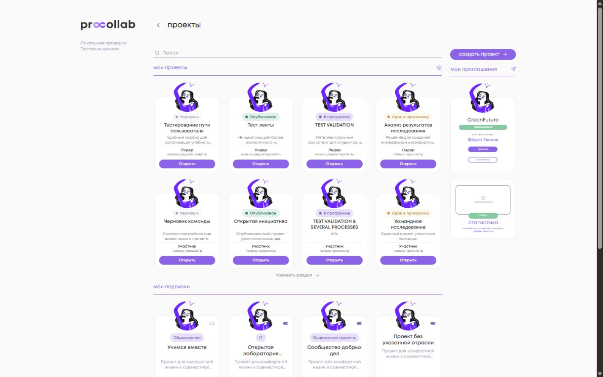

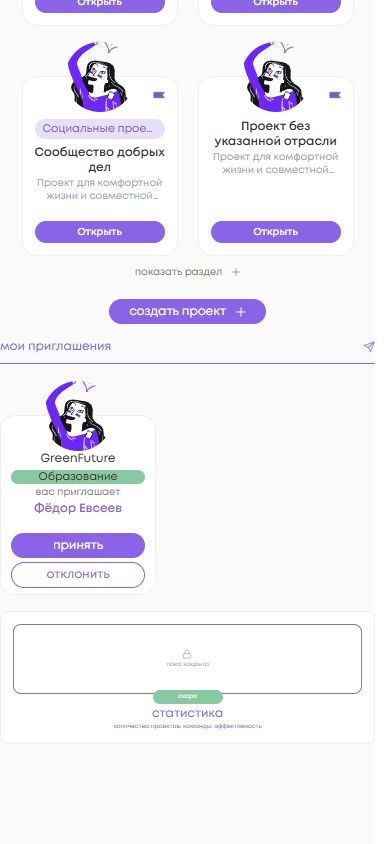

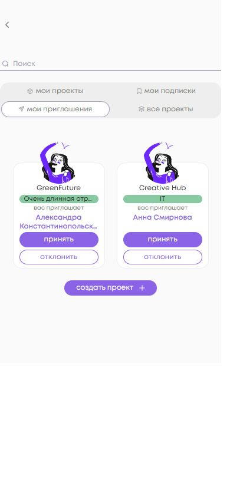

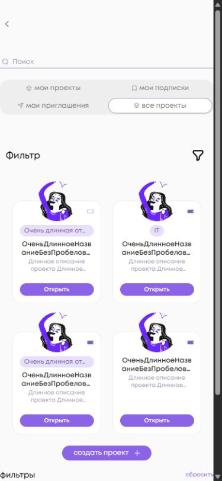

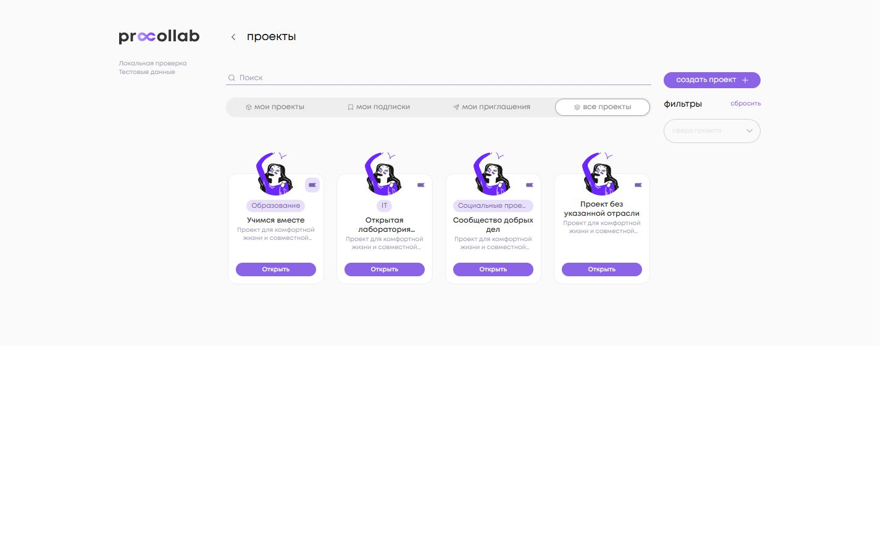


