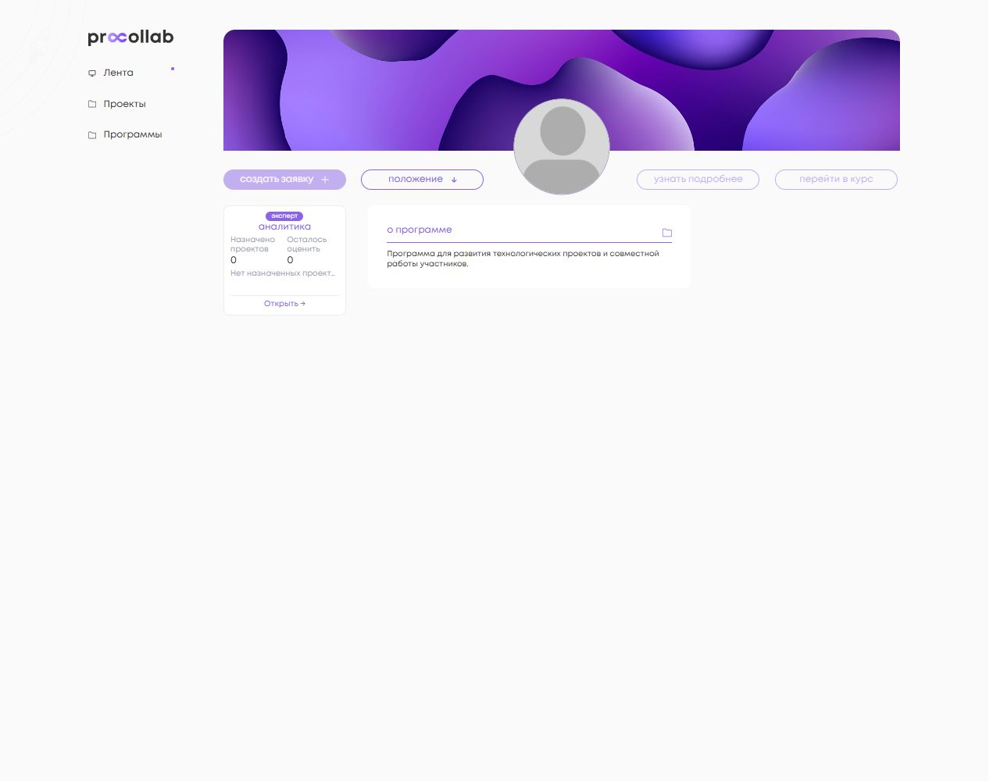

<!-- @format -->

# Ролевая аналитика программы: DEV

Исходная Angular-база: `99c8813a66f89560a946eab7d1de73ab2925d0f5`.
Контракт backend подготовлен от `ed5244bd4a098bd0f1cee0f5e380dd67bdd61a96`.
Ветка обоих репозиториев: `feature/dev-program-role-analytics-widget`.
Точные итоговые SHA и связанные Draft PR указаны в описаниях PR.

## Источники и границы доступа

| Показатель                     | Фактический источник                                                                                | Доступ / изменение                                                                                                                |
| ------------------------------ | --------------------------------------------------------------------------------------------------- | --------------------------------------------------------------------------------------------------------------------------------- |
| Роль                           | Менеджеры текущей PartnerProgram → Expert.programs → PartnerProgramUserProfile                      | Backend определяет роль по авторизованному пользователю; Angular использует контекстные флаги. Добавлен `is_user_expert` в detail |
| Проект участника               | Project.leader либо Collaborator, через PartnerProgramProject текущей программы                     | Новый read-only `participant_project`; лидер и член команды видят один проект. Legacy `current_application` не изменён            |
| Кейс                           | Системное поле с точным `name="case"`, его значение на текущей PartnerProgramProject                | Без поиска по label, выбора первого варианта и связи другой программы                                                             |
| Этапы                          | submitted + общий `_solution_rows` backend                                                          | Без баллов, имён экспертов и закрытых результатов                                                                                 |
| Участники / без проектов       | Общий `_get_participant_metrics`: distinct user, Exists для лидера и Collaborator текущей программы | Только организатор; черновики означают наличие проекта                                                                            |
| Проекты / отправленные решения | Общий `_get_solution_metrics`: связи PartnerProgramProject / submitted-связи                        | Только организатор; это не число отправивших пользователей                                                                        |
| Назначено / осталось           | ProjectExpertAssignment текущего эксперта и программы + `annotated_assignment_queryset`             | Только эксперт; незавершённый not_ready входит в остаток                                                                          |
| Срок                           | `datetime_evaluation_ends`                                                                          | Локальные часы обновляются раз в секунду без HTTP polling                                                                         |

GET `/programs/{id}/analytics-widget/` возвращает только одну ролевую ветвь.
Manager-only endpoints не используются участником или экспертом. Отсутствие member-роли не скрывает виджет менеджера/эксперта; закрытые новости, контакты и материалы сохраняют прежние ограничения.

Нарушение правила одной команды возвращает 409 и состояние «Данные проекта требуют проверки». Нет выбора проекта, dropdown, произвольного первого проекта или исправления пользовательских данных.

## Поведение

- Участник: кейс, название и переход к проекту, текущий этап без галочки; галочки только у предшествующих этапов. Черновик — «Не отправлен». Без проекта доступна существующая явная команда создания заявки, если срок подачи открыт. До нажатия бизнес-действия не выполняются.
- Distributed: оценённость определяет общая серверная аналитика по всем назначениям; частично заполненный проект не завершён, допустимый ноль считается внесённой оценкой. Неотправленное решение остаётся not_ready.
- Open: сохранено текущее правило основной аналитики — наличие ProjectScore по критерию этой программы означает evaluated. Виджет не вводит более строгого или нового критерия. У эксперта нет выдуманных назначений: оба счётчика «—», одна строка «Свободное оценивание…» со сроком и доступным переходом.
- Неконкурсные программы не имитируют обязательную сдачу: этапы и отправленные решения неприменимы. Персональные distributed-счётчики нейтральны; свободное оценивание сохраняется.
- «Без проектов»: доля рассчитывается до округления; ≤10% зелёная, ≤25% жёлтая, выше красная. При нуле участников — «—» и нейтральный цвет. `19 / 248 = 7,7%`; полная подсказка «19 из 248 участников без проекта».
- Дедлайн: сначала нет назначений / всё завершено; затем отсутствие срока, >48 часов, ≤48 часов, наступление срока. До суток — часы, до часа — минуты. Точная дата, время и часовой пояс доступны в подсказке.
- Ошибки API не превращаются в нули. Retry только для сетевой/серверной ошибки; 401/403/404/409 имеют контролируемый текст. Смена программы, пользователя, роли и logout очищают данные и отменяют прежний запрос; поздние ответы отбрасываются.
- После успешного создания связи, изменения полей/кейса, сдачи решения и оценки существующая EventBus передаёт `ProgramWidgetChanged`. Неуспешная операция не инициирует обновление.

Архитектура: domain-модель → repository port/HTTP adapter → use-case → локальный сервис состояния → отдельный компонент страницы. Общие SoonCard и Modal, React, зависимости и CI не меняются.

## Геометрия и visual smoke

Измерена исходная страница на DEV-базе, а не иллюстрация из задания. Chromium, viewport 1280 × 1000, DPR 1, масштаб 100%, загружен существующий шрифт Mont.

| Элемент     | x до / после            | y до / после          | Ширина до / после       | Высота до / после       |
| ----------- | ----------------------- | --------------------- | ----------------------- | ----------------------- |
| Карточка    | 285,828125 / 285,828125 | 262,59375 / 262,59375 | 157 / 157               | 140,984375 / 140,984375 |
| О программе | 471,15625 / 471,15625   | 262,59375 / 262,59375 | 413,328125 / 413,328125 | 106,59375 / 106,59375   |

CSS фиксирует высоту 140,9844 px; фактическое значение Chromium — 140,984375 px. Подписи метрик 10 px. Названия и единственная строка срока сокращаются многоточием; MatTooltip доступен с клавиатуры. Внутренней прокрутки нет.

Проверены 15 состояний: три роли, три нулевых состояния, loading, network error, forbidden, черновик, длинные названия, большие числа, open, просрочка и завершённая работа. Измерения: [исходные](baseline-geometry.json), [после](smoke-results.json). Скриншоты ниже сняты на реальных компонентах страницы с локальными fixtures; размеры About и оболочка повторяются в обеих сборках.

Это не интеграционная проверка живого DEV. Backend-права и бизнес-состояния проверены Django-тестами; переходы — href компонентов и существующими маршрутами. Полный сценарий в браузере с реальным входом, отправкой и оцениванием на DEV не выполнялся. Smoke использует TestBed с подменой сервисов и не вызывает API; клики создания заявки в fixtures не создают данные.

### Скриншоты

Исходная страница:


| Участник                                              | Организатор                                            | Эксперт                                             |
| ----------------------------------------------------- | ------------------------------------------------------ | --------------------------------------------------- |
|          |          |              |
|  |  |  |

### Воспроизведение локального smoke

```sh
npm exec -- ng build social_platform --configuration development --browser docs/program-role-widget/smoke/page.ts --ts-config docs/program-role-widget/smoke/tsconfig.json --index docs/program-role-widget/smoke/index.html --output-path tmp/current
node docs/program-role-widget/smoke/serve.cjs 4302
```

Открыть `http://localhost:4302/?view=participant` при указанном viewport. Другие значения `view`: `organizer`, `expert`, `participant-zero`, `organizer-zero`, `expert-zero`, `loading`, `error`, `forbidden`, `draft`, `long`, `organizer-large`, `expert-open`, `expert-overdue`, `expert-complete`. Fixtures находятся вне production entry point и не входят в обычную сборку приложения.

## Проверки 14.09.2026

| Команда                                                             | Фактический результат                                                                                                                                                                                                                      |
| ------------------------------------------------------------------- | ------------------------------------------------------------------------------------------------------------------------------------------------------------------------------------------------------------------------------------------ |
| Targeted Vitest, команда ниже                                       | 37 файлов, 337 тестов PASS, включая 61 новый теста виджета                                                                                                                                                                                 |
| `npm exec -- vitest run --pool=forks --maxWorkers=4 --minWorkers=1` | 365 файлов / 1540 тестов PASS; exit 1 из-за unhandled `ngx-autosize: window is not defined` после teardown `profile-mid-side.component.spec.ts`. Полный прогон выполнен до последних уточнений; последние изменения перепроверены targeted |
| `npm run lint:ts`                                                   | 0 ошибок, 6 существующих предупреждений в logger/chat-message/message-input                                                                                                                                                                |
| Scoped Stylelint нового SCSS                                        | PASS                                                                                                                                                                                                                                       |
| Scoped Prettier изменённых TS/HTML и документации                   | PASS                                                                                                                                                                                                                                       |
| `npm run build:pr`                                                  | PASS, Angular strict compilation; существующие Sass deprecation warnings. Генерируемый Windows sprite восстановлен, в diff не включён                                                                                                      |
| `git diff --check`                                                  | PASS                                                                                                                                                                                                                                       |

```sh
npm exec -- vitest run --pool=forks --maxWorkers=4 --minWorkers=1 projects/social_platform/src/app/api/program projects/social_platform/src/app/api/project/facades/edit/project-additional.service.spec.ts projects/social_platform/src/app/ui/pages/program/detail/main/role-widget projects/social_platform/src/app/ui/widgets/detail/services/program/detail-program-info.service.spec.ts projects/social_platform/src/app/infrastructure/adapters/program/program-http.adapter.spec.ts projects/social_platform/src/app/infrastructure/repository/program/program.repository.spec.ts
npm exec -- stylelint projects/social_platform/src/app/ui/pages/program/detail/main/role-widget/program-role-widget.component.scss
```

Для будущего DEV-развёртывания сначала нужен backend с GET-контрактом и `is_user_expert`, затем этот Angular. При отсутствии endpoint показывается контролируемое состояние недоступности. Merge и deploy не выполнены.

Дополнительно: [адаптивные границы 1000 и 1440 px](responsive-smoke.json) совпадают до/после; Retry сохраняет геометрию. Подсказки при клавиатурном фокусе: [кейс](screenshots/long-case-focus-1280.png), [проект](screenshots/long-project-focus-1280.png). Hover отдельно не проверялся.
