<!-- @format -->

# Доработка ролевого виджета: DEV, 14.09.2026

Продолжение существующих Draft PR [Angular #348](https://github.com/PROCOLLAB-github/procollab/pull/348) и [backend #742](https://github.com/PROCOLLAB-github/api/pull/742). Angular base: `99c8813a66f89560a946eab7d1de73ab2925d0f5`, предыдущий head: `f9ee3c397acf0fc6ed643246b44760fa82705313`. Точный head этого коммита указан в PR. Backend base: `ed5244bd4a098bd0f1cee0f5e380dd67bdd61a96`, head без изменений: `3d84c7f4090985e4f42a13654e8fb05856f65cb3`.

## Исправления

- Организатор с `isUserManager=true`, `isUserMember=false` получает и видит новости. Условие `member || manager` одинаково в загрузке и шаблоне списка. Созданная новость появляется в том же списке. Четыре регрессионных теста страницы используют настоящий шаблон, фасад страницы и NewsInfoService: организатор, участник, эксперт без member/manager и посторонний пользователь. Правила операций с новостями не менялись.
- Заголовок и вторичный бейдж разведены по горизонтали. Данные и нижнее действие занимают отдельные зоны; значения 14 px полужирные, подписи метрик 10 px / 12 px. Использованы существующие шрифты и цвета. Нижняя зона высотой 22 px одинакова во всех состояниях.
- Кейс и проект — две выровненные строки. Только длинные динамические названия получают ellipsis и доступный MatTooltip. Между маркерами этапов добавлена тонкая линия. Текущая «Проверка» не имеет галочки; конечный серверный `evaluated` завершает всю цепочку.
- Организатор: «Сдано решений» с контролируемым переносом, числа второй строки выровнены. Рядом с «Без проектов» маленькая цветная точка и вторичный процент вместо тесного разделителя. Формула и пороги неизменны: `19 / 248 = 7,7%`, зелёный.
- Эксперт: два счётчика, один статусный блок. Активный срок показан двумя строками: «До конца оценивания» и «2 дня», «5 часов» либо «25 минут». Полные русские единицы времени и склонения, без ellipsis. Нулевые, завершённые и просроченные состояния полностью видны. В open показаны режим и оставшееся время один раз, счётчики «—».

Серверные источники и правила описаны в [основной документации](../README.md#источники-и-границы-доступа). В этом follow-up backend-код, React, `current_application`, права команд/сдачи, правила оценивания, shared Modal/SoonCard, зависимости, миграции и workflows не изменялись.

## Геометрия

Chromium, Mont загружен, DPR 1, масштаб 100%. Размеры исходной страницы проверены по воспроизводимой сборке DEV-базы. Нет transform/zoom карточки, расширения колонки или внутренней прокрутки.

| Viewport    | Карточка до и после (x; y; w; h), CSS px | «О программе» до и после (x; y; w; h)       |
| ----------- | ---------------------------------------- | ------------------------------------------- |
| 1280 × 1000 | 285,828125; 262,59375; 157; 140,984375   | 471,15625; 262,59375; 413,328125; 106,59375 |
| 1440 × 1000 | 365,828125; 262,59375; 157; 140,984375   | 551,15625; 262,59375; 413,328125; 106,59375 |
| 1000 × 1000 | Карточка скрыта, как на базе             | 197,5; 277,59375; 139,5; 161,1875           |

Все 23 состояния при 1280 имеют одинаковые card/About/footer rect. [Измерения и текстовые DOM Range](geometry.json), [1000/1440](responsive.json), [fixture Retry](retry.json), [реальный HTTP 503 → Retry](integration-retry.json). Проверены сами скриншоты, а не только scrollHeight: служебные подписи, статусы и единицы времени видны целиком. Метрики шрифта Mont выходят примерно на 1 px за собственный line-height; overflow у строк видимый, это не отсечение глифов. Динамические названия намеренно сокращены; полное значение доступно при hover/focus.

## Скриншоты

Полная страница при 100%: [участник](screenshots/participant-page.png), [организатор](screenshots/organizer-page.png), [эксперт](screenshots/expert-page.png), [исходная страница](../screenshots/before-1280.png).

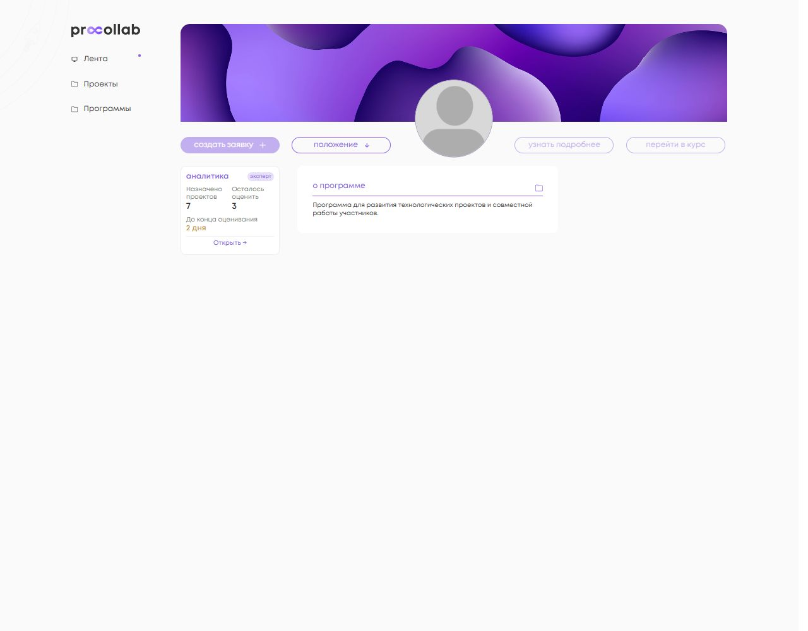

Кропы ниже получены из исходных PNG без увеличения, уменьшения и обработки: 158 × 143 физических px, целочисленная рамка вокруг дробного CSS rect 157 × 140,984375. Они дополняют полные страницы.

| Участник                                              | Организатор                                            | Эксперт                                             |
| ----------------------------------------------------- | ------------------------------------------------------ | --------------------------------------------------- |
| 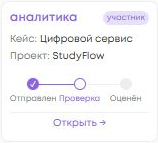         | 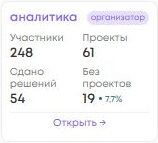           | 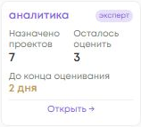                 |
| 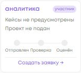 | 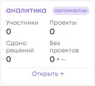           | 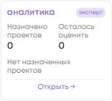 |
| 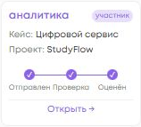 | 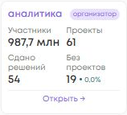 | 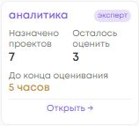          |
| 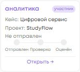           | 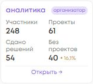       | 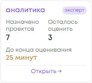      |

Полный перечень `view` воспроизводимого smoke: `participant`, `participant-submitted`, `participant-evaluated`, `participant-zero`, `draft`, `long`, `participant-no-case`, `organizer`, `organizer-zero`, `organizer-large`, `organizer-yellow`, `organizer-red`, `expert`, `expert-zero`, `expert-complete`, `expert-hours`, `expert-minutes`, `expert-overdue`, `expert-missing`, `expert-open`, `loading`, `error`, `forbidden`. Для каждого сохранены `<view>-page.png` и `<view>-card.png` в [screenshots](screenshots). Команда сборки fixture smoke — в [README](../README.md#воспроизведение-локального-smoke).

Отдельно: [hover кейса без клавиатурного фокуса](screenshots/long-hover.png), [клавиатурный focus проекта и полная подсказка](screenshots/long-focus.png), [свободное оценивание](screenshots/expert-open-page.png), [просрочка](screenshots/expert-overdue-page.png).

## Окончательные проверки Angular

Все production TS/HTML/SCSS и тесты этого follow-up присутствовали в окончательном полном прогоне. После него менялись только документация/артефакты; восстановлен генерируемый Windows sprite.

| Проверка                              | Результат                                                                                         |
| ------------------------------------- | ------------------------------------------------------------------------------------------------- |
| Targeted Vitest, команда ниже         | **39 файлов, 349 тестов PASS**, exit 0                                                            |
| Full Vitest, итоговая версия          | **367 файлов, 1560 тестов прошли; 1 unhandled error, exit 1**. Не считается успешным полным suite |
| Full Vitest, исходный base `99c8813…` | **361 файл, 1489 тестов прошли; 1 unhandled error, exit 1**                                       |
| `npm run lint:ts`                     | 0 ошибок, 6 предупреждений: logger/chat-message/message-input                                     |
| Scoped Stylelint и Prettier           | PASS                                                                                              |
| `npm run build:pr`                    | PASS; Angular strict compilation, существующие Sass deprecation warnings                          |
| `git diff --check`                    | PASS                                                                                              |

### Сравнение ошибки full suite

Два полных запуска на одной Windows-машине: Node **24.18.0**, npm **11.16.0**, Vitest **3.2.6**, ngx-autosize **2.0.4**. Оба worktree используют junction к одному неизменённому `node_modules`; команда и параметры одинаковы. База — отдельный detached worktree на точном SHA, её исходники не редактировались.

```sh
npm exec -- vitest run --pool=forks --maxWorkers=4 --minWorkers=1
```

В обоих прогонах `ReferenceError: window is not defined`, цепочка `WindowRef.nativeWindow → AutosizeDirective._addWindowResizeHandler → _onTextAreaFound → _findNestedTextArea → Timeout`, после teardown. Vitest связывает поздний callback с `news-form.component.spec.ts` на head и `profile-mid-side.component.spec.ts` на base. Разные относительные префиксы путей обусловлены размещением worktree. Это подтверждает воспроизведение ошибки без изменений PR; точная причина таймера не исследовалась и не исправлялась. Ошибки не подавлялись, тесты не отключались.

Точные выводы с stack trace, итогами и exit code: [head](full-head-result.txt), [base](full-base-result.txt). Время: head 400,37 s, base 407,93 s. Разница в количестве тестов между base и текущим PR — 71.

```sh
npm exec -- vitest run --pool=forks --maxWorkers=4 --minWorkers=1 projects/social_platform/src/app/api/program projects/social_platform/src/app/api/project/facades/edit/project-additional.service.spec.ts projects/social_platform/src/app/ui/pages/program/detail/main projects/social_platform/src/app/ui/widgets/detail/services/program/detail-program-info.service.spec.ts projects/social_platform/src/app/infrastructure/adapters/program/program-http.adapter.spec.ts projects/social_platform/src/app/infrastructure/repository/program/program.repository.spec.ts
npm run lint:ts
npm exec -- stylelint projects/social_platform/src/app/ui/pages/program/detail/main/role-widget/program-role-widget.component.scss
npm exec -- prettier --check <изменённые TS/HTML/SCSS и документы>
npm run build:pr
git diff --check
```

## Backend: CI и локальные результаты

Повторно проверен [Backend PostgreSQL CI run 34849441959](https://github.com/PROCOLLAB-github/api/actions/runs/34849441959): **completed / success**, `headSha=3d84c7f4090985e4f42a13654e8fb05856f65cb3`, точное совпадение с актуальным head PR #742. Проверки Lint и Tests также success. Backend-код в этом follow-up не менялся; искусственного коммита нет.

Ранее выполненные локальные результаты относятся к этому же backend head и не заменяются результатом CI:

- Targeted Django: **120/120 PASS**.
- Full PostgreSQL: **849 тестов, 1 failure** в `feed.tests.test_feed_api.FeedAPITests.test_feed_returns_project_news_as_news_content` (`project` вместо `news`). Отдельный запуск этого теста на исходном DEV SHA прошёл; причина сбоя полного прогона **не установлена**. Посторонний feed-код не исправлялся.
- Full SQLite: **849 тестов, OK, skipped=4**, но процесс завершился с ошибкой удаления тестовой БД **WinError 32** после тестов.
- Mypy не начал проверку: `mypy.ini` объединяет две строки plugins в один import. Конфигурация не менялась.

## Локальная интеграция

Это отдельная проверка реальной связки: Angular AppComponent/APP_CONFIG и реальные маршруты/сервисы на `localhost:4304`, Django текущего backend head на `localhost:8009`, PostgreSQL 18. Создана отдельная БД `procollab_widget_integration_f348_20260914` с синтетическими пользователями и Angular-моделями. DEV/PROD API и данные не использовались. Только локальный environment направлен на этот API; frontend-сервисы не подменялись fixtures. Для писем использован locmem backend из `settings_ci`; внешние письма не отправлялись.

| Сценарий                     | Фактический результат                                                                                                                                                                                                                                                                                                                                       |
| ---------------------------- | ----------------------------------------------------------------------------------------------------------------------------------------------------------------------------------------------------------------------------------------------------------------------------------------------------------------------------------------------------------- |
| Организатор без member       | Виджет 3 участника / 1 проект / 0 сдано / 1 без проекта, 33,3%; существующая новость видна. Созданная через форму новость появляется в списке — [скрин](screenshots/integration-manager-news.png)                                                                                                                                                           |
| Переход организатора         | Открылась действующая `/office/program/2/analytics`, данные основной аналитики загрузились                                                                                                                                                                                                                                                                  |
| Смена программы              | У того же организатора переход с программы 2 на пустую 3 заменил счётчики на 0 и процент на «—»                                                                                                                                                                                                                                                             |
| Лидер и член команды         | Оба видят project 1 / programLinkId 1, один case и этап. Нижнее действие открывает `/office/projects/1?programLinkId=1`; у члена команды нет ссылки редактирования — [лидер](screenshots/integration-leader.png), [член команды](screenshots/integration-teammate.png)                                                                                      |
| Изменение case               | Через «перейти в заявку» → данные для конкурсов → Новый кейс → сохранить черновик. При возврате виджет показывает сохранённое значение — [скрин](screenshots/integration-case-updated.png)                                                                                                                                                                  |
| Сдача                        | Заполненный тестовый проект отправлен через действующую форму и подтверждение. Реальный submitted стал true, виджет перешёл в «Проверка» — [скрин](screenshots/integration-submitted.png)                                                                                                                                                                   |
| Эксперт без member           | Виджет 1 / 1, срок «2 дня»; закрытого списка новостей нет. Нижнее действие открыло `/office/program/2/projects-rating` с назначенным проектом — [скрин](screenshots/integration-expert.png)                                                                                                                                                                 |
| Оценка 0                     | В действующей форме введён допустимый 0, подтверждён и сохранён. После возврата счётчики 1 / 0 и «Все проекты оценены» — [скрин](screenshots/integration-expert-complete.png). Член команды видит три галочки «Оценён» — [скрин](screenshots/integration-evaluated.png)                                                                                     |
| Нулевые состояния            | Реальный участник без проекта — [скрин](screenshots/integration-participant-zero.png); эксперт с ролью в другой программе и без назначений — 0 / 0, «Нет назначенных проектов» — [скрин](screenshots/integration-expert-zero.png)                                                                                                                           |
| Logout / другой пользователь | Logout переводит на /auth/login, карточка отсутствует. Следующий вход загружает только данные нового пользователя                                                                                                                                                                                                                                           |
| Посторонний пользователь     | Прежний рекламный блок; виджета и закрытых новостей нет — [скрин](screenshots/integration-outsider.png)                                                                                                                                                                                                                                                     |
| Ошибка / Retry               | Локальный тестовый middleware временно возвращал **503 только для analytics-widget**. После штатных ограниченных HTTP retries: безопасный текст и «Повторить», без raw body. После снятия fault и нажатия кнопки реальные данные загрузились — [ошибка](screenshots/integration-error.png), [успех](screenshots/integration-retry-success.png). Rect совпал |

Тестовое окружение потребовало двух дополнений синтетических fixtures: обязательные поля проекта перед сдачей и MailingSchema #2 для локального уведомления оценки. До добавления шаблона API возвращал `MailingSchema matching query does not exist`; после добавления повторное подтверждение в UI прошло успешно. Это подготовка изолированных данных, не изменение правил или production-кода.

Ограничения: живой DEV не проверялся. В процессе навигации редактора в локальной сборке наблюдались фоновые `PUT /projects/NaN/ → 404`; отдельная причина и сравнение этого пути с base не установлены. Канонический вход «перейти в заявку», явное сохранение case и сдача прошли, но чистое отсутствие ошибок фонового autosave **не подтверждено**. Многопрограммный проект, все пограничные комбинации доступа и поздние ответы проверены автоматическими тестами; браузерный интеграционный сценарий не повторяет каждую комбинацию. Обновление EventBus без ухода со страницы проверено unit-тестами; в браузере подтверждён результат после возврата из существующих редакторов.

Для будущего DEV-развёртывания сначала нужен backend #742 с read-only контрактом и `is_user_expert`, затем Angular #348. Merge, deploy и действия с PROD не выполнялись.
