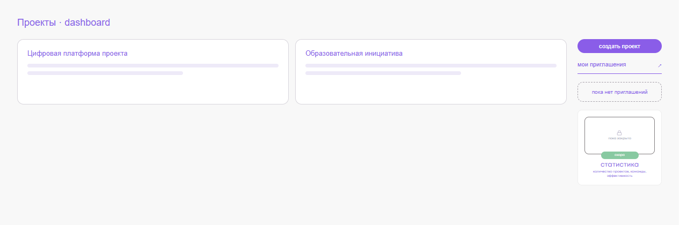
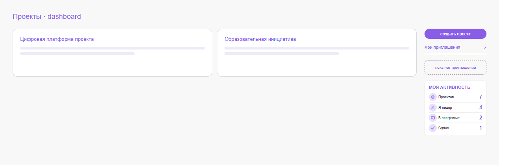
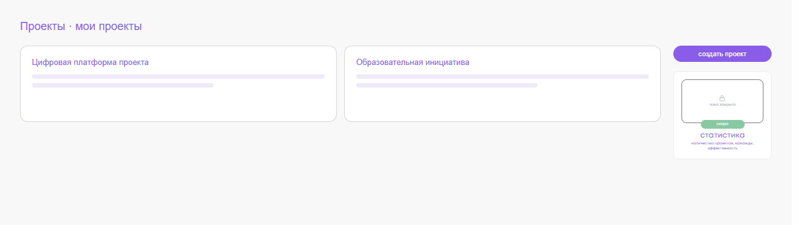
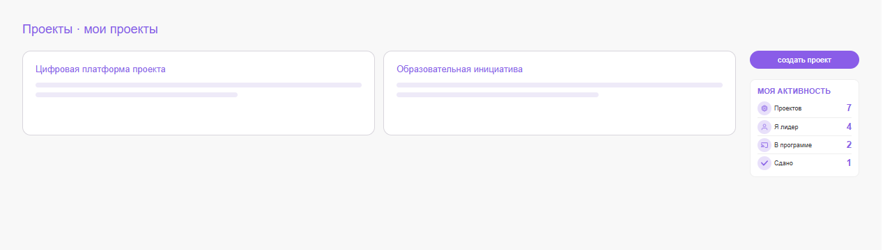
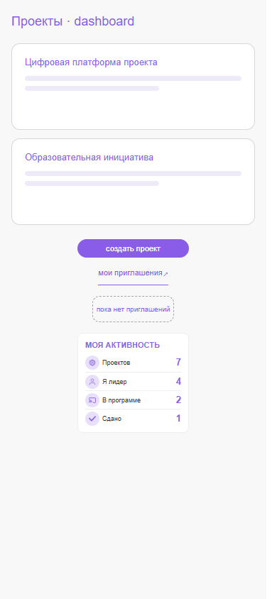

<!-- @format -->

# Блок «Моя активность» в проектах

На dashboard проектов и в разделе «Мои проекты» прежняя заглушка
`app-soon-card` заменена отдельным информационным компонентом
`ProjectActivityCardComponent`. Общий `SoonCardComponent` не изменён.

Источник данных — существующий `ProjectRepositoryPort.refreshCount()` и
`count$`, которые получают authoritative ответ `GET /projects/count/`.
Компонент не выполняет HTTP-запросы и не вычисляет статистику по первым
16 проектам dashboard.

Показатели:

- «Проектов» — все уникальные legacy-проекты пользователя;
- «Я лидер» — проекты, где пользователь является лидером;
- «В программе» — опубликованные проекты с канонической, ещё не сданной
  связью `PartnerProgramProject`;
- «Сдано» — проекты, у которых каноническая связь с программой сдана.

Каноническая связь определяется backend по минимальному `pk`. После
успешного принятия приглашения Angular повторно запрашивает весь счётчик,
не пытаясь оптимистично вычислять lifecycle.

Во время загрузки и при ошибке вместо недостоверных чисел отображается
нейтральный прочерк с доступной screen reader подписью. Для пользователя без
проектов отображаются четыре нуля.

## Геометрия

| Элемент                     |                До |             После |
| --------------------------- | ----------------: | ----------------: |
| Ширина карточки             |            157 px |            157 px |
| Высота карточки             |          140,2 px |            141 px |
| X правой колонки            |         1075,8 px |         1075,8 px |
| Y карточки                  |          203,8 px |          203,8 px |
| Положение блока приглашений | 1075,8 × 113,8 px | 1075,8 × 113,8 px |

Замеры сделаны в desktop Storybook-истории на реальных Angular-компонентах.
Разница высоты менее одного пикселя не меняет положение карточки, блока
приглашений или ширину правой колонки.

## Визуальная проверка

### Dashboard

До:

После:

### Мои проекты

До:

После:

### Mobile

Снимки созданы из Storybook-историй с реальными `SoonCardComponent` и
`ProjectActivityCardComponent`. Они фиксируют desktop и mobile footprint;
данные в истории демонстрационные, production-значения приходят только из
backend count endpoint.
