<!-- @format -->

# Отрасль и обновление подписки в карточках проектов

База DEV после #364: `0ffe6c9e3c01016cdc01824e93656fff775f43a6`.
Ветка: `fix/dev-project-card-industry-subscription`.

## Изменения

- В приглашениях отрасль увеличена с 6 до 11 px, белый текст заменён на тёмный
  на прежнем зелёном фоне. Правка применяется и к списку, и к правому виджету.
  Убраны чрезмерные горизонтальные отступы плашки, длинный текст сокращается
  многоточием; полное название доступно в `title`.
- В публичных карточках отрасль увеличена с 9 до 11 px. Lifecycle, роль и доступ
  в «Моих проектах» не менялись.
- После успешного ответа подписки/отписки `ChangeDetectorRef.markForCheck()`
  уведомляет OnPush-представление. Закладка обновляется без перезагрузки,
  подтверждение отписки закрывается после первого успешного запроса.

Причина задержки: приложение использует zoneless change detection, а
`isSubscribed` и `isUnsubscribeModalOpen` — обычные поля. Асинхронный ответ менял
их, но не уведомлял Angular. Следующее действие пользователя запускало обновление.
Публичный Input, use cases, события подписок, API и shared modal сохранены.
Неуспешный ответ не имитирует изменение подписки и не закрывает подтверждение.

Backend, React, зависимости, workflows, маршруты и статистика не менялись.
Корзина и новые действия не добавлялись. Merge/deploy не выполнялись.

## Проверки

Node `20.20.2`, npm `10.8.2`, Windows.

Новые асинхронные тесты сначала выполнены на исходном компоненте:
**6 failed / 2 passed**, exit 1. После исправления: **8/8 passed**.
Проверяются оба варианта `base`/`subs`, состояние до ответа, новая иконка и
`aria-pressed`, отсутствие перехода при подписке, одно подтверждение отписки,
ошибка подписки, ошибка отписки и успешный повтор. После ответа тесты не вызывают
`detectChanges()`: иначе они скрыли бы эту регрессию.

| Команда                                                                                        | Результат                                           |
| ---------------------------------------------------------------------------------------------- | --------------------------------------------------- |
| Targeted InfoCard/List/Dashboard, команда ниже                                                 | **59/59**, 5 файлов, exit 0                         |
| `npm run format:check`                                                                         | exit 0                                              |
| `npm run lint:ts`                                                                              | exit 0; 6 существующих предупреждений вне diff      |
| `npx stylelint projects/social_platform/src/app/ui/widgets/info-card/info-card.component.scss` | exit 0                                              |
| `npm run build:prod`                                                                           | exit 0; существующие Angular/Sass/CommonJS warnings |
| `git diff --check`                                                                             | exit 0                                              |

```text
npm run test:ci -- --pool=forks projects/social_platform/src/app/ui/widgets/info-card projects/social_platform/src/app/ui/pages/projects/list/list.component.spec.ts projects/social_platform/src/app/ui/pages/projects/dashboard/dashboard.component.spec.ts projects/social_platform/src/app/ui/pages/projects/projects.component.spec.ts
```

`projects.component.spec.ts` уже исключён штатной конфигурацией DEV и в 59 тестов
не входит. Исключения и test setup не менялись. Использован `--pool=forks`:
предыдущая проверка #364 зафиксировала NG0401 в стандартном pool (см.
[отчёт #364](../project-cards-readability/README.md)). В этой задаче стандартный
pool и полный suite повторно не запускались.

Windows-команда `build:sprite` снова создала пустой tracked SVG. Только этот
побочный результат восстановлен из HEAD, он не включён в diff. Браузерная
проверка использует исходный спрайт. Скрипт сборки не менялся.

## Браузерная проверка

Скриншоты настоящих Angular-компонентов, локальная тестовая оболочка и данные.
Use cases возвращают ответ через 700 мс. Live DEV API, авторизация и реальные
подписки пользователей **не проверялись и не изменялись**.

- «Все проекты»: подписка закрашивает закладку без reload; одно нажатие
  «отписаться» закрывает modal и снимает закладку после ответа.
- «Мои подписки»: тот же сценарий; подписка также проверена клавишей Enter.
- Desktop 1440×900, tablet 768×1024, mobile 390×844: горизонтального overflow
  нет. Длинная отрасль сокращается, две строки имени не перекрывают кнопки.
- Карточки до/после **156×180 px**. Позиции карточек и статистики на dashboard
  совпадают на desktop и mobile. Между длинным именем и кнопками остаётся 2.22 px.
- Console errors не обнаружены. В локальной оболочке и до, и после есть
  одинаковый NG0912 о двух экземплярах IconComponent; он не исправлялся здесь.

Измерения: [geometry.json](geometry.json).
Результаты действий и console: [browser-check.json](browser-check.json).

## Скриншоты

| Поверхность                      | До                                 | После                                |
| -------------------------------- | ---------------------------------- | ------------------------------------ |
| Приглашения                      | 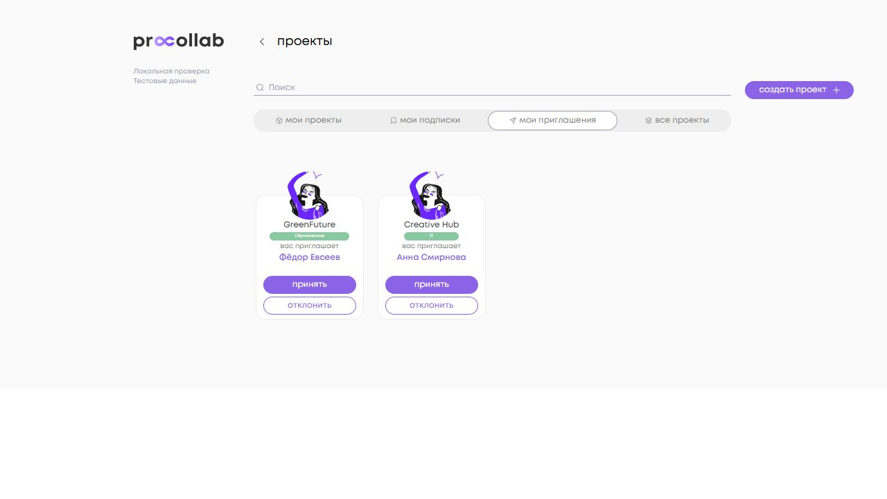          | 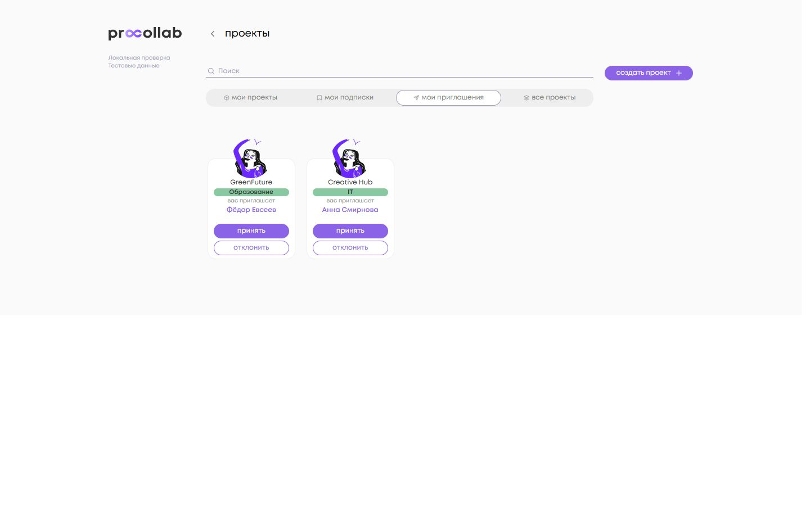          |
| Dashboard и правый виджет        | 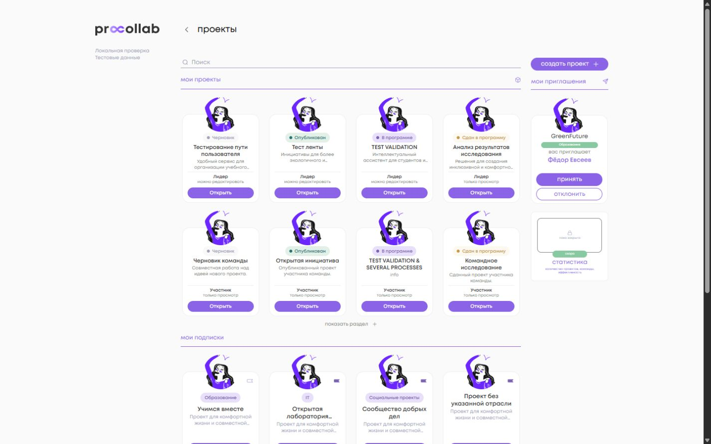        | 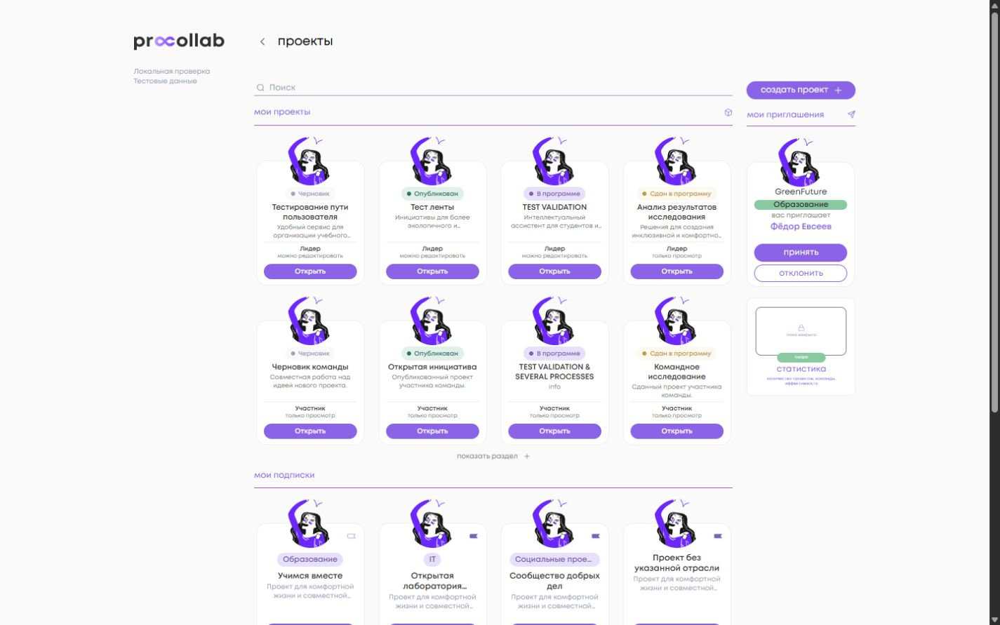        |
| Публичные карточки               | 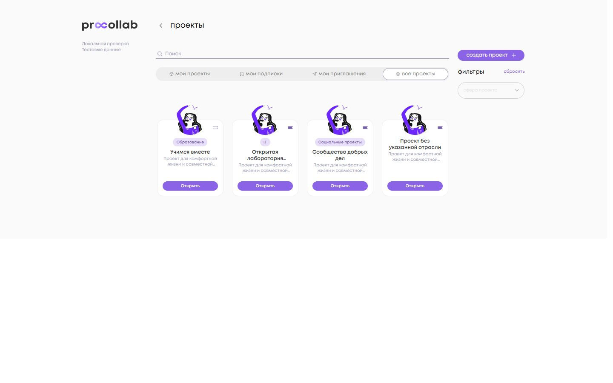              |               |
| Mobile: длинная отрасль и имя    | 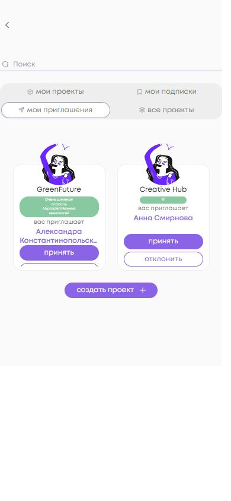   | 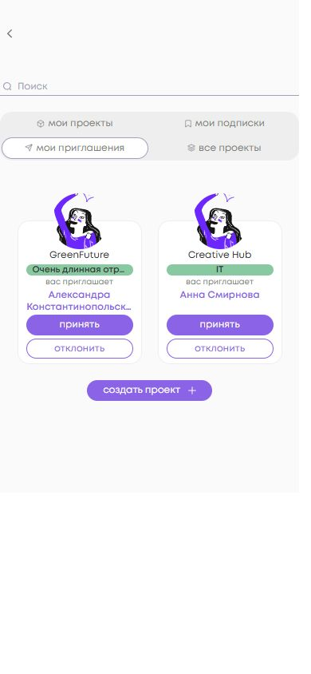   |
| Mobile: адаптация правой колонки | 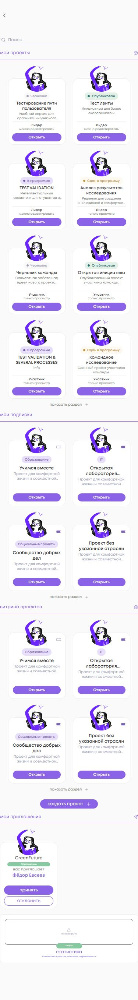 | 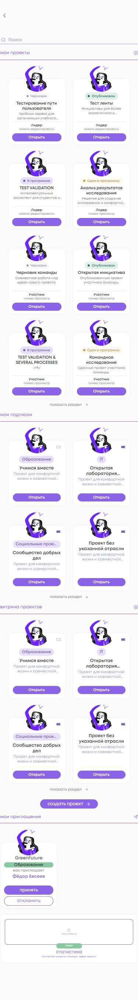 |

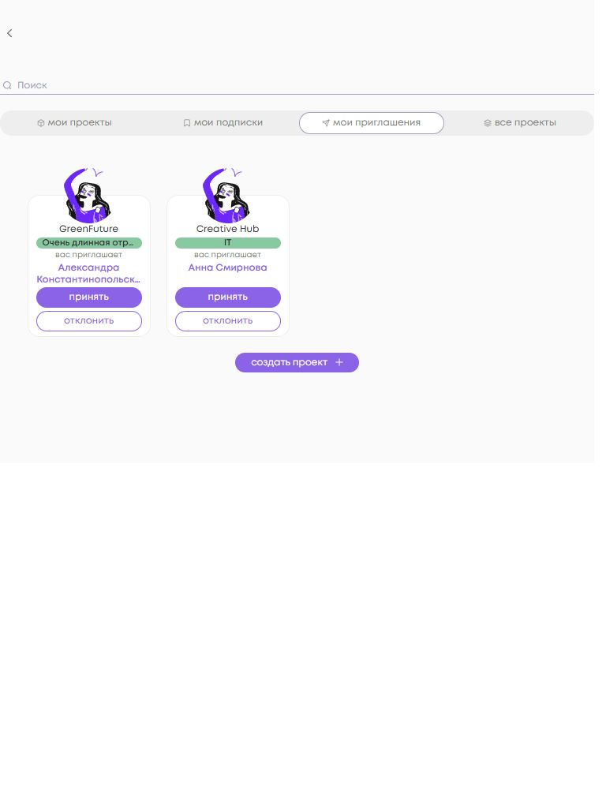

| Сценарий     | Подписка после ответа                     | Отписка после одного подтверждения                          |
| ------------ | ----------------------------------------- | ----------------------------------------------------------- |
| Все проекты  |            | 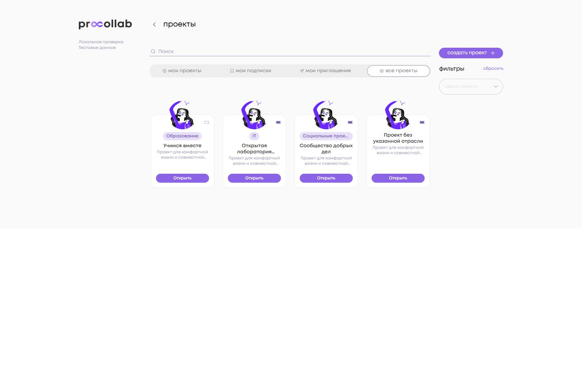           |
| Мои подписки | 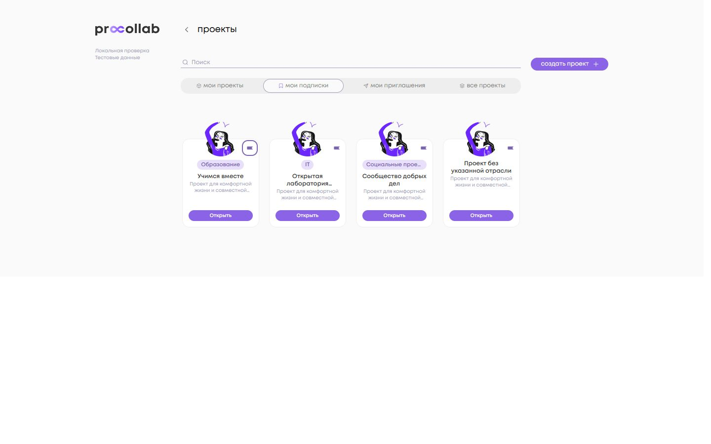 | 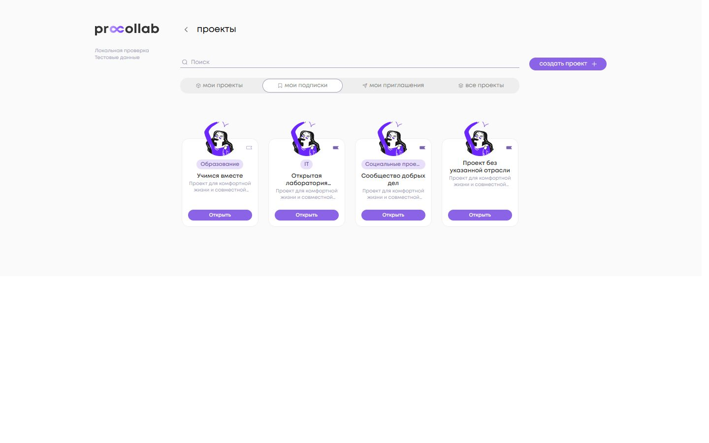 |

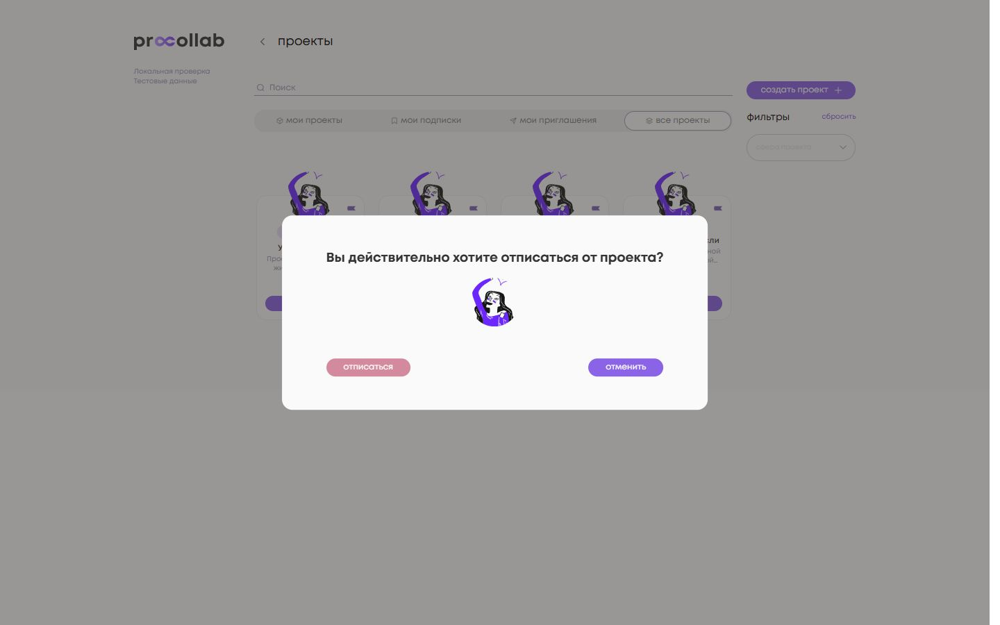
