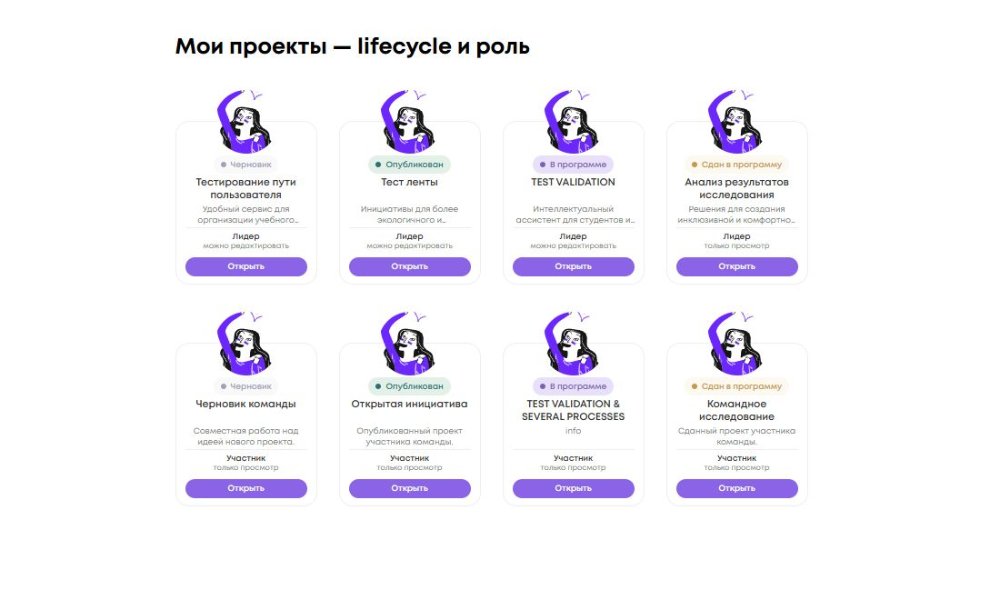

<!-- @format -->

# Lifecycle проекта и роль в «Моих проектах»

База DEV после #360: `358e818c7ebd8b7d5916e56167a402e2848177d6`.

Правила отображения в базе уже в основном соответствовали требованиям.
Эта доработка явно связывает доступ с фактом сдачи, типизирует lifecycle labels,
убирает постоянный CTA из presentation model и закрепляет восемь сочетаний
в общих fixtures, component/list/dashboard tests и визуальной приёмке.

## Источники и независимые правила

В существующем `InfoCardComponent.myProjectPresentation`:

- Lifecycle использует только `Project`: `partnerProgram?.isSubmitted === true`
  → `draft === true` → `partnerProgram != null` → опубликованный проект.
  При одновременных draft и submitted побеждает сдача.
- Факт сдачи — только `isSubmitted`. `canSubmit` не участвует: запрет отправки
  может означать закрытый срок и не доказывает, что проект сдан.
- Роль: известный `loggedUserId` совпадает с `project.leader` → «Лидер»;
  иначе «Участник». Отсутствующие ID не считаются совпадением.
- Текущий пользователь по-прежнему приходит из `ProfileInfoService.profile()?.id`
  в Dashboard и ProjectsList. Новых запросов, чтения JWT/localStorage нет.
- `canEdit = isLeader && !isSubmitted` определяет только подпись доступа.
  Она не вычисляется из lifecycle label и не предоставляет новых прав.

| Lifecycle        | Лидер               | Участник        |
| ---------------- | ------------------- | --------------- |
| Черновик         | можно редактировать | только просмотр |
| Опубликован      | можно редактировать | только просмотр |
| В программе      | можно редактировать | только просмотр |
| Сдан в программу | только просмотр     | только просмотр |

При незагруженном профиле все четыре lifecycle сохраняются, роль — «Участник»,
доступ — «только просмотр».

CTA теперь непосредственно в шаблоне: **«Открыть» →
`AppRoutes.projects.detail(project.id)`** без query params. Нативная ссылка,
одиночная навигация и отдельная кнопка подписки из #360 сохранены.
Редактор открывается со страницы проекта штатным действием.

Эта presentation model применяется только к `type="projects"` и
`appereance="my"` (написание существующего input сохранено).
Подписки/витрина сохраняют отрасль и «Открыть», остальные типы карточек
не получают role/access. Permissions, guards и бизнес-правила не менялись.

## Внешний вид

SCSS не менялся. «В программе» — `--accent-light/dark`, «Сдан в программу» —
`--gold-light/dark`. В текущей палитре есть `--blue-dark`, но нет `--blue-light`,
поэтому сохранена разрешённая золотая пара. Эти два состояния проверены рядом
для лидера и для участника, различаются и цветом, и текстом.

Скриншот снят с реальных Angular InfoCard на локальном стенде с тестовыми данными
через DI. Верхний ряд — четыре lifecycle лидера, нижний — те же lifecycle
участника. Это не авторизованная проверка развёрнутого DEV; backend и реальные
проекты не использовались. Целевые detail-страницы в стенде заменены выводом маршрута.

Все восемь карточек: **156×180 px**, аватар **70×70 px**. Названия и описания
центрированы и ограничены двумя строками существующим CSS. Измерения, цвета,
подписи и href: [acceptance.json](acceptance.json).

Дополнительно в браузере проверено отсутствие профиля: lifecycle не меняется,
все карточки показывают «Участник / только просмотр» и detail route.

## Проверки

Node 20.20.2, npm 10.8.2.

- `npm ci`: exit 0.
- `npx vitest run --pool=forks info-card projects/list/list.component.spec.ts projects/dashboard/dashboard.component.spec.ts`:
  44/44, три файла, exit 0. Покрыты все восемь сочетаний, одинаковый lifecycle
  при смене роли, неизвестный пользователь, submitted > draft для обеих ролей,
  canSubmit, постоянный CTA/detail, неизменность остальных контекстов.
- `npm run lint:ts`: exit 0; шесть существующих warnings вне изменённых файлов.
- `npx stylelint projects/social_platform/src/app/ui/widgets/info-card/info-card.component.scss`:
  exit 0; изменённых SCSS нет, проверен используемый stylesheet.
- `npm run test:ci`: exit 1, прежний NG0401 в setupTestBed до выполнения тестов,
  371 файл. Test harness не исправлялся, ошибки не подавлялись, исключения тестов
  и зависимости не менялись.

- `npm run test:ci -- --pool=forks`: **1696/1696, 371 файл, exit 0**,
  без NG0401 и unhandled errors. Известный teardown ngx-autosize в этом запуске
  не воспроизвёлся.
- `npm run format:check`: exit 0.
- `npm run build:prod`: exit 0; существующие Sass/CommonJS warnings.
- `git diff --check`: exit 0.

В браузере Enter для лидера «В программе» и «Сдан в программу» открыл
соответствующий detail (103 и 104) без параметров редактора. Ошибок консоли нет.

**Backend untouched. React untouched. Permissions untouched. Card size unchanged.**
Merge/deploy не выполнялись.
