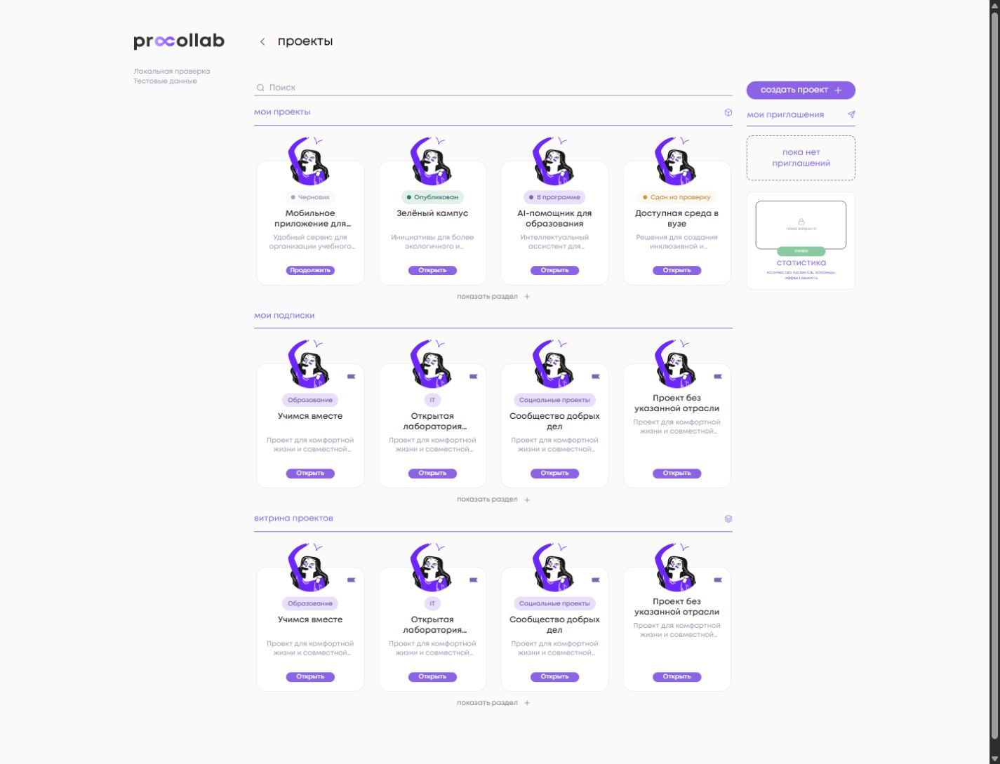
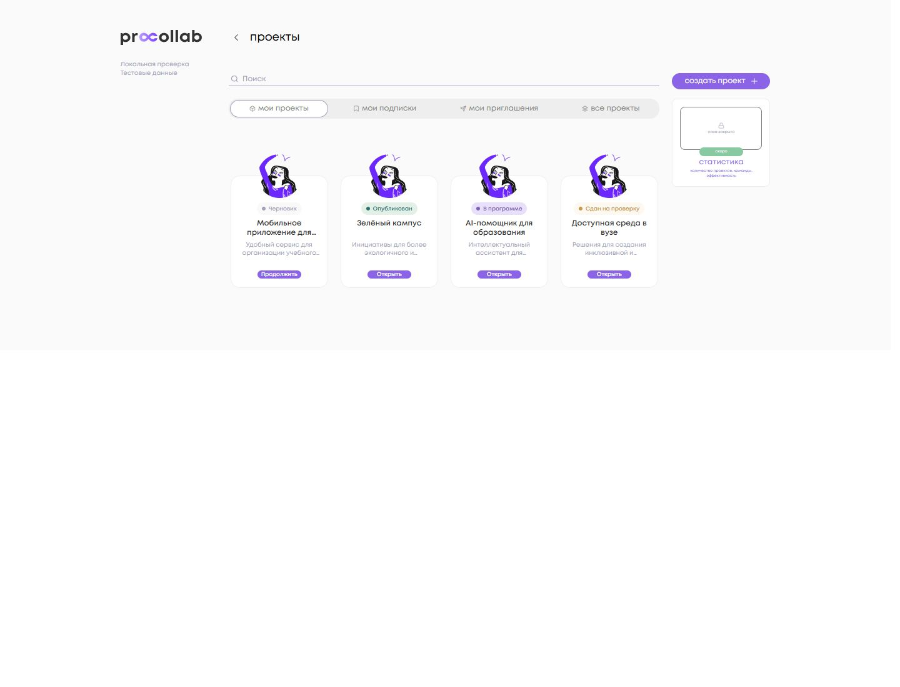
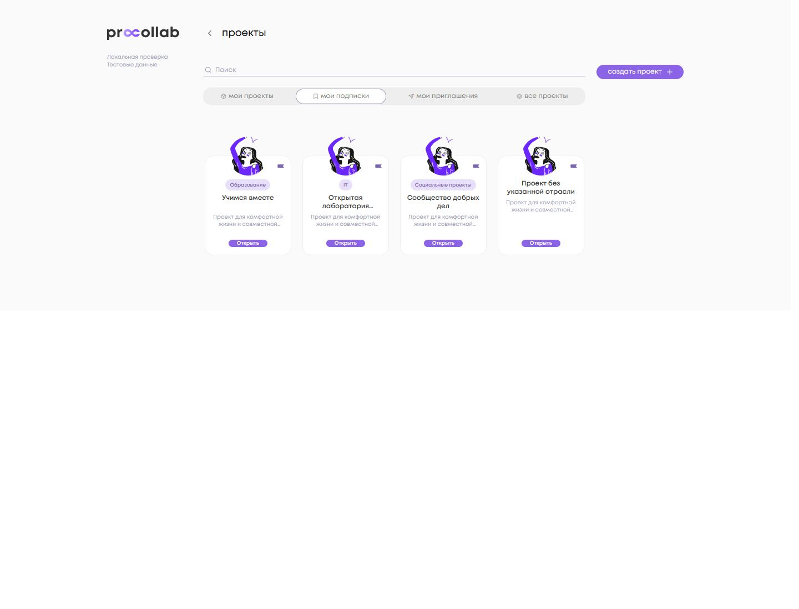
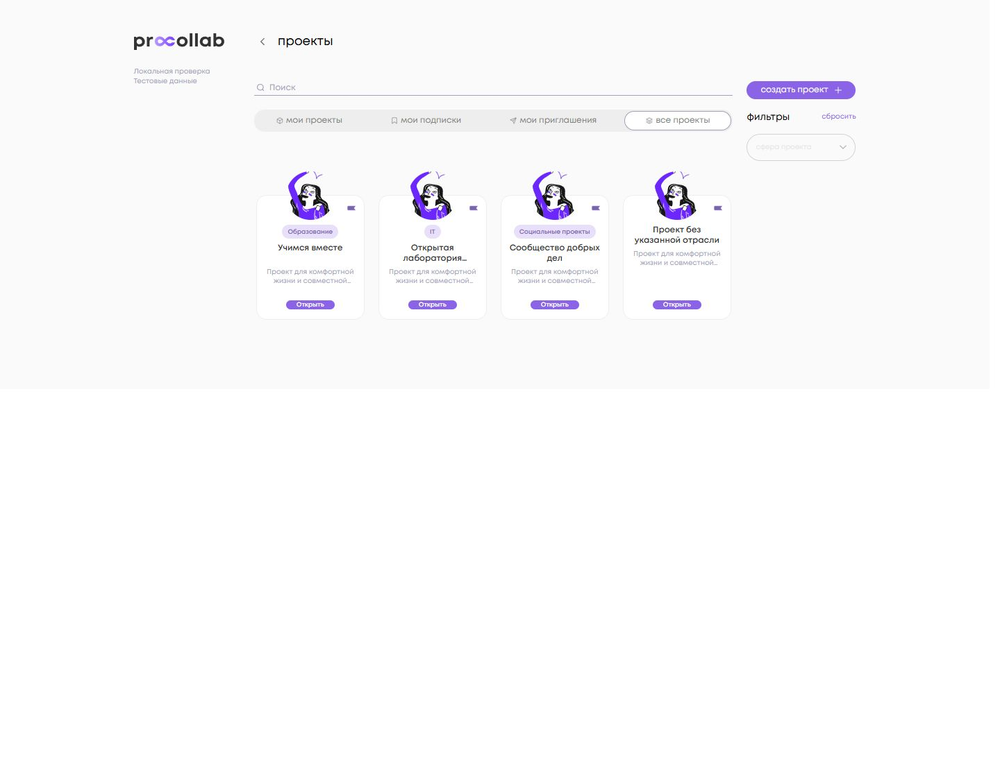
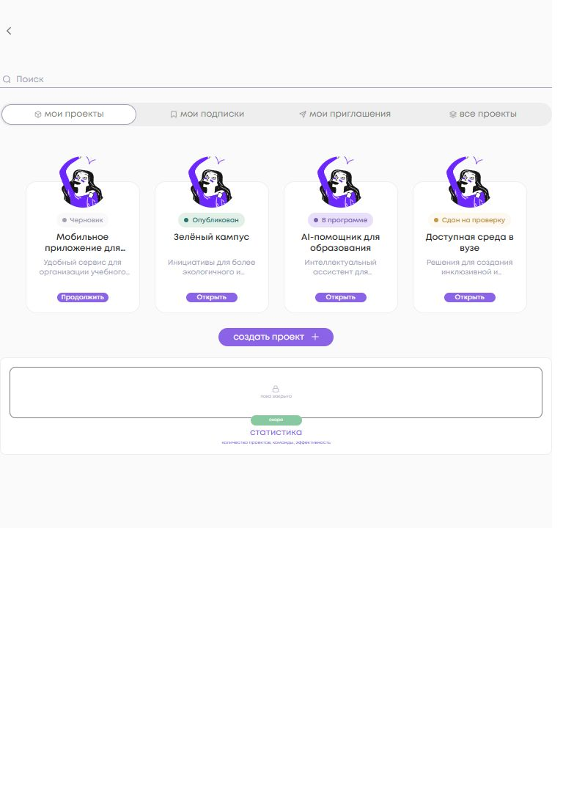
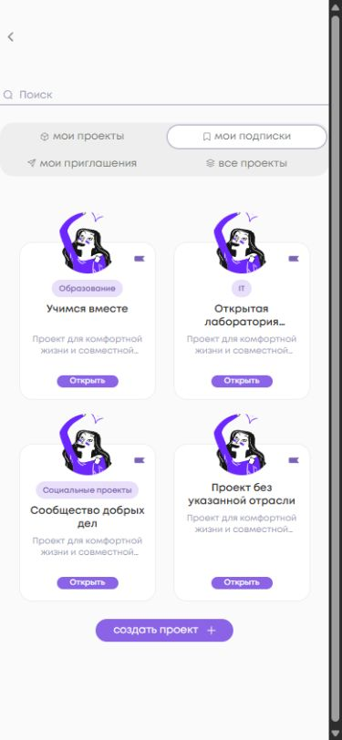
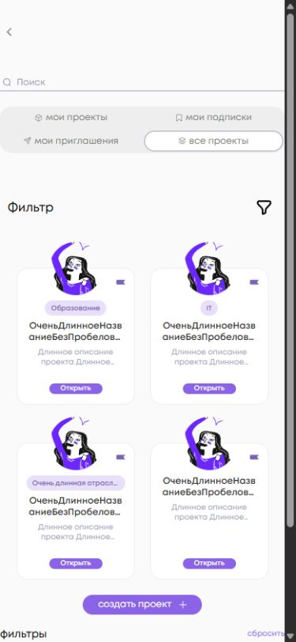

<!-- @format -->

# Единые карточки проектов

База DEV после #357: `918e30d54b3240078f8dda43c0fbc5761c011ae6`.
Используется тот же `InfoCardComponent` на dashboard и в полных списках.

## Контекст и данные

| Раздел                | `appereance` | Плашка         | CTA                                         |
| --------------------- | ------------ | -------------- | ------------------------------------------- |
| Мои проекты           | `my`         | Статус из #357 | «Продолжить» для черновика, иначе «Открыть» |
| Мои подписки          | `subs`       | Отрасль        | «Открыть»                                   |
| Витрина / все проекты | `base`       | Отрасль        | «Открыть»                                   |

Полный список явно передаёт контекст из существующих `isMy/isSubs/isAll`.
Dashboard определяет его по `sectionName`, независимо от декоративной иконки.
`InfoCard` больше не читает `location.href`.

Приоритет статуса своих проектов не изменён:
`partnerProgram.isSubmitted === true` → `draft === true` → наличие
`partnerProgram` → опубликованный проект. В остальных контекстах lifecycle
не отображается. Отрасль берётся из уже загруженного `IndustryRepositoryPort`.
При отсутствии отрасли плашка не создаётся и её строка не резервируется.
Дополнительных HTTP-запросов и расширений API нет.

Название остаётся целиком в DOM; CSS сокращает название и описание после двух
строк. Фиктивные счётчики, нижние status icons и status tooltip удалены.
Маршрут CTA остаётся `AppRoutes.projects.detail(id)`.

## Подписки и приглашения

Действие подписки — отдельная кнопка в углу, с доступным именем, подсказкой и
видимым клавиатурным фокусом. Контейнер явно передаёт `showSubscriptionAction`,
актуальный `isSubscribed` и ID проекта. Подписки dashboard используют общий
набор ID подписок, как и полный список.

`AddProjectSubscriptionUseCase`, `DeleteProjectSubscriptionUseCase` и сценарий
подтверждения отписки не изменены. Для существующего списка проектов программы
также явно передаётся флаг действия: удаление проверки URL не должно скрыть
ранее доступную подписку. Список участников программы это действие не получает.

Обычный список отслеживает элементы по `project.id`, приглашения — по `inviteId`.
Тесты проверяют перестановку обычных проектов с одинаковым `inviteId=0`, а также
двух приглашений одного проекта с разными `inviteId`. Обработчики принятия и
отклонения не изменены. Проектный модификатор CSS не применяется к invite,
members, rating и empty cards.

## Геометрия и адаптивность

| Параметр                    | Значение                                |
| --------------------------- | --------------------------------------- |
| Карточка во всех контекстах | 156×180 px                              |
| Аватар                      | 70×70 px; CSS `top: -35px`              |
| Плашка                      | 20 px                                   |
| Название                    | 12 px / 15 px, до двух строк            |
| Описание                    | 10 px / 13 px, до двух строк            |
| CTA                         | 70×13,796875 px, прежняя нижняя область |

Сетка набирает столько колонок по 156 px, сколько помещается в контейнере,
с интервалами 20 px по горизонтали и 50 px по вертикали. Вертикальный интервал
учитывает выступающий аватар. На узком экране боковая панель идёт под списком,
а вкладки переносятся вместо расширения страницы. Shared Avatar/Button и общие
responsive tokens не менялись.

Проверены четыре страницы при ширинах **1440, 768, 390 и 320 px**, DPR=1:
все размеры сохранены, горизонтального переполнения и перекрытий карточек с
учётом аватаров нет. Для каждого viewport измерения одной карточки совпадают
между dashboard и соответствующим полным списком, включая отсутствие отрасли.
Сводка фактических измерений: [acceptance.json](acceptance.json).

## Скриншоты

Это снимки реальных Angular-компонентов `ProjectsComponent`,
`DashboardProjectsComponent`, `ProjectsListComponent`, фильтра и карточек,
локально собранных с `TestBed` и данными из `info-card.fixture.ts`.
Фасады данных заменены фикстурами; внешний sidebar локального стенда упрощён.
Авторизация, реальные проекты и DEV/PROD API не использовались. Снимки не являются
проверкой backend-интеграции или развёрнутого DEV.

### Dashboard

### Мои проекты

### Подписки

### Все проекты

### Tablet, mobile и длинные тексты

Безразрывное длинное название не увеличивает карточку. Длинная отрасль имеет
ellipsis; полное значение остаётся доступным именем и `title` фокусируемой плашки.
Локально выполнены открытие подтверждения отписки клавишей Enter, подтверждение
и обратная подписка. Ошибок консоли нет; предупреждение NG0912 о существующих
двух IconComponent относится к базовому приложению.

## Проверки и ограничения

Проверки выполнены в Node 20.20.2:

| Команда                                                                                                                     | Фактический результат                                                                            |
| --------------------------------------------------------------------------------------------------------------------------- | ------------------------------------------------------------------------------------------------ |
| `npm ci`                                                                                                                    | exit 0                                                                                           |
| `npm run format:check`                                                                                                      | exit 0 после приведения локальных CRLF к LF; посторонних изменений в Git diff нет                |
| `npm run lint:ts`                                                                                                           | exit 0, шесть существующих предупреждений вне изменяемых файлов                                  |
| Scoped `stylelint` пяти изменённых SCSS                                                                                     | exit 0                                                                                           |
| `npx vitest run --pool=forks info-card projects/list/list.component.spec.ts projects/dashboard/dashboard.component.spec.ts` | 29/29, три файла, exit 0                                                                         |
| `npm run test:ci`                                                                                                           | exit 1: NG0401 в setupTestBed до выполнения тестов, 371 файл                                     |
| `npm run test:ci -- --pool=forks`                                                                                           | Два запуска: в каждом 371 файл и 1680/1680 тестов прошли, но exit 1 из-за одного unhandled error |
| `npm run build:pr`                                                                                                          | exit 0, полная development-сборка приложения                                                     |
| `npm run build:prod`                                                                                                        | exit 0 после восстановления доступа к Google Fonts                                               |
| `git diff --check`                                                                                                          | exit 0                                                                                           |

Unhandled error обоих полных запусков — `window is not defined` из отложенного
обработчика `ngx-autosize` после teardown неизменённого
`news-form.component.spec.ts`. Полный suite **не считается GREEN**, несмотря на
успешные assertions. Ошибка не подавлялась; тесты не исключались.
Конфигурация тестов, зависимости и workflows не изменены. Первый production build
при сетевом timeout Google Fonts был остановлен; повторный штатный запуск завершился
успешно без изменения конфигурации сборки.

Backend и React не изменены. Логика приглашений, lifecycle, публикации, сдачи,
редактирования и маршруты проектов не изменены. Merge/deploy не выполнялись.
