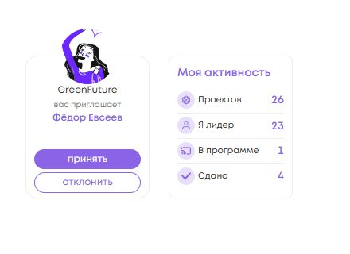

<!-- @format -->

# Карточки проектов и «Моя активность» — DEV

База: `b9ffb77ec79819ab555fef0ee614cd3ea00bc616`, актуальный DEV после #367.
Ветка: `fix/dev-project-cards-no-industry-activity`.
Проверка: 22 сентября 2026, Windows, Node 20.20.2, npm 10.8.2.

## Изменения представления

Отрасль занимала отдельную строку компактной карточки и сокращала место для
названия и описания. Удалены только её разметка, стили, подсказка на ссылке
проекта и локальная зависимость InfoCard от IndustryRepositoryPort.
Это касается подписок, витрины, полного списка и приглашений, включая dashboard.
`Project.industry`, справочник, API и фильтрация по `industry` сохранены.

В публичной карточке описание теперь занимает до четырёх строк / 52 px вместо
двух / 26 px. Название приглашения использует до двух строк; полный текст
сохранён в DOM и `title`. Фиксированной пустой строки под отрасль нет.
Размер карточек 156×180 px, аватар 70 px, lifecycle, роль, доступ, CTA,
bookmark и действия приглашений сохранены. В «Моих проектах» сохранён lifecycle,
а не заменён отраслью; описание по-прежнему ограничено двумя строками.

«Моя активность» увеличена до 156×180 px. Заголовок 14/600/18, подписи
11/400/14, значения 14/600/17 с табличными цифрами, круг иконки 22 px,
иконка 12 px. Четыре строки равномерно заполняют доступную высоту.
При очень больших числах CSS сокращает только видимое значение; полное число
остаётся в DOM и подсказке. В loading/error подсказка с прежним числом отсутствует.

Расчёты четырёх метрик, `count$`, `countState$`, `refreshCount()`, обновление
после принятия приглашения и условия показа блока не менялись.
Активность остаётся только на dashboard/my. Backend, React, зависимости,
workflows и тестовая конфигурация не изменены.

## Измерения и адаптивность

Измерены `getBoundingClientRect()` реальных Angular-компонентов. Для сравнения
использованы одинаковые viewport, масштаб 100% и тестовые данные; исходный
preview собран до правок из указанной базы. Это локальная проверка с подменой
API/facade тестовыми данными, не проверка живого DEV или пользовательских данных.

| Параметр                                     | До             | После          |
| -------------------------------------------- | -------------- | -------------- |
| Активность, desktop                          | 157×141        | 156×180        |
| Project/invite card                          | 156×180        | 156×180        |
| Правая колонка, desktop: X / ширина          | 1075,484 / 157 | 1075,484 / 157 |
| Активность, desktop: Y                       | 429,188        | 429,188        |
| Правая колонка, tablet: X / ширина           | 0 / 753        | 0 / 753        |
| Активность, tablet: Y относительно документа | 1562,969       | 1562,969       |
| Правая колонка, mobile: X / ширина           | 0 / 375        | 0 / 375        |
| Высота каждой строки активности              | около 26       | 31,75          |
| Трансформация заголовка                      | uppercase      | none           |

Desktop: 1440×900, полный dashboard 1440×1320. Tablet: 768×1024.
Mobile: 390×844. Крупный план приглашения рядом с активностью: 440×320.
Ширины 753 и 375 учитывают штатный вертикальный scrollbar 15 px.

Проверены dashboard, my, subscriptions, all, invites: горизонтального overflow
нет, размеры карточек сохранены. На mobile/tablet правая колонка остаётся
ниже списка в существующем адаптивном layout. Приглашение и активность не
перекрываются. Длинные названия/описания сокращаются внутри карточек,
описание не пересекается с CTA. Зазор title–description публичной карточки 2 px.

Числа 0, 26, 123 и 9999 полностью помещаются. Для 999999999999 работает
ellipsis с полным значением в DOM/title. Во всех этих случаях и при loading/error
активность остаётся 156×180 px. Нули отображаются как 0; loading/error — четыре «—».
Нет дополнительных кнопок или метрик. Иконки остаются `aria-hidden`.

Исходные измерения: [measurements.json](measurements.json). Мобильный Y в JSON
зависит от прокрутки к кнопкам приглашения; сравнение положения по X не зависит.
В консоли локального preview нет ошибок; есть существующее предупреждение
NG0912 о двух IconComponent, одинаковое до и после.

## Скриншоты

| Поверхность                      | До                                            | После                                           |
| -------------------------------- | --------------------------------------------- | ----------------------------------------------- |
| Dashboard целиком                | [до](screenshots/dashboard-before.png)        | [после](screenshots/dashboard-after.png)        |
| Мои подписки                     | [до](screenshots/subscriptions-before.png)    | [после](screenshots/subscriptions-after.png)    |
| Витрина / все проекты            | [до](screenshots/all-before.png)              | [после](screenshots/all-after.png)              |
| Приглашения                      | [до](screenshots/invites-before.png)          | [после](screenshots/invites-after.png)          |
| Приглашение рядом с активностью  | [до](screenshots/invite-activity-before.png)  | [после](screenshots/invite-activity-after.png)  |
| Mobile, первый экран             | [до](screenshots/mobile-dashboard-before.png) | [после](screenshots/mobile-dashboard-after.png) |
| Mobile, приглашение и активность | [до](screenshots/mobile-right-before.png)     | [после](screenshots/mobile-right-after.png)     |
| Tablet, dashboard                | [до](screenshots/tablet-dashboard-before.png) | [после](screenshots/tablet-dashboard-after.png) |

Дополнительно: [mobile с длинным именем приглашающего](screenshots/mobile-invites-after.png),
[длинные публичные карточки](screenshots/subscriptions-long-after.png),
tablet: [my](screenshots/tablet-my-after.png),
[subscriptions](screenshots/tablet-subscriptions-after.png),
[all](screenshots/tablet-all-after.png), [invites](screenshots/tablet-invites-after.png).

Состояния активности: [0](screenshots/activity-0.png), [26](screenshots/activity-26.png),
[123](screenshots/activity-123.png), [9999](screenshots/activity-9999.png),
[очень большое число](screenshots/activity-999999999999.png),
[loading](screenshots/activity-loading.png), [error](screenshots/activity-error.png).



## Проверки

```sh
npm ci
npm run test:ci -- --pool=forks projects/social_platform/src/app/ui/widgets/info-card/info-card.component.spec.ts projects/social_platform/src/app/ui/widgets/projects-filter/projects-filter.component.spec.ts projects/social_platform/src/app/ui/pages/projects
npm run lint:ts
npx stylelint projects/social_platform/src/app/ui/widgets/info-card/info-card.component.scss projects/social_platform/src/app/ui/pages/projects/project-activity-card/project-activity-card.component.scss
npm run test:ci
npm run test:ci -- --pool=forks
npm run build:prod
git diff --check
```

- `npm ci`: exit 0; зависимости и lockfile не менялись.
- Targeted: **114/114**, 26 файлов, exit 0. Включены InfoCard, Activity,
  фактический DOM ProjectsComponent, Dashboard/List и отраслевой фильтр.
  Проверены отсутствие отрасли и её скрытого title, lifecycle/роль/доступ,
  маршруты, подписки, приглашения, четыре метрики и смена состояния загрузки.
- `lint:ts`: exit 0; шесть прежних `Unused eslint-disable` предупреждений
  в logger.service.ts, chat-message.model.ts и message-input.component.ts.
- Scoped Stylelint: exit 0.
- Scoped Prettier `--check`: exit 0 для изменённых TS/HTML и документации.
  SCSS по существующему `.prettierignore` проверяется Stylelint.
  Полный `format:check` не запускался; чужие файлы не форматировались.
- Обычный `npm run test:ci`: **exit 1**, 378 suites не начали тесты из-за
  `NG0401: No platform exists!` в `test-setup.ts:31 → setupTestBed()`.
  Эта же ошибка воспроизведена на чистом checkout базы указанным ниже тестом.
  Это не успешный штатный запуск; harness и конфигурация не исправлялись.
- Полный повтор с `--pool=forks`: **1741/1741**, 378 файлов, **exit 0**,
  200,86 секунды; без NG0401 и unhandled errors. Ошибка teardown ngx-autosize
  в этом запуске не возникла.
- `build:prod`: exit 0. Есть прежние Sass/CommonJS предупреждения.
  Windows-команда `build:sprite` генерирует пустой sprite из-за кавычек glob;
  её локальный побочный diff восстановлен из HEAD и в PR не включён.
  Браузерные preview используют исходный sprite; production-артефакт не развёртывался.
- `git diff --check`: exit 0.

Проверка NG0401 на **чистой базе b9ffb77ec79819ab555fef0ee614cd3ea00bc616**:

```sh
npm run test:ci -- projects/social_platform/src/app/ui/pages/projects/project-activity-card/project-activity-card.component.spec.ts
```

Результат: exit 1, 1 suite, тесты не начали выполнение, та же ошибка
`NG0401 → setupTestBed()`. Файлы базы не менялись, `git status --short` пуст;
использован тот же установленный набор зависимостей через локальный junction.

Merge и deploy не выполнялись. Действия с живыми приглашениями или подписками
не выполнялись; их поведение проверено существующими и обновлёнными тестами.
