<!-- @format -->

# Читаемость карточек проектов и приглашений

DEV base: `683da4b9b30334bab4bd6c7a1afea3ddc91fe9ad`.
Ветка: `fix/dev-project-cards-invitations-readability`.

Изменены только шаблон и SCSS `InfoCardComponent`. Данные, lifecycle, роли, доступ,
маршруты, подписки и обработчики приглашений сохранены. Backend, React, зависимости,
workflows и test harness не менялись. Корзина и другие действия не добавлялись.
Статистика, её шаблон и стили не изменены.

## Что изменилось

- У заголовка проекта убрана зарезервированная пустая вторая строка: короткий title
  больше не оставляет зазор 16–21 px перед описанием. Двухстрочное ограничение сохраняется.
- Зазор title/description теперь 1 px в my и 2 px в subscriptions/all.
- CTA использует всю ширину внутреннего блока, шрифт 10 px и высоту 22 px.
  В subscriptions/all вместо 70 × 13,8 px получено 130 × 22 px; в my — 134 × 22 px.
- В приглашениях подпись увеличена с 6 до 10 px, имя с 10 до 12 px,
  шрифт кнопок с 6 до 12 px. Кнопки вместо 70 × 13,8 px занимают 134 × 25,6 px.
- Общий вариант invite применяется и в полном списке, и в правом блоке Dashboard.
  Длинное имя занимает максимум две строки, полный текст остаётся в DOM и title.
  В проверенном длинном имени между текстом и действиями остаётся 4,4 px.
- Кнопки используют существующие параметры ButtonComponent. Другие варианты
  InfoCard сохраняют прежний размер действий; TypeScript и общая кнопка не менялись.

## Геометрия и браузерная проверка

Локально собраны настоящие ProjectsComponent, ProjectsList, Dashboard и InfoCard
с тестовыми данными и заглушками сервисов. До правок использована точная DEV-база.
Одинаковые данные, viewport и масштаб применены до/после; обращения к DEV/PROD
и действия с пользовательскими данными не выполнялись.

Проверены пять поверхностей (Dashboard, my, subscriptions, all, invites) на
1440 × 900, 768 × 1024 и 390 × 844, DPR 1: всего 15 сравнений.

- Все карточки сохранили 156 × 180 px и прежние координаты, число карточек в ряду не изменилось.
- Геометрия статистики совпала до/после на всех применимых поверхностях.
- Горизонтального overflow и переполнения внутреннего контента нет.
- Длинное имя приглашения не наезжает на кнопки.
- «Принять»/«Отклонить» в списке и правой колонке передают прежний inviteId 801;
  навигации при этих действиях нет. Проверка выполнена на безопасных заглушках.
- «Открыть» отображает тестовый detail-placeholder проекта 201; реальный API не вызывается.
- Console errors: 0; существующий preview warning NG0912 о повторном IconComponent.

Точные значения: [geometry.json](geometry.json), [browser-smoke.json](browser-smoke.json).
Это локальная UI-приёмка, а не авторизованная проверка развёрнутого DEV.

## Проверки

Node 20.20.2 / npm 10.8.2, `npm ci` — exit 0.

| Проверка                   | Результат                                           |
| -------------------------- | --------------------------------------------------- |
| Targeted, обычный pool     | NG0401 в setup до сбора тестов, exit 1              |
| Targeted с `--pool=forks`  | 61/61, 8 файлов, exit 0                             |
| `npm run lint:ts`          | exit 0; 6 существующих warnings вне diff            |
| Stylelint изменённого SCSS | exit 0                                              |
| `npm run build:prod`       | exit 0; существующие Angular/Sass/CommonJS warnings |

Повторился известный NG0401 штатного DEV test setup; свежий clean-base запуск
в этой UI-задаче не выполнялся. Режим forks указан только в команде, конфигурация
тестов не менялась. Полный suite не запускался: задача требует targeted-проверки.

```text
npm run test:ci -- --pool=forks projects/social_platform/src/app/ui/widgets/info-card projects/social_platform/src/app/ui/pages/projects/list projects/social_platform/src/app/ui/pages/projects/dashboard projects/social_platform/src/app/ui/pages/program/detail/list/list.component.spec.ts projects/social_platform/src/app/ui/primitives/button/button.component.spec.ts
npm run format:check
npm run lint:ts
npx stylelint projects/social_platform/src/app/ui/widgets/info-card/info-card.component.scss
npm run build:prod
git diff --check
```

Windows-команда build:sprite перегенерировала tracked SVG в пустой спрайт.
Этот побочный артефакт восстановлен из HEAD и не включён в diff; visual smoke
использует штатный спрайт репозитория. Генератор/скрипты сборки в этой задаче не менялись.

Финальные `npm run format:check` и `git diff --check` также завершились с exit 0.

## Скриншоты до/после

Скриншоты сняты с настоящих компонентов, без перерисовки или генерации картинок.
Внешняя оболочка preview и данные тестовые; содержимое статистики сохранено.

### Мои проекты

| До                               | После                              |
| -------------------------------- | ---------------------------------- |
| 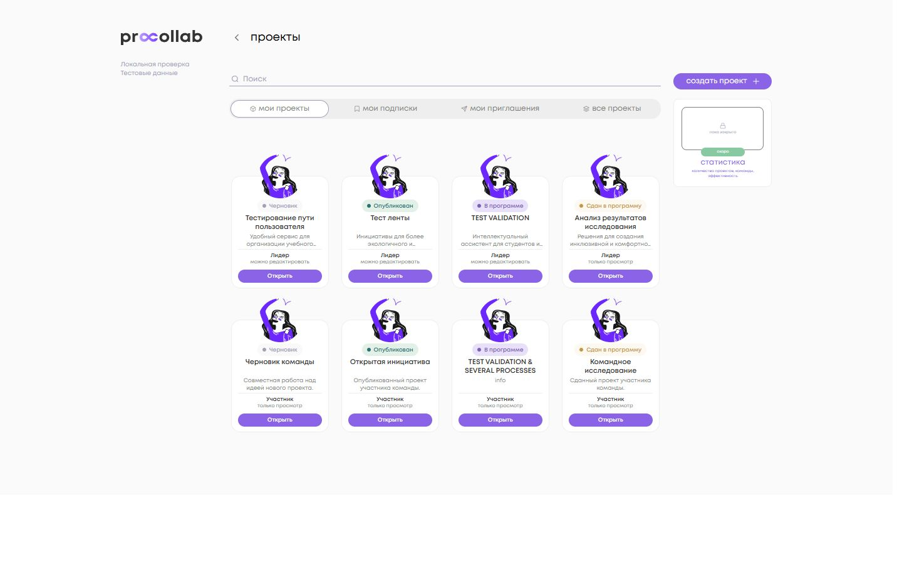 | 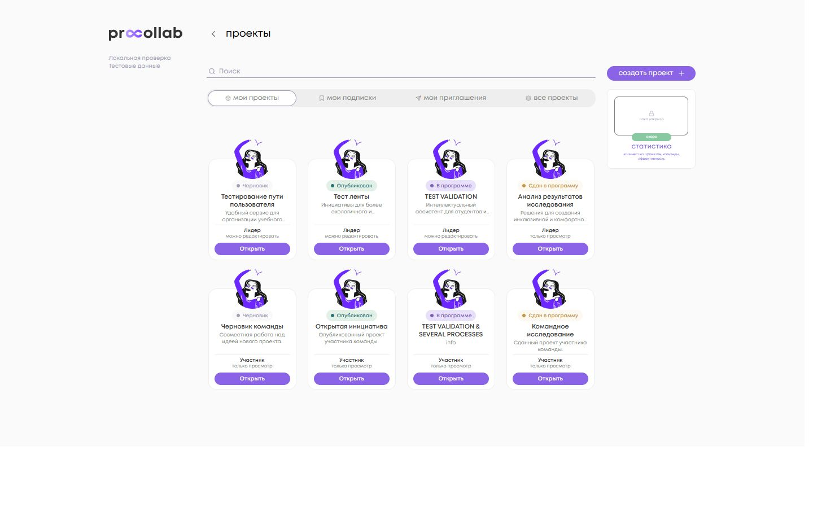 |

### Мои подписки

| До                                       | После                                      |
| ---------------------------------------- | ------------------------------------------ |
| 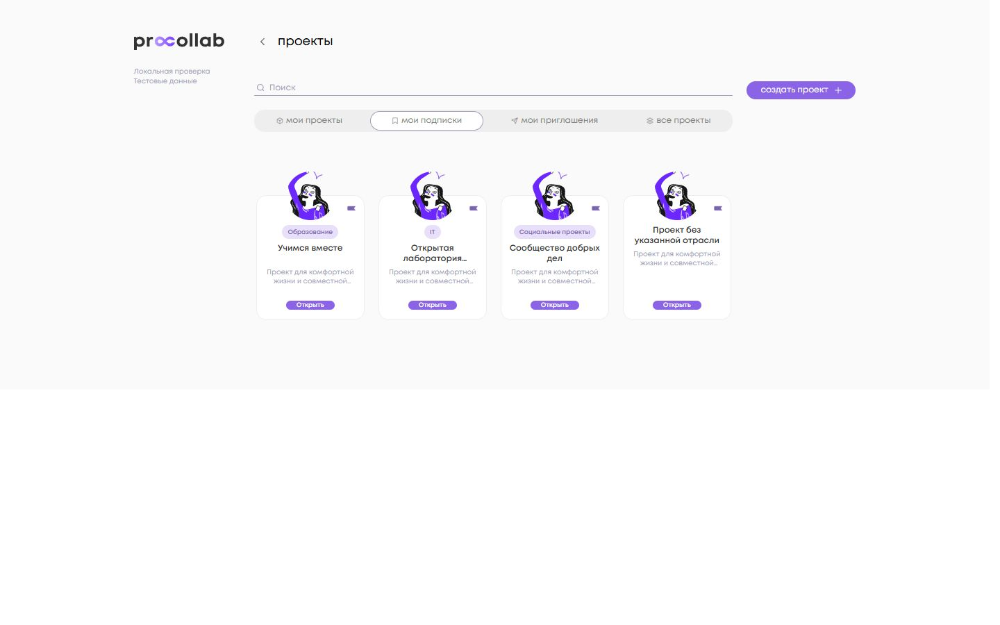 | 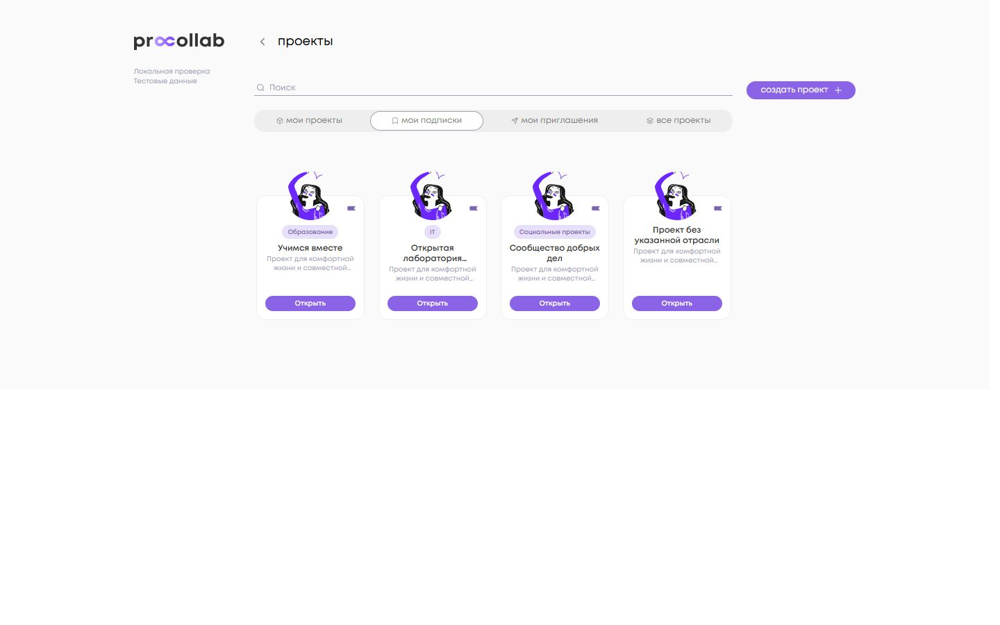 |

### Все проекты

| До                                | После                               |
| --------------------------------- | ----------------------------------- |
| 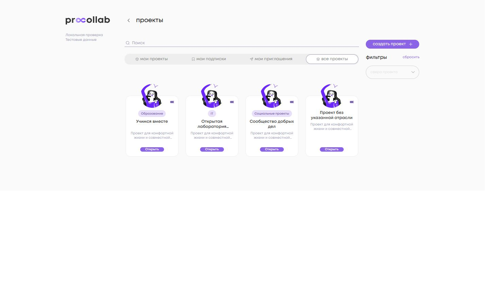 | 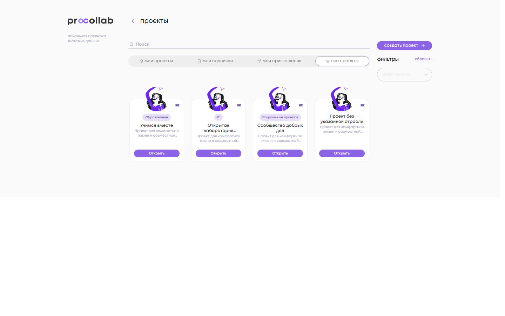 |

### Мои приглашения

| До                                    | После                                   |
| ------------------------------------- | --------------------------------------- |
| 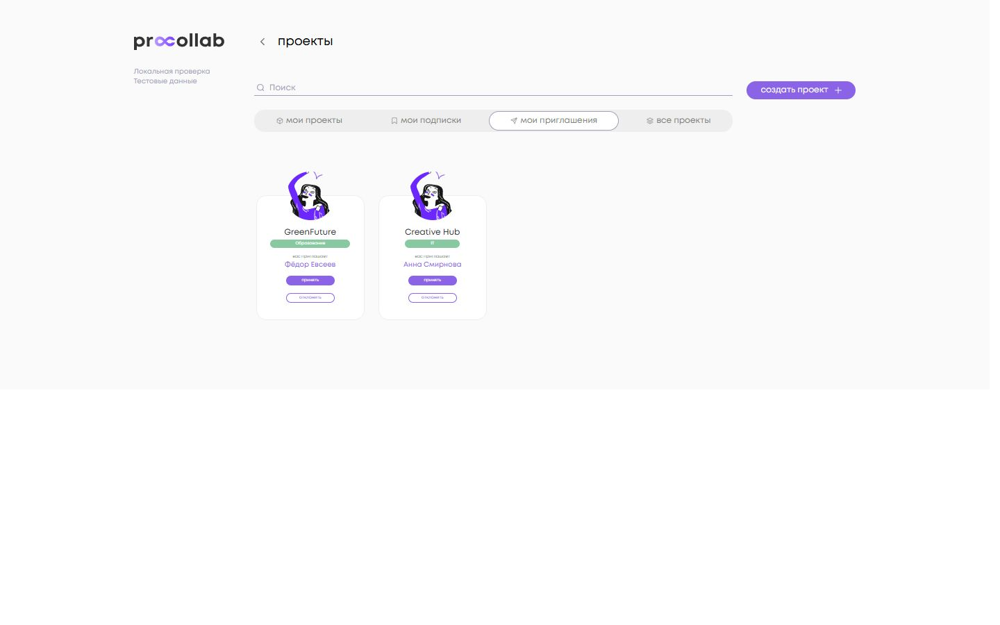 | 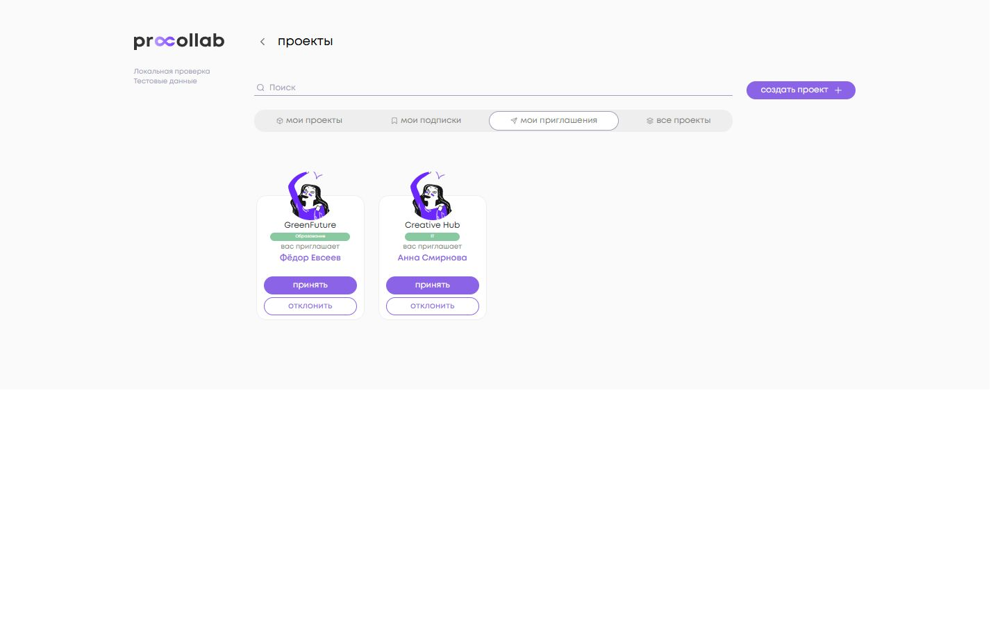 |

### Первый экран и правый блок приглашений со статистикой

| До                                                  | После                                                 |
| --------------------------------------------------- | ----------------------------------------------------- |
| 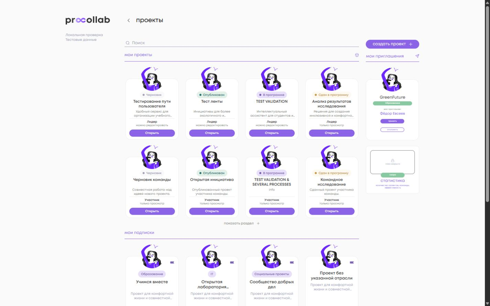 | 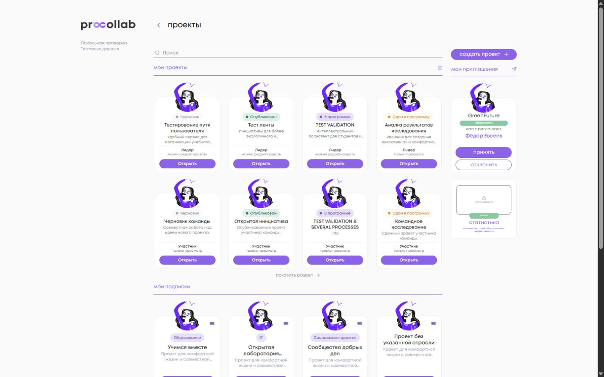 |

### Mobile: приглашения и адаптация правой колонки

| Поверхность    | До                                              | После                                             |
| -------------- | ----------------------------------------------- | ------------------------------------------------- |
| Приглашения    | 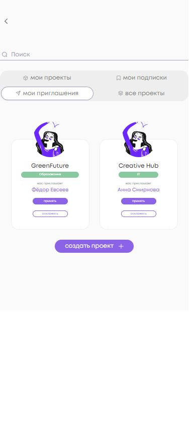 |  |
| Правая колонка | 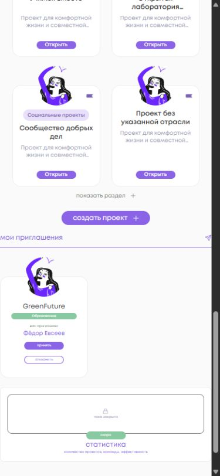 | 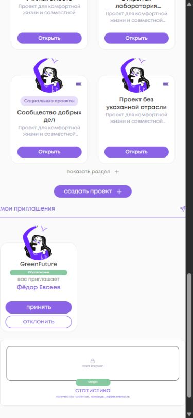 |

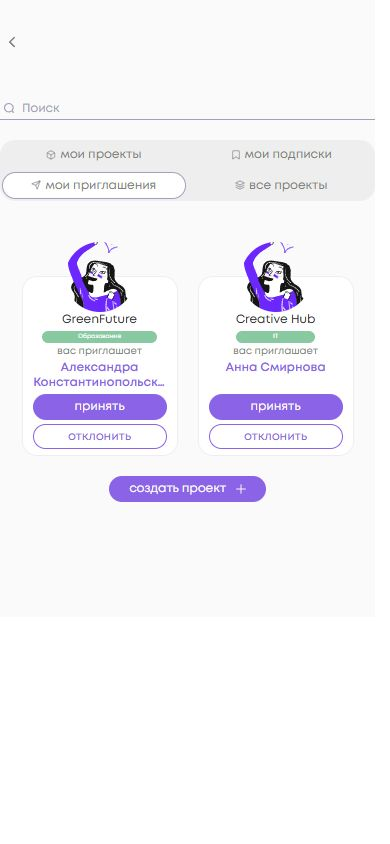

### Tablet

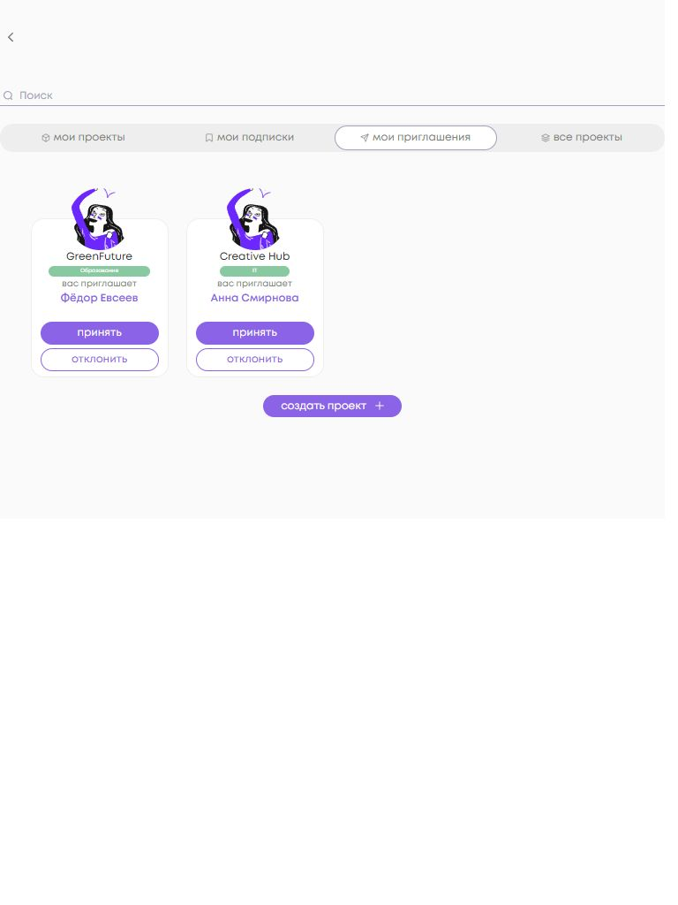

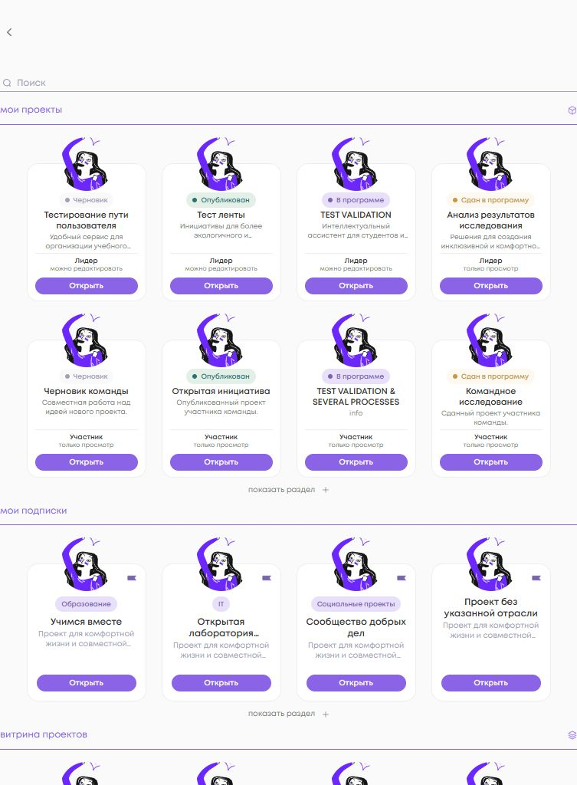
