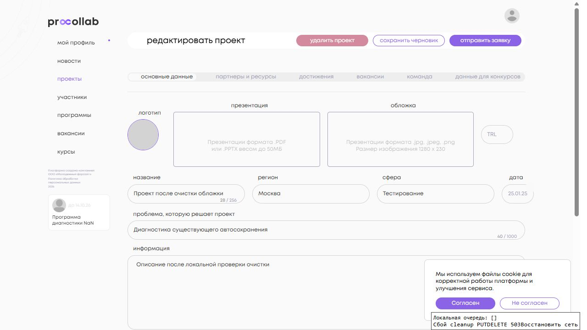
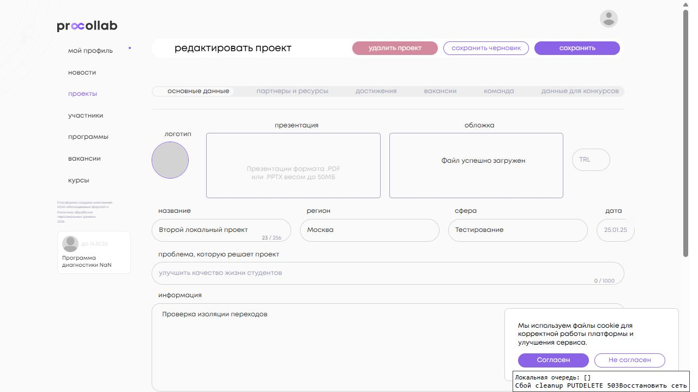
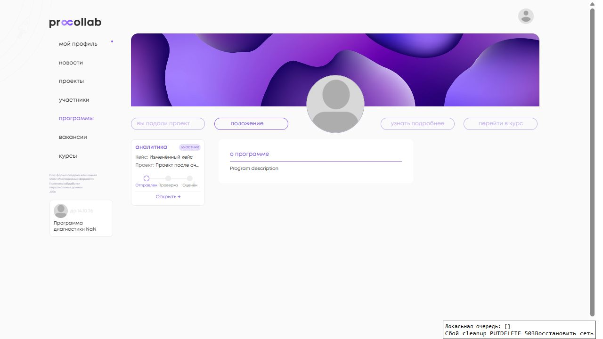

<!-- @format -->

# Очистка файлов проекта — 17.09.2026

Исправление предназначено для Angular DEV. Ветка: `fix/dev-project-file-cleanup-autosave`. Base после `git fetch origin`: `8f59c8ed7bbad1ceb1deba669c65b66a92040231` (повторно проверен перед PR). Backend проверен на `8ed5670d2123dd1f1b53668567ad60bde8641bcc` и не изменялся. Итоговый Angular SHA указан в описании Draft PR.

## Причина и исправление

Root `ProjectFormAutosaveService` получал другой уровень `ActivatedRoute`: `Number(undefined)` давал `NaN`. Начальный `patchValue` пустого файла запускал тот же обработчик, а `stripNullish` удалял намеренное `""` из явного сохранения. Подробные исходные Network evidence и скриншоты сохранены в [диагностике до исправления](../program-role-widget/nan-diagnostic/README.md).

- `ProjectFormService` хранит ID загруженного **Project**, отдельно от `programLinkId`. Передаёт accessor в autosave; сервис больше не внедряет `ActivatedRoute`. ID фиксируется при событии до очереди `concatMap`, поэтому уже ожидающая очистка проекта 31 не превращается в запрос к 32.
- Перед запросом и записью в очередь проверяются `Number.isSafeInteger(id) && id > 0`, разрешённое файловое поле и строковое значение. Повреждённые записи прежней очереди не повторяются; повреждённый JSON трактуется как отсутствие пригодных записей.
- Только начальное заполнение двух файловых controls выполняется с `emitEvent: false`. Подписки обычных полей продолжают получать события. Сброс формы сначала убирает ID и историю файлов.
- Локальная история непустых значений отличает первоначально пустое нетронутое поле от удалённого файла, включая файл, загруженный в этой сессии. `getFormValue()` восстанавливает `""` только для намеренно очищенных файлов. Глобальный `stripNullish` не менялся.
- `UploadFileComponent` очищает control после DELETE 2xx или 404. При network/4xx/5xx, кроме 404, URL остаётся, показывается ошибка. Повторный клик во время DELETE блокируется. Поздний ответ не очищает файл другого контекста, даже при совпавшем URL. Upload-флоу не изменён.
- При сетевой ошибке сохранения очистки показывается сообщение и сохраняется patch с исходным ID. После `online` он повторяется для этого ID. После уничтожения соответствующего контекста поздние запросы отменяются.

### Презентация и стандартная обложка

Для презентации успешная очистка означает `GET.presentation_address === ""`; старый файл не появляется после открытия редактора.

Для обложки инвариант другой: GET **не должен возвращать URL удалённого пользовательского файла**. Существующий `Project.save()` вправе заменить `""` стандартной `DefaultProjectCover`; если стандартных обложек нет, локальная проверка получила `null`. Стандартная обложка после повторного открытия допустима. `Project.save()`, `DefaultProjectCover` и backend-контракт не менялись.

### Сохранение после очистки и сдача

Реальная интеграция выявила особенность существующего `validate_project`: явная пустая строка принимается с `draft: true`, но отвергается с `draft: false`. Простое добавление `""` во все payload ломало последующее сохранение опубликованного проекта (400).

Локальный фасад редактора сохраняет явный `""` в draft-запросе. Перед публикацией, если payload содержит очищенные файлы, он сначала подтверждает их очистку отдельным `draft: true` запросом, затем отправляет обычный payload публикации без этих уже сохранённых пустых ключей. Новый URL замены сохраняется как обычно. Ошибка первого запроса останавливает второй и не показывает успех; уничтожение редактора отменяет продолжение. При отсутствии очистки дополнительного запроса нет. Программные связи, порядок существующего сохранения дополнительных полей/submit и серверные ограничения не меняются.

Это по-прежнему несколько HTTP-операций, а не транзакция File ↔ Project ↔ программная связь. При недоступной сети удалённый физический файл может временно иметь старую ссылку в Project до успешного повтора; UI сообщает, что очистка ещё не сохранена. Также существующий submit связи предшествует сохранению основной формы: ошибка основной формы не откатывает submit. Атомарность этих операций данный Angular PR не вводит.

## Реальная локальная проверка

Windows, Node `24.18.0`, npm `11.16.0`, Vitest `3.2.6`, Django `4.2.11`. Зависимости установлены через `npm ci` из неизменённого lockfile.

Использована отдельная PostgreSQL БД `procollab_file_cleanup_20260917`, созданная как копия предыдущей **локальной синтетической** БД `procollab_widget_nan_20260914`. DEV/PROD данные не использовались, миграции не выполнялись. Реальные Angular AppComponent, router/resolvers, формы, auth, API, Django `Project`, `UserFile` и права доступа. Только внешний CDN-транспорт заменён локальным файловым каталогом; upload создаёт реальные файлы и `UserFile`, DELETE удаляет их. Проверки БД и локального пути запрещают этому адаптеру обращаться к живому CDN.

Angular: `http://127.0.0.1:4316`; backend: `http://127.0.0.1:8011`. Отдельная локальная точка входа использует production-компоненты приложения. Временный proxy фиксирует method/path/payload/status без токенов и auth-заголовков, показывает очередь в тестовой панели; отдельные кнопки воспроизводят socket failure cleanup PUT и DELETE 503. При обычной работе ответы API не подменяются. В репозиторий не добавлены настройки окружения, аккаунты, пароли или инструменты подключения.

Синтетические ID: лидер 11, участник команды 12, программа 21, проекты 31/32, программная связь **73**. Время в [evidence.json](evidence.json) — UTC 16.09, локальная дата проверки — 17.09 MSK. Этот файл содержит запросы, readback, состояние очереди, наличие физических файлов и `UserFile`; промежуточный 400 тоже сохранён и пояснён.

| Сценарий                      | Выполненная проверка и результат                                                                                                                                                                                                                                                                                               |
| ----------------------------- | ------------------------------------------------------------------------------------------------------------------------------------------------------------------------------------------------------------------------------------------------------------------------------------------------------------------------------ |
| A — первоначально пустое поле | После загрузки редактора 26 секунд без cleanup PUT; во всех записанных сценариях нет `/projects/NaN/`, `/0/`, `/null/`.                                                                                                                                                                                                        |
| B — презентация               | Реальная загрузка через file chooser → draft save → DELETE 204 → один cleanup PUT `/projects/31/` с `presentation_address: "", draft: true` → 200. GET возвращает `""`; после ухода и открытия поле пустое.                                                                                                                    |
| C — обложка                   | DELETE 204 → PUT `/projects/31/` с `cover_image_address: ""` → 200. Без стандартных обложек GET вернул `null`. Затем отдельная локальная `DefaultProjectCover`: удаление пользовательской обложки проекта 32 → GET возвращает `default-cover.png`, старый `cover-32.png` — 404. После reload отображается стандартная обложка. |
| D — явный draft save          | После удаления payload сохраняет `""`. Первоначально пустая нетронутая презентация не добавляется при сохранении обложки. Readback подтверждает очистку и сохранение нового названия/описания.                                                                                                                                 |
| E — offline                   | DELETE проходит, cleanup PUT получает transport status 0. После штатных retry очередь содержит только `{projectId:31, field:"presentationAddress", value:""}`. Восстановление сети повторяет PUT 31, GET пустой, очередь `[]`.                                                                                                 |
| F — проект 31 → 32            | Очередь 31 повторена из открытого редактора 32 на `/projects/31/`. Последующее удаление презентации 32 отправляет `/projects/32/`; файлы проектов не смешиваются.                                                                                                                                                              |
| DELETE 404                    | Отсутствующий локальный `already-missing.pdf` → DELETE 404 → очистка control и PUT 31/200.                                                                                                                                                                                                                                     |
| DELETE 503                    | Все штатные повторы DELETE вернули 503; URL остаётся, cleanup PUT отсутствует. Feedback и network/400/403/500 также проверены unit-тестами.                                                                                                                                                                                    |
| Upload / замена               | File chooser → POST `/files/` 201 → сохранение нового URL. Замена обложки успешно сохранена при финальной публикации. Upload 413 и сохранение прежнего значения покрыты regression tests.                                                                                                                                      |
| Кейс и шаги                   | Вход из программы с `programLinkId=73`, переход main ↔ additional, выбор «Изменённый кейс», PUT fields именно связи 73/200. `projectId=31` не смешивается с ID связи.                                                                                                                                                          |
| Сдача после удаления          | Финальный прогон: DELETE презентации/204, cleanup/200, fields 73/200, submit 73/200, подтверждение очистки/200, основной PUT `draft:false`/200. GET: `presentation_address:""`, `draft:false`, `submitted:true`, кейс сохранён.                                                                                                |
| Лидер / команда               | Лидер выполняет сценарии редактора. Для участника 12: draft GET/PUT того же имени — 200/200 по существующим правам; после публикации GET/PUT — 200/403. После сдачи UI лидера показывает «редактирование недоступно» по существующим правилам конкурса.                                                                        |
| Виджет                        | После сдачи показывает участника, текущий проект, «Изменённый кейс» и этап «Отправлен». «Открыть» ведёт к проекту 31 со связью 73. Код виджета не менялся.                                                                                                                                                                     |

Физические файлы и `UserFile` удалённых презентаций и пользовательских обложек отсутствуют. Локальная стандартная обложка сохраняется. Живой CDN, DEV/PROD runtime и отдельный полный backend suite не проверялись; backend-код не менялся.

### Скриншоты

После удаления презентации, явного сохранения, ухода и открытия редактора (до создания стандартной обложки):



Отдельная проверка проекта 32: удалённая пользовательская обложка заменена стандартной. Надпись «Файл успешно загружен» относится к новому стандартному URL, что подтверждается readback:



Неизменённый виджет после успешной сдачи на окончательной реализации:



## Автоматические проверки

Новые проверки защищают явный ID без ActivatedRoute, подавление только initial file events, обе очистки, непустую замену, обычный `stripNullish`, изоляцию проектов, валидацию старой очереди, online replay, destroy, DELETE 404/ошибки/гонки и последовательное сохранение перед публикацией.

| Команда                                                                                               | Реальный результат                                                                                   |
| ----------------------------------------------------------------------------------------------------- | ---------------------------------------------------------------------------------------------------- |
| `npm ci`                                                                                              | exit 0; lockfile и dependencies без изменений.                                                       |
| Targeted Vitest, четыре spec ниже                                                                     | **73/73**, 4 файла, exit 0.                                                                          |
| `npm run lint:ts`                                                                                     | exit 0; 6 прежних предупреждений unused eslint-disable в других файлах.                              |
| `npx stylelint projects/social_platform/src/app/ui/primitives/upload-file/upload-file.component.scss` | exit 0; CSS/SCSS не менялись.                                                                        |
| Scoped Prettier                                                                                       | exit 0: восемь изменённых TS-файлов, README и evidence.json.                                         |
| `npm run build:pr`                                                                                    | exit 0; существующие Sass/Angular warnings. Сгенерированный sprite восстановлен, в diff отсутствует. |
| `git diff --check`                                                                                    | exit 0.                                                                                              |
| `npm run test:ci` на итоговом коде                                                                    | exit 1: 367 suites падают при setup с `NG0401`, ни один тест не исполняется.                         |
| Та же команда на точном base, те же зависимости                                                       | exit 1: те же 367 suites, `NG0401`, тесты не исполняются.                                            |
| Полный `npx vitest run --pool=forks --maxWorkers=4 --minWorkers=1` на base                            | **1560/1560**, 367 файлов, exit 0.                                                                   |
| Полный forks на окончательном коде                                                                    | **1605/1605**, 367 файлов; exit 1 из-за одного `ngx-autosize` teardown.                              |

Targeted-команда:

```powershell
npx vitest run --pool=forks --maxWorkers=4 --minWorkers=1 `
  projects/social_platform/src/app/api/project/facades/edit/project-form-autosave.service.spec.ts `
  projects/social_platform/src/app/api/project/facades/edit/project-form.service.spec.ts `
  projects/social_platform/src/app/api/project/facades/edit/projects-edit-info.service.spec.ts `
  projects/social_platform/src/app/ui/primitives/upload-file/upload-file.component.spec.ts
```

Общий для base и head сбой штатной команды в локальном окружении:

```text
Error: NG0401: No platform exists!
 ❯ assertPlatform ../darwin_arm64-fastbuild-ST-199a4f3c4e20/bin/packages/core/src/platform/platform.ts:115:11
 ❯ ../darwin_arm64-fastbuild-ST-199a4f3c4e20/bin/packages/core/src/platform/platform.ts:88:77
 ❯ setupTestBed packages/vitest-angular/setup-testbed.ts:54:29
 ❯ test-setup.ts:31:13
Test Files 367 failed (367)
Tests no tests
exit 1
```

Первый полный forks-прогон до добавления обработки публикации: 1600/1600 assertions, 367 файлов, **exit 1** из-за teardown. Повтор того же набора — 1600/1600, exit 0. В выполненном сравнении base этот teardown не воспроизвёлся; совпадение с ранее известным стеком не выдаётся за успешную проверку или воспроизведение на base:

```text
ReferenceError: window is not defined
 ❯ WindowRef.get nativeWindow [as nativeWindow] projects/ngx-autosize/src/lib/window-ref.service.ts:5:3
 ❯ projects/ngx-autosize/src/lib/autosize.directive.ts:122:20
 ❯ NoopNgZone.runOutsideAngular node_modules/@angular/core/fesm2022/debug_node.mjs:8168:16
 ❯ AutosizeDirective._addWindowResizeHandler projects/ngx-autosize/src/lib/autosize.directive.ts:120:16
 ❯ AutosizeDirective._onTextAreaFound projects/ngx-autosize/src/lib/autosize.directive.ts:108:5
 ❯ AutosizeDirective._findNestedTextArea projects/ngx-autosize/src/lib/autosize.directive.ts:103:9
 ❯ Timeout._onTimeout node_modules/ngx-autosize/fesm2015/ngx-autosize.mjs:80:16
 ❯ listOnTimeout node:internal/timers:605:17
 ❯ processTimers node:internal/timers:541:7
Origin: projects/social_platform/src/app/ui/widgets/news-form/news-form.component.spec.ts
Caught after test environment was torn down.
```

Окончательный прогон после добавления пяти тестов публикации: **1605/1605**, 367 файлов, **exit 1**, тот же стек `ngx-autosize`, но origin — `profile-mid-side.component.spec.ts`. [Точные фрагменты логов](test-failures.txt) сохранены вместе с итогами и exit codes. Полный suite не объявляется зелёным.

Тесты не отключались, ошибка не подавлялась. Pool выбран только аргументами диагностического запуска; test setup, CI, workflows и зависимости не изменены. Проверки выполнены вручную; при commit штатный hook с глобальным `lint:scss --fix` не запускается, чтобы не добавлять постороннее форматирование. Используются проверенные scoped Stylelint и общий `lint:ts`, настройки hooks в репозитории не меняются.

## Состав изменений

- `project-form-autosave.service.ts` и spec: явный ID, очередь, сообщения об ошибках, жизненный цикл.
- `project-form.service.ts` и spec: ID/история файлов, initial events, явное `""`.
- `projects-edit-info.service.ts` и spec: совместимость очистки с существующей валидацией публикации.
- `upload-file.component.ts` и spec: DELETE 404/ошибка/защита от позднего ответа; upload сохранён.
- Этот отчёт, Network/API evidence и три скриншота.

Backend, React, `current_application`, analytics-widget, права и правила команд/сдачи, программные связи, shared modal и глобальный `stripNullish` не менялись. Merge, deploy и операции с PROD не выполнялись.
