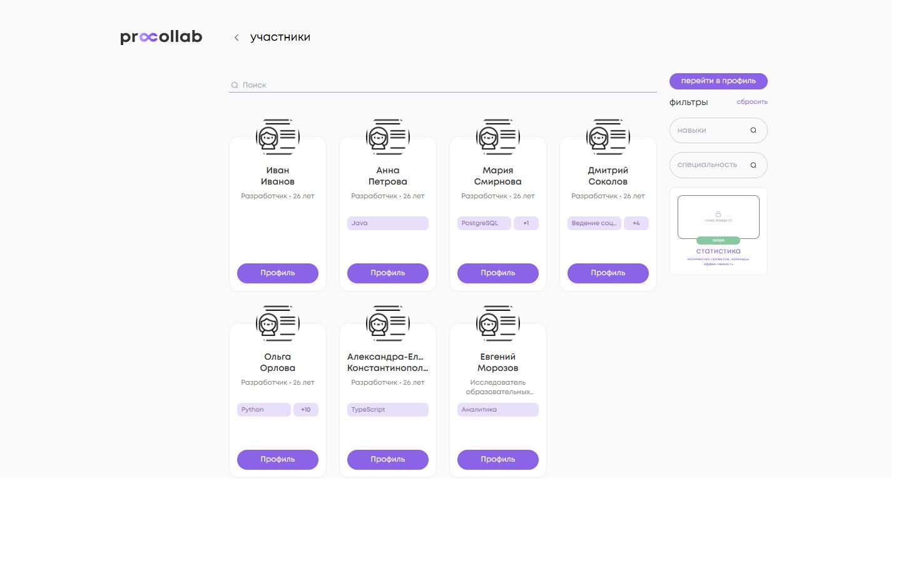
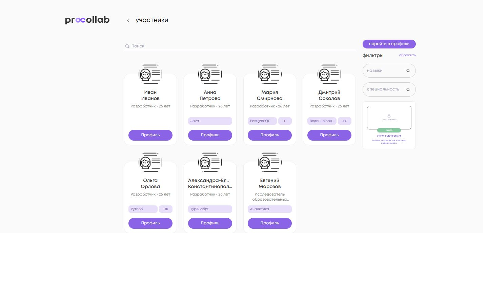
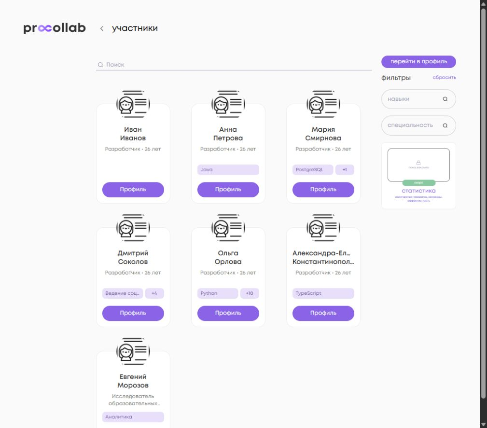
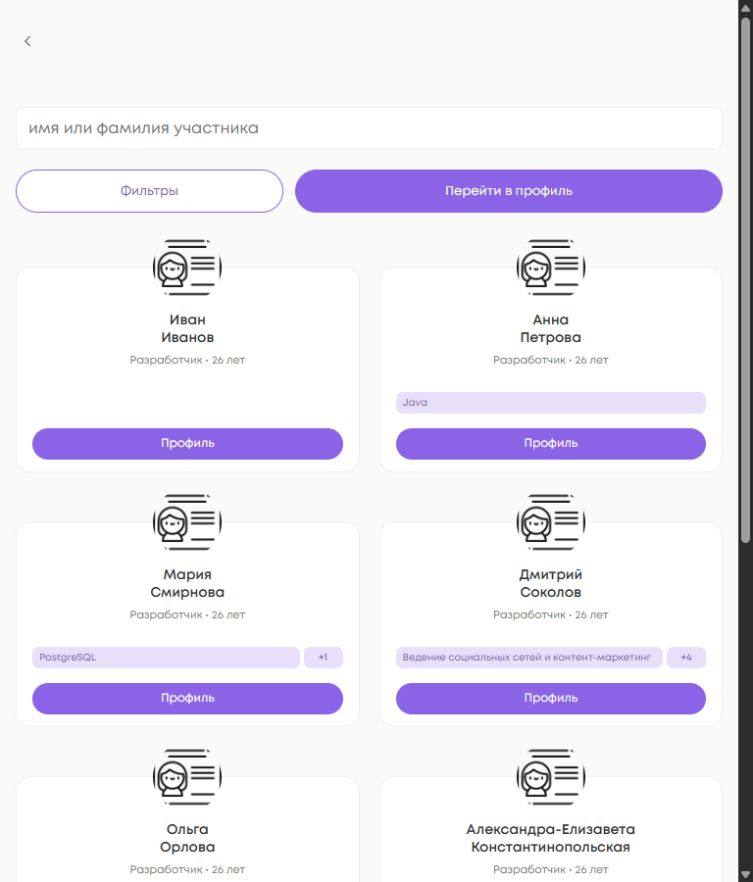
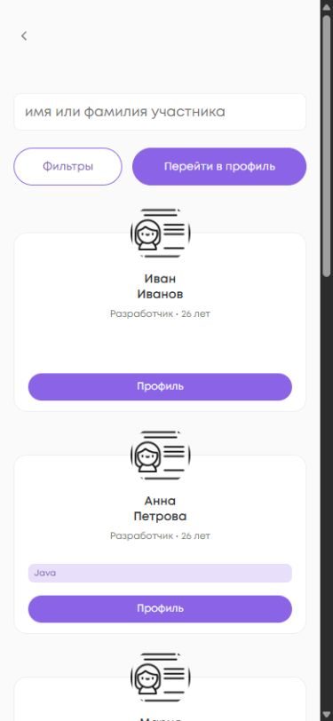
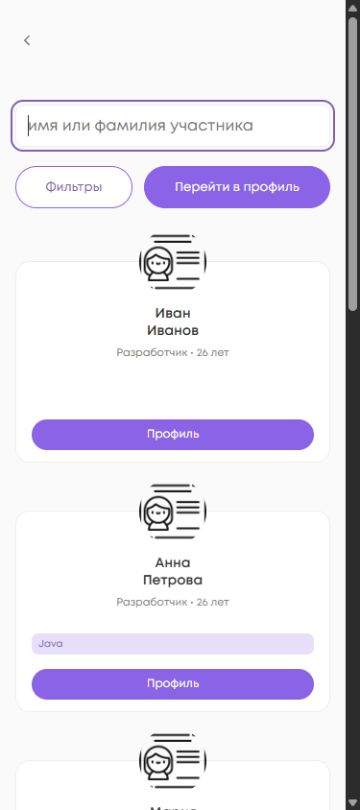
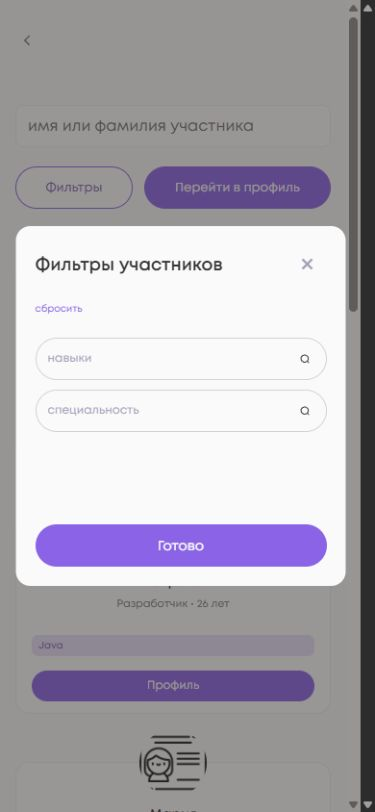
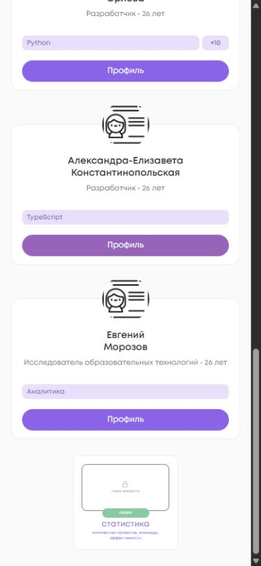

<!-- @format -->

# PROD: страница «Участники»

База master: `0cd4bb85ba8368695a3b0859e83630cb715067e5`.
Источники: DEV #377 (`3c67203663e2b4dd50b8e72df3d5fb53390c287f`), #378 (`63e67b3b59513f7a82f23122c4a51440251b280f`), #379 (`96a7a676f7d47194fa105fb1748a5bfc28b5b544`).

Перенесены только API-фасад поиска участников и компоненты страницы. Их исходная версия master совпадала с DEV до #377. Backend-поиск подготовлен отдельно: [api #755](https://github.com/PROCOLLAB-github/api/pull/755).

## Поведение

- Поиск: нормализация пробелов, debounce 300 мс последнего текста, fullname в URL, актуальное число результатов, отмена старого запроса и игнорирование опоздавшей страницы старого поиска. Другие фильтры сохраняют смысл.
- Карточка: одна ссылка на профиль, имя/фамилия, вторичная информация, первый навык в исходном порядке и точный `+N`. Строка навыков всегда 22 px, даже когда навыков нет. Основной chip занимает свободную ширину, длинный текст обрезается с ellipsis и сохраняется в title.
- Mobile: одна широкая колонка на телефонах, отдельное окно прежних фильтров с Escape/возвратом фокуса; статистика под списком. На tablet — две колонки. Логика статистики, shared modal, React и DEV не изменены.

## Финальное отличие от DEV #379

Высота карточки уменьшена **248 → 210 px**. Это единственное runtime-отличие перенесённых файлов от итогового DEV source. Измерено в настоящей Angular fixture: зазор skill→CTA **53 → 15 px**. Смещение кнопки не задано вручную: сохранён `margin-top: auto`.

Не менялись ширина desktop 156 px, avatar 70×70 px, CSS `top: -35px; left: 50%`, CTA 32 px, типографика имени и структура карточки. Измеренный верх аватара относительно внешней рамки — −34 px из-за округления border, одинаковый до/после; desktop X = 43 px. Строка навыков начинается на Y = 128 px; CTA после — Y = 165 px. Все семь карточек имеют одинаковую высоту, CTA выровнены внутри каждого ряда.

## Браузерная проверка

Локальная fixture использует реальные MembersComponent, member-card, фильтры, стили office и приложения. Данные синтетические; API и фасад выдачи подменены, основной sidebar/header office не воспроизводятся целиком. Это проверка компонентов и геометрии, **не live E2E**. Безопасной авторизованной сессии PROD/DEV не было; live-поиск до deploy не проверен. Поиск проверен targeted-тестами фасада и PostgreSQL API-тестами.

Семь примеров: без навыков; Java; PostgreSQL +1; длинный навык +4; Python +10; длинные имя/фамилия; специальность в две строки.

| CSS viewport | Колонки | Ширина карточки | Высота | skill→CTA | Горизонтальное переполнение |
| ------------ | ------- | --------------- | ------ | --------- | --------------------------- |
| 1440         | 4       | 156             | 210    | 15        | 0                           |
| 1280         | 4       | 156             | 210    | 15        | 0                           |
| 1024         | 3       | 156             | 210    | 15        | 0                           |
| 768          | 2       | 350,5           | 210    | 15        | 0                           |
| 414          | 1       | 367             | 210    | 15        | 0                           |
| 390          | 1       | 343             | 210    | 15        | 0                           |
| 375          | 1       | 328             | 210    | 15        | 0                           |

Размеры учитывают обычную полосу прокрутки браузера. В mobile DOM нет правого sidebar; статистика измерена ниже списка. Окно фильтров открывается, Escape закрывает его и возвращает фокус. Вложенных интерактивных элементов внутри ссылки карточки нет. Console errors fixture: 0. Измерения: [до](geometry-before.json), [после](geometry-after.json).

### Скриншоты

До — финальный DEV #379 (248 px), после — PROD-перенос (210 px), одна и та же fixture и CSS viewport 1440×900.










### Повторение fixture

Скопировать primary-main.ts, primary-tsconfig.json, surface-index.html и serve-preview.py из этой папки в локальную tmp/. Они не подключены к runtime, CI или production build.

```powershell
npx ng build social_platform --configuration=development --browser tmp/primary-main.ts --ts-config tmp/primary-tsconfig.json --index tmp/surface-index.html --output-path tmp/preview-after
Copy-Item tmp/preview-after/browser/surface-index.html tmp/preview-after/browser/index.html
# Запускать из tmp/preview-after/browser; сервер доступен только локально.
python ../../serve-preview.py 4351
```

Открыть http://127.0.0.1:4351/office/members. Измерения выполнялись через getBoundingClientRect в браузере, без подмены размеров DOM. Изображения сохранены самим браузером; при узком viewport их физическая ширина может отличаться от CSS viewport.

## Проверки

Node 20.20.2; `npm ci` успешно. Targeted: `npm run test:ci -- --pool=forks projects/social_platform/src/app/api/member/facades/members-info.service.spec.ts projects/social_platform/src/app/ui/pages/members/` — 20/20 (5 файлов).

`npm run lint:ts` — exit 0, 6 существующих предупреждений. Scoped Stylelint и Prettier для изменённых исходников — exit 0. `npm run build:prod` — exit 0; существующие Sass/CommonJS/budget warnings. На Windows штатный build:sprite с одинарными кавычками генерирует пустой sprite; только этот сгенерированный файл восстановлен из HEAD, в PR он не входит. Браузерная fixture собрана с исходным корректным sprite. Production scripts/dependencies не менялись.

`npm run test:ci -- --pool=forks`: **1902/1902**, 395 файлов, exit 0; без NG0401 и unhandled errors. `git diff --check`: OK. Реальные данные не изменялись, merge/deploy не выполнялись.
